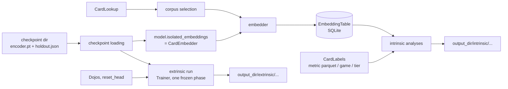

# evaluation: post-training evaluation of embedding checkpoints

## Scope

The earlier design notes in `src/evaluation/` have been replaced by a
stub `README.md` pointing here. Skeleton work follows this plan.

`src/evaluation/` measures finished encoder checkpoints, offline. It is
a library of composable pieces called by hand from a script, not an
experiment framework: `Trainer` never calls it, and there is no
first-class "experiment" object. The first intended use is manual:
take a single-card and a multi-card checkpoint and produce t-SNE plots
and cluster/compactness numbers for both, and learning curves for the
single-card one (multi-card extrinsic runs are near-term). Longer term:
comparing checkpoints/architectures/seeds (including trained vs.
untrained of the same architecture) and tracking one run's checkpoints
over time. Outputs are files on disk (plots, CSV, JSON) in an output
directory the caller picks (by convention `data/evaluations/<name>/`),
reproducible from a re-run with the same inputs and seeds.

Evaluation is agnostic to how a checkpoint was trained: it never
validates or compares the `HoldoutSpec`s (or any other training
configuration) of the encoders it is given. Encoders being compared
*should* usually share a training `HoldoutSpec` for the comparison to
mean much, but that is the caller's judgment, not a checked rule.

Two families, split by whether a new model is fit on top of the frozen
embeddings:

- **Intrinsic** - no model is fit. Embed a set of cards once, then run
any number of analyses over the stored embeddings (t-SNE plot,
cluster-then-match, label compactness, and more later).
- **Extrinsic** - a fresh dojo decoder head is trained on the frozen
encoder; its loss curve is the measurement. Compared across encoders
on the same dojo(s).

Domain shift away from the training regime (a withheld card, a
withheld set, a withheld game) is not an evaluation mode of its own. It
is expressed through *which cards go in* (corpus selection) and *how
they are labeled* (a holdout-tier label computed from the checkpoint's
`HoldoutSpec`). Evaluation embeds cards exactly as stored: it applies
no card mods and creates no synthetic variants.

MVP limits:

- Intrinsic: context-free single-card embeddings only - a
`SingleCardModel`, or a `MultiCardModel` embedding every card as its
own list of one (`CardEncoderModel.isolated_embeddings`), i.e. its
isolated-card encoding.
- Extrinsic: single-card-input dojos only. Either model may be passed.
The canonical `forward` of both models (`CardEncoderModel`,
`src/encoder_model/card_encoder_model.py`) always reads its input as a
batch, so on a single-card dojo a `MultiCardModel` embeds each card on
its own (no attention across batch-mates) - its isolated-card encoding.
- Frozen encoder only (no fine-tuning).
- Categorical labels only.
- No caching in the extrinsic path: the frozen encoder re-encodes every
batch.

Near-term, and the design must not preclude it: extrinsic runs on
multi-card dojos, comparing a contextualized `MultiCardModel` against a
`SingleCardModel` on the same multi-card dojo. This is why the extrinsic
run takes any frozen `TrainableEncoder` (the model itself), not the
context-free `CardEmbedder` view. Nothing in the extrinsic path assumes context-free
encoding: a batch of multi-card inputs goes to
`forward_batched_multi_card`, which contextualizes each example only
against itself.


## Component overview




### Checkpoint loading - built (step 1)

`load_encoder_weights(dir, model)` and `load_checkpoint_holdout(dir)` in
`training/recording/checkpointer.py`; `DirectoryCheckpointer` writes
`holdout.json` (`HoldoutSpec.to_json`). See
`src/training/recording/README.md`. The `HoldoutSpec` is only an input a
caller may hand to a holdout-tier label, never used for validation.
Rebuilding the model object stays the caller's job for the MVP.

### Corpus selection, Embedder, EmbeddingTable - built (step 3a)

`select_corpus`/`CorpusSpec`/`TierFilter`, `EmbeddingTable` (SQLite, rows
sorted by `nocab_uuid`, always finite) and `embed_corpus` (resumable;
log-and-skip failed batches, `max_consecutive_failures` cap). See
`src/evaluation/README.md`.

### Context-free embedding on the model - built (step 2)

`CardEncoderModel.embedding_dim` (from `EmbeddingHead.output_dim`, the one
source of the width) and `isolated_embeddings(cards, precision)`, sharing
`inference_context` with `evaluate_split_losses`. See
`src/encoder_model/README.md`. No adapter classes: evaluation depends on
the `CardEmbedder` Protocol (step 3, in `evaluation/`), which both models
satisfy structurally.

### CardLabels

A Protocol mapping a card row to a categorical label or `None` (not
labeled; excluded from that analysis). MVP implementations:

- **Metric parquet labels** - reads a per-card categorical metric's
parquet the way dojos do, using only its `nocab_uuid` and `label`
columns (e.g. `MaskedFieldMetric` output: `nocab_uuid`,
`masked_field`, `label`); other columns ignored; labels converted with
`str()`. Takes one or more parquets, so a per-game metric family (e.g.
the planned rarity metrics, one per game) forms one label source for
a multi-game corpus. Unlike `GenericDojo`, it does not check the
metric's embedded binder version against the current binder (same
"recorded, never checked" policy as the table; `nocab_uuid`s are
stable).
- **Game labels** - `source_game.value`.
- **Holdout tier labels** - `HoldoutSpec.tier_of(nocab_uuid, source_game)` under the checkpoint's spec: the domain-shift label.

First label sets planned: game (easy), a cross-game normalized rarity
(medium), MtG set (hard). Game labels need nothing outside this plan.
MtG set labels come later.

**Outside this plan:** the rarity labels depend on a cross-game rarity
metric family in `data_refinement/metrics/`, which this plan does not
design. It is tracked in `src/data_refinement/metrics/TODO.md` ("Cross-game
rarity metric family"). Evaluation consumes it only through
`MetricParquetLabels` over its per-game parquets.

### Intrinsic analyses

A Protocol with one shared call - run over an `EmbeddingTable`, write
files into an output directory, return a result. Anything else an
analysis needs (labels, a sampling rule, a seed, hyperparameters) is
constructor input, so analyses with and without labels share the
Protocol. MVP analyses:

- **Projection plot** - 2D projection colored by a label; seeded and
with fixed hyperparameters so plots are comparable across tables.
Illustrative only; always reported next to a quantitative analysis.
- **Cluster agreement** - cluster with no knowledge of labels, then
permutation-invariant agreement (ARI/NMI) against the labels.
- **Label compactness** - how tightly cards group by their known label
(silhouette, nearest-centroid accuracy).

Corpora reach 10^4-10^5+ cards, so every analysis that is super-linear
or plots points takes an explicit, seeded **sampling** rule (all, or a
per-label cap). The same table contents + seed + rule selects the same
card rows.

(Library: scikit-learn only for the MVP - its t-SNE, KMeans and HDBSCAN.
openTSNE is added only if sampled corpora prove too slow. One
`requirements.txt` for every machine; only torch's install source differs.)

### Extrinsic run

An extrinsic run *is* a training run: dojo heads trained on a frozen
encoder. It reuses `Trainer` unchanged in kind; evaluation owns only
*what* to run and *how to compare*, `training/` stays the one place that
knows *how to train*. No second training loop.

For each encoder under comparison, on the same dojos (built by the
caller with whatever `HoldoutSpec` it chooses; `Trainer` still requires
all dojos in one run to share one): take the encoder model itself as a
`TrainableEncoder` (a `SingleCardModel`; later a contextualized
`MultiCardModel` on multi-card dojos, see open questions), call `reset_head()` on every
dojo, build a `TrainingPlan` with one `Phase` (`encoder_trainable=False`,
every passed dojo in its diet - the diet *is* the `dojos` argument, so
no dojo is ever scored with an untrained head - no held-out dojos), and
run `Trainer` with
no checkpointer and a `CsvRunListener` (`training/recording/run_listener.py`:
one row per (round, dojo)) writing into
`<output_dir>/extrinsic/<encoder_label>/`. After `Trainer.run()`
returns, one VALIDATION pass scores the final heads (the last round's
weights - no best-round restore, since nothing was checkpointed) at the
same precision and batch budget as Trainer's own TEST passes (both
taken from `HardwareLimits`; precision is applied inside
`evaluate_split_losses`), and is written next to the rounds CSV. If the
run stopped early for any reason (`stopped_early_reason` set: repeated
failures may have corrupted the weights; every dojo quarantined means
no head finished training), the VALIDATION pass is skipped. A plotting step overlays
every encoder's TEST curve per dojo. An untrained baseline is just
another encoder input, not special-cased code.

Every dojo must have a trainable head: a frozen encoder plus a
head-less dojo (e.g. `ContrastiveDojo`, whose `trainable_parameters()`
is empty) has nothing to train, so `run_extrinsic` rejects it up front.
(A frozen encoder's contrastive TEST loss is a fixed number - closer to
an intrinsic measurement; see open questions.)

Comparability across encoders: the caller reuses the *same dojo
objects* for every encoder. `reset_head()` restores each head to the
state it had when the dojo was built (`GenericDojo`), so every encoder's
run starts from an identical head; building fresh dojos per encoder
would instead give each a different random head unless torch was
seeded before construction. `GenericDojo` reads TRAIN in file order;
the remaining randomness (mods drawing on global `random`, the diet
sampler) is fixed by `run_extrinsic` seeding Python `random` and
`torch` from `spec.seed` before each run and passing `spec.seed` as
the plan's seed. Each run writes into a fresh directory
(`FileExistsError` if `<output_dir>/extrinsic/<encoder_label>/` exists),
since `CsvRunListener` appends.

The run stops at the phase's saturation rule like any training phase;
unequal curve lengths plot fine, and rounds-to-saturation is itself a
signal. A caller wanting a fixed budget sets `patience_rounds` above
`max_rounds`.

Dojos run exactly as built, including their own `ModPipeline` (a
masked-field dojo still masks its target field); evaluation neither
adds nor removes mods. Comparing a dojo with and without masking means
the caller builds it both ways. Which dojos, and whether a dojo's task
is meaningful with frozen embeddings, is the caller's choice, not a
property of this harness. This is also the follow-up to training's
`TrainingPlan.held_out_dojos`: during training those are scored with
never-trained heads; an extrinsic run trains heads for them on the
frozen encoder.

### `training/` support for extrinsic reuse - built (step 1)

Optional checkpointer, frozen phases in eval mode, `RoundReport.elapsed_seconds`,
`evaluate_split_losses(split=..., precision=...)` with autocast shared via
`encoder_model/precision.py`, side-effect-free `CsvRunListener` construction
with a header check, and `RoundRow`/`read_rounds_csv`. See
`src/training/README.md` and `src/training/recording/README.md`.

Guard rule: `Trainer` never gets an "evaluation mode" flag and
`training/` never imports `evaluation/`. If a future extrinsic need can
only be met by `Trainer` knowing it is being used for evaluation, that
is the point to write a separate loop - not before.

### Scripts

Hand-written `scripts/` (or notebook) code composes the pieces above
directly: load checkpoint(s), select a corpus, embed into one table per
encoder, run whichever analyses are wanted; separately, extrinsic runs
per encoder. No shared driver or configuration schema.

### Output layout (convention, not enforced)

```
data/evaluations/<name>/
  embeddings/<encoder_label>.db
  intrinsic/<encoder_label>/<analysis_name>/...   (plots, metrics JSON)
  extrinsic/<encoder_label>/rounds.csv
  extrinsic/<encoder_label>/validation.json
  extrinsic/plots/...
```


## Contract manifest

Existing contracts this plan depends on (cited, unchanged unless noted):

```python
# src/data_refinement/card_binder/card_lookup.py
class CardLookup(Protocol):
    def all_cards(self, source_game: GameId) -> Iterable[GenericCard]: ...
    def version_for(self, source_game: GameId) -> str: ...

# src/schema/holdout.py
@dataclass(frozen=True)
class HoldoutSpec:
    seed: int
    tier_ratios: tuple[float, float, float]
    held_out_games: frozenset[GameId]
    def tier_of(self, nocab_uuid: UUID, source_game: GameId) -> CardTier: ...

# src/encoder_model/card_encoder_model.py - base of SingleCardModel and MultiCardModel
class CardEncoderModel(nn.Module):
    def forward(self, x: BatchedTrainingInput) -> BatchedModelOutput: ...  # always batched
    def forward_batched_single_card(self, x: BatchedSingleCardInput) -> BatchedSingleCardEmbedding: ...
        # each card embedded on its own; MultiCardModel attends over length-one sequences
    def forward_multi_card(self, x: MultiCardInput) -> MultiCardEmbedding: ...
        # one group, cards contextualized together (MultiCardModel: NOT context-free)

# src/training/trainable_encoder.py
class TrainableEncoder(Protocol):
    training: bool
    def __call__(self, inputs: BatchedTrainingInput) -> BatchedModelOutput: ...
    def parameters(self) -> Iterator[nn.Parameter]: ...
    def train(self, mode: bool = True) -> "TrainableEncoder": ...
    def state_dict(self) -> Mapping[str, Tensor]: ...
    def encoder_only_state_dict(self) -> Mapping[str, Tensor]: ...

# src/dojos/dojo.py - Dojo.name, Dojo.holdout, Dojo.trainable_parameters(), Dojo.reset_head()
# src/training/plan.py - Phase(encoder_trainable=False, ...), TrainingPlan(holdout=...),
#   HardwareLimits
# src/training/trainer.py - requires dojo.holdout == plan.holdout; encoder params
#   filtered on requires_grad; a frozen phase sets requires_grad=False on them
# src/schema/splits.py - Split.TRAIN / VALIDATION / TEST
```

Built in step 1 and now existing (cited; see the training READMEs):

```python
# src/training/trainer.py - Trainer(..., checkpointer: Checkpointer | None, listeners, *,
#   cost_of=...); frozen phases keep the encoder in eval mode
# src/training/recording/reports.py - RoundReport.elapsed_seconds
# src/training/recording/run_listener.py - CsvRunListener (no side effect until first
#   write; ValueError on header mismatch), RoundRow, read_rounds_csv(path) -> list[RoundRow]
# src/encoder_model/precision.py - Precision, ParameterOwner,
#   device_type_of(model) -> str, autocast_for(model, precision) -> ContextManager
# src/training/round_evaluation.py - evaluate_split_losses(model, dojos, *, split,
#   budget, max_examples, precision) -> Mapping[str, float]
# src/schema/holdout.py - HoldoutSpec.to_json() / from_json(text)
# src/training/recording/checkpointer.py - load_checkpoint_holdout(dir) -> HoldoutSpec,
#   load_encoder_weights(dir, model) -> None
# src/dojos/dojo.py - Dojo.reset_head restores the as-built head, deterministically
```

New boundaries:

```python
# --- encoder_model: built in step 2 (see src/encoder_model/README.md) ---
# CardEncoderModel.embedding_dim -> int; CardEncoderModel.isolated_embeddings(cards,
#   precision="fp32") -> float32 (N, embedding_dim) CPU Tensor; EmbeddingHead.output_dim;
#   MultiCardModel(text_encoder, embedding_head, num_heads, num_layers);
#   precision.inference_context(model, precision)

# --- evaluation: built in step 3a (see src/evaluation/README.md) ---
# src/evaluation/corpus.py - CorpusSpec(games, tier_filter), TierFilter(holdout, tiers),
#   select_corpus(cards, spec) -> Iterator[GenericCard]
# src/evaluation/embedding_table.py - CardRow(nocab_uuid, source_game),
#   EmbeddingTableMetadata, EmbeddingTable.create/open/add/has_card/rows/vectors_for
# src/evaluation/corpus_embedding.py - CardEmbedder Protocol,
#   embed_corpus(embedder, corpus, table, batch_size, precision, *,
#   max_consecutive_failures=5) -> int


# --- evaluation: labels ---
class CardLabels(Protocol):
    name: str
    def label_of(self, row: CardRow) -> str | None: ...

class MetricParquetLabels:     # per-card categorical metric parquet
    def __init__(self, name: str, parquet_paths: Sequence[Path]) -> None: ...
        # ValueError if parquet_paths is empty, any parquet lacks nocab_uuid/label
        # columns, or a nocab_uuid appears in more than one row across all the
        # files (e.g. a per-deck metric); labels via str()
class GameLabels:
    def __init__(self) -> None: ...          # name = "game"
class HoldoutTierLabels:
    def __init__(self, holdout: HoldoutSpec) -> None: ...   # name = "holdout_tier"


# --- evaluation: intrinsic analyses ---
class CardSample(Protocol):
    def select(self, rows: Sequence[CardRow],
               labels: CardLabels | None, seed: int) -> list[CardRow]: ...
# MVP: AllCards(), PerLabelCap(max_per_label: int) - ValueError if labels is None.
# Rows whose label is None are dropped by every label-using sample/analysis.

@dataclass(frozen=True)
class AnalysisResult:
    files: tuple[Path, ...]
    scalars: Mapping[str, float]     # e.g. {"ari": 0.41, "nmi": 0.52}; also written as scalars.json

class EmbeddingAnalysis(Protocol):
    name: str
    def run(self, table: EmbeddingTable, output_dir: Path) -> AnalysisResult: ...
        # output_dir is this analysis's own directory (caller composes
        # .../intrinsic/<encoder_label>/<name>/); run creates it.
        # FileExistsError if it already exists and is non-empty.
# MVP: ProjectionPlot, ClusterAgreement, LabelCompactness - each takes its
# labels / CardSample / seed / hyperparameters in its constructor.
# run raises ValueError if, after sampling and dropping unlabeled rows, fewer
# than two cards remain, or (for label-using analyses) fewer than two distinct
# labels remain; nothing is written in that case.


# --- evaluation: extrinsic ---
@dataclass(frozen=True)
class ExtrinsicSpec:
    diet_rule: DietRule
    head_lr: float
    steps_per_round: int
    max_rounds: int
    saturation: SaturationSpec
    eval_examples_per_dojo: int     # cap for both the per-round TEST and final VALIDATION pass
    seed: int

@dataclass(frozen=True)
class ExtrinsicResult:
    rounds_csv: Path | None
        # CsvRunListener output; None if the file does not exist after the run
        # (no round completed, or the listener's writes failed - Trainer swallows them)
    validation_losses: Mapping[str, float] | None
        # final heads; also written as validation.json. None if the run stopped
        # early, and then validation.json is not written.
    stopped_early_reason: str | None            # from TrainingResult
    quarantined: frozenset[str]
        # dojos quarantined by the end of the run (final RoundReport; empty if
        # none completed). Their VALIDATION loss, if any, is for an under-trained
        # head; also written into validation.json alongside the losses.

def run_extrinsic(encoder: TrainableEncoder, encoder_label: str, dojos: Sequence[Dojo],
                  spec: ExtrinsicSpec, hardware: HardwareLimits,
                  output_dir: Path, *,
                  cost_of: Callable[[GenericCard], int] = lambda card: 1,
                  ) -> ExtrinsicResult: ...
    # cost_of is passed to Trainer and used for the VALIDATION pass's
    # BatchBudget (max_cost=hardware.max_batch_cost), so both passes batch alike.
    # Fixed mapping of spec -> Phase/TrainingPlan (not caller-configurable):
    #   Phase(name="extrinsic", dojo_names=names of `dojos` in order,
    #         diet_rule, head_lr, steps_per_round, max_rounds, saturation from spec,
    #         encoder_trainable=False, encoder_lr=0.0, max_grad_norm default)
    #   TrainingPlan(phases=(that phase,), holdout=dojos[0].holdout,
    #         held_out_dojos=frozenset(), eval_examples_per_dojo, seed from spec,
    #         faults=FaultPolicy() default)
    # Every RoundRow.phase in rounds.csv is therefore "extrinsic".
    # Order: (a) validate - the FileExistsError check, run_extrinsic's own
    # checks, then building Phase/TrainingPlan from spec, CsvRunListener (no
    # side effect) and Trainer (its constructor is the single source
    # of plan/dojo validation; not re-implemented here); (b) only then seed,
    # reset_head(), run. A call that fails validation leaves nothing on disk and can be retried.
    # Every dojo is in the one frozen phase's diet (dojo names come from `dojos`).
    # Seeds random/torch from spec.seed; calls reset_head() on every dojo (restores
    # the as-built head, so reusing dojo objects across encoders gives every
    # encoder the same starting head); runs
    # Trainer(checkpointer=None); then a VALIDATION pass unless stopped early.
    # The run's TrainingPlan.holdout is taken from the dojos. The encoder's
    # training HoldoutSpec is never consulted.
    # Raises: ValueError if dojos is empty or any dojo's trainable_parameters()
    #   yields no parameters (consume the iterable - GenericDojo returns a
    #   generator, which is always truthy);
    #   any ValueError from Phase/TrainingPlan construction (e.g. steps_per_round or
    #   max_rounds < 1, negative head_lr, eval_examples_per_dojo < 1) or from
    #   Trainer.__init__ (duplicate dojo names, dojos disagreeing on holdout),
    #   all raised before any side effect.
    #   FileExistsError if output_dir/extrinsic/<encoder_label>/ exists.
    # Side effects: after validation and before Trainer.run(), creates
    #   output_dir/extrinsic/<encoder_label>/ itself (so it exists even if no
    #   round completes; a retry after a run-time failure then needs a new label
    #   or the directory removed - by design, since a partial run is a real
    #   result). Writes rounds.csv (if any round completed) and validation.json
    #   (unless stopped early); trains the dojos' heads;
    #   leaves the encoder with requires_grad=False and in eval mode;
    #   reseeds the process-wide `random` and `torch` generators.

def plot_learning_curves(curves: Mapping[str, Path], output_dir: Path,
                         x_axis: Literal["step", "elapsed_seconds"] = "step") -> tuple[Path, ...]: ...
    # encoder_label -> rounds CSV, read only via read_rounds_csv (evaluation never
    # parses the CSV itself); one overlay plot per dojo of TEST loss vs x_axis.
    # output_dir is the plots directory itself; created if missing; existing
    # plot files of the same name are overwritten (plots are cheap to regenerate).
```


## Open questions

- **Metric-parquet label convention.** `MetricParquetLabels` is the third
reader hard-coding `nocab_uuid` + a literal `label` column (after
`masked_field.py` and `deck_card_mask.py`); the convention belongs to
`data_refinement/metrics`. Give it a shared home if a fourth consumer
appears (likely the rarity family).
- **Left to the skeleton step:** typed constructors of `ProjectionPlot`,
`ClusterAgreement`, `LabelCompactness`, and the exact fields of
`validation.json` (losses + `quarantined`).

- **Recording what produced an output directory.** Not needed for the
first hand-driven runs. If repeated runs make it worth it later, a
small README or config dump per output directory (which checkpoints,
corpus, seeds) - not an experiment framework.
- **Frozen contrastive loss as a measurement.** A head-less dojo's
TEST loss on a frozen encoder needs no training - it could become an
intrinsic analysis or a zero-step extrinsic score. Not in MVP.
- **Explicit "no saturation" option.** The fixed-budget workaround
(`patience_rounds > max_rounds`) is adequate for the MVP; a named
option on `SaturationSpec` may be worth it if it gets used often.
- **Held-out set rung.** `HoldoutSpec` supports whole-game and per-card
hash holdout only. A held-out set/expansion within a game needs a new
declarative field (not a callable, so equality and `to_json` keep
working), and card data needs a normalized set field or a per-game
extractor. Deferred past MVP.
- **Run manifest (instead of a TrainingConfig).** Decided against a
config schema that constructs objects: driver scripts are the config.
If reproducibility records are needed later: lossless JSON for
`TrainingPlan`/`HardwareLimits` (as `HoldoutSpec` gets here), written
into the checkpoint manifest, plus a small closed `ModelSpec` (model
class, text encoder, head type and dims) saved with each checkpoint so
evaluation can rebuild the model without the original script (and stop
asking the caller for `embedding_dim`). Dojos recorded by name only.
- **`SingleCardModel` vs. `MultiCardModel` on one multi-card dojo**
(near-term). Whether that comparison needs anything beyond two
`run_extrinsic` runs.
- **Intrinsic evaluation of contextualized / deck-level embeddings.**
Deferred; not shaping the MVP. Directions to discuss later: deck
embeddings (pooled card embeddings, or a dedicated deck token) grouped
by deck-level labels, or averaging an anchor card's embedding over
random companion sets. Any of these is a new embedder and possibly a
new table shape, not an extension of `CardEmbedder`.
- **Fine-tuned extrinsic runs** (`encoder_trainable=True`). Out of MVP.
- **Caching in the extrinsic path.** Deferred until frozen runs prove
slow. If added: a `TrainableEncoder` wrapper keyed by card content (not
`nocab_uuid`, so dojo-masked cards are distinct entries and dojos need
no change), valid for context-free encoders only.
- **Embedding stability under card perturbation.** A possible later
intrinsic analysis (how far a card's embedding moves under a
perturbation, or a robustness check). Deferred; would bring back
card-level mods and variants, which the MVP deliberately omits.

