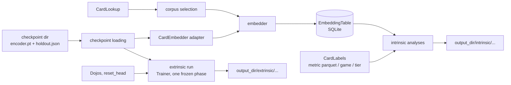

# evaluation: post-training evaluation of embedding checkpoints

## Scope

The earlier design notes in `src/evaluation/` have been replaced by a
stub `README.md` pointing here. Skeleton work follows this plan.

`src/evaluation/` measures finished encoder checkpoints, offline. It is
a library of composable pieces called by hand from a script, not an
experiment framework: `Trainer` never calls it, and there is no
first-class "experiment" object. The first intended use is manual:
take a single-card and a multi-card checkpoint and produce t-SNE plots
and cluster/compactness numbers for both, and learning curves for the
single-card one (multi-card extrinsic runs are near-term). Longer term:
comparing checkpoints/architectures/seeds (including trained vs.
untrained of the same architecture) and tracking one run's checkpoints
over time. Outputs are files on disk (plots, CSV, JSON) in an output
directory the caller picks (by convention `data/evaluations/<name>/`),
reproducible from a re-run with the same inputs and seeds.

Evaluation is agnostic to how a checkpoint was trained: it never
validates or compares the `HoldoutSpec`s (or any other training
configuration) of the encoders it is given. Encoders being compared
*should* usually share a training `HoldoutSpec` for the comparison to
mean much, but that is the caller's judgment, not a checked rule.

Two families, split by whether a new model is fit on top of the frozen
embeddings:

- **Intrinsic** - no model is fit. Embed a set of cards once, then run
any number of analyses over the stored embeddings (t-SNE plot,
cluster-then-match, label compactness, and more later).
- **Extrinsic** - a fresh dojo decoder head is trained on the frozen
encoder; its loss curve is the measurement. Compared across encoders
on the same dojo(s).

Domain shift away from the training regime (a withheld card, a
withheld set, a withheld game) is not an evaluation mode of its own. It
is expressed through *which cards go in* (corpus selection) and *how
they are labeled* (a holdout-tier label computed from the checkpoint's
`HoldoutSpec`). Evaluation embeds cards exactly as stored: it applies
no card mods and creates no synthetic variants.

MVP limits:

- Intrinsic: context-free single-card embeddings only - a
`SingleCardModel`, or a `MultiCardModel` embedding every card as its
own list of one (via its `CardEmbedder` adapter), i.e. its isolated-card
encoding.
- Extrinsic: single-card-input dojos only. Either model may be passed.
The canonical `forward` of both models (`CardEncoderModel`,
`src/encoder_model/card_encoder_model.py`) always reads its input as a
batch, so on a single-card dojo a `MultiCardModel` embeds each card on
its own (no attention across batch-mates) - its isolated-card encoding.
- Frozen encoder only (no fine-tuning).
- Categorical labels only.
- No caching in the extrinsic path: the frozen encoder re-encodes every
batch.

Near-term, and the design must not preclude it: extrinsic runs on
multi-card dojos, comparing a contextualized `MultiCardModel` against a
`SingleCardModel` on the same multi-card dojo. This is why the extrinsic
run takes any frozen `TrainableEncoder` (the model itself), not a
`CardEmbedder`. Nothing in the extrinsic path assumes context-free
encoding: a batch of multi-card inputs goes to
`forward_batched_multi_card`, which contextualizes each example only
against itself.


## Component overview




### Checkpoint loading (outside `evaluation/`: `schema/holdout.py`, `training/recording/`)

An evaluation needs the encoder weights from a checkpoint directory,
and optionally the `HoldoutSpec` the run trained with - only as an
input the caller may hand to a holdout-tier label, never for
validation. Today `DirectoryCheckpointer` writes
`encoder.pt` (`encoder_only_state_dict()`) and `manifest.json`
containing `repr(plan)`, which cannot be parsed back. This plan adds a
lossless JSON round trip to `HoldoutSpec`, has the checkpointer write
`holdout.json` next to the weights, and adds loaders. Rebuilding the
model object itself stays the caller's job for the MVP (the driver
constructs the architecture and loads `encoder.pt` into it).

### Corpus selection

Which cards to embed: every card of one or more games from a
`CardLookup` (`all_cards(source_game)` per game), optionally narrowed
to cards of given `CardTier`s under a given `HoldoutSpec`. A generator
over existing types; no new stored state. The tier filter selects an
exact set of tiers (e.g. only VALIDATION cards), which is not what
`VisibleCardLookup` does (nested per-split visibility for training), so
it is not reused here.

### CardEmbedder adapters (outside `evaluation/`: `encoder_model/`)

Placed in `encoder_model/` despite evaluation being the only consumer:
each adapter is a view of a specific model class and depends on its
explicit forward methods, so it changes with the model, not with
evaluation.

A context-free "cards in, one vector per card out" view of a model,
used by the embedder (intrinsic path only). Both models already provide
it: `forward_batched_single_card(cards)` embeds each card on its own in
one batched pass (for `MultiCardModel`, self-attention over length-one
sequences). The adapters call only that.

The adapter owns
eval mode and `no_grad` for its calls and exposes only the embedding
size, so callers never reach through to the model.

### Embedder

Takes a `CardEmbedder`, a corpus, and an open `EmbeddingTable`; embeds
in batches and appends. A card whose `nocab_uuid` is already in the
table is skipped, so an interrupted run resumes and a second corpus can
extend the same table - within the games the table was created for.

### EmbeddingTable

A SQLite file (same precedent as `DeckBox`) with a metadata record and
one row per card, keyed by `nocab_uuid`, holding its `source_game` and
its vector. Two cards with identical content (e.g. functional reprints)
simply store the same vector twice. Unlike `DeckBox` (batched commits,
explicit `flush()`/`save()`), every `add()` is committed before it
returns - the embedder's resume guarantee depends on it. The binder
versions are recorded once at creation and never checked: extending a
table from a different binder version is the caller's responsibility.

One table = one encoder; comparing encoders means comparing tables.

### CardLabels

A Protocol mapping a card row to a categorical label or `None` (not
labeled; excluded from that analysis). MVP implementations:

- **Metric parquet labels** - reads a per-card categorical metric's
parquet the way dojos do, using only its `nocab_uuid` and `label`
columns (e.g. `MaskedFieldMetric` output: `nocab_uuid`,
`masked_field`, `label`); other columns ignored; labels converted with
`str()`. Takes one or more parquets, so a per-game metric family (e.g.
the planned rarity metrics, one per game) forms one label source for
a multi-game corpus. Unlike `GenericDojo`, it does not check the
metric's embedded binder version against the current binder (same
"recorded, never checked" policy as the table; `nocab_uuid`s are
stable).
- **Game labels** - `source_game.value`.
- **Holdout tier labels** - `HoldoutSpec.tier_of(nocab_uuid, source_game)` under the checkpoint's spec: the domain-shift label.

First label sets planned: game (easy), a cross-game normalized rarity
(medium), MtG set (hard). Game labels need nothing outside this plan.
MtG set labels come later.

**Outside this plan:** the rarity labels depend on a cross-game rarity
metric family in `data_refinement/metrics/`, which this plan does not
design. It is tracked in `src/data_refinement/metrics/TODO.md` ("Cross-game
rarity metric family"). Evaluation consumes it only through
`MetricParquetLabels` over its per-game parquets.

### Intrinsic analyses

A Protocol with one shared call - run over an `EmbeddingTable`, write
files into an output directory, return a result. Anything else an
analysis needs (labels, a sampling rule, a seed, hyperparameters) is
constructor input, so analyses with and without labels share the
Protocol. MVP analyses:

- **Projection plot** - 2D projection colored by a label; seeded and
with fixed hyperparameters so plots are comparable across tables.
Illustrative only; always reported next to a quantitative analysis.
- **Cluster agreement** - cluster with no knowledge of labels, then
permutation-invariant agreement (ARI/NMI) against the labels.
- **Label compactness** - how tightly cards group by their known label
(silhouette, nearest-centroid accuracy).

Corpora reach 10^4-10^5+ cards, so every analysis that is super-linear
or plots points takes an explicit, seeded **sampling** rule (all, or a
per-label cap). The same table contents + seed + rule selects the same
card rows.

(Library choices - openTSNE for scale, KMeans/HDBSCAN - are feature-level
decisions, not fixed here.)

### Extrinsic run

An extrinsic run *is* a training run: dojo heads trained on a frozen
encoder. It reuses `Trainer` unchanged in kind; evaluation owns only
*what* to run and *how to compare*, `training/` stays the one place that
knows *how to train*. No second training loop.

For each encoder under comparison, on the same dojos (built by the
caller with whatever `HoldoutSpec` it chooses; `Trainer` still requires
all dojos in one run to share one): take the encoder model itself as a
`TrainableEncoder` (a `SingleCardModel`; later a contextualized
`MultiCardModel` on multi-card dojos, see open questions), call `reset_head()` on every
dojo, build a `TrainingPlan` with one `Phase` (`encoder_trainable=False`,
every passed dojo in its diet - the diet *is* the `dojos` argument, so
no dojo is ever scored with an untrained head - no held-out dojos), and
run `Trainer` with
no checkpointer and a `CsvRunListener` (`training/recording/run_listener.py`:
one row per (round, dojo)) writing into
`<output_dir>/extrinsic/<encoder_label>/`. After `Trainer.run()`
returns, one VALIDATION pass scores the final heads (the last round's
weights - no best-round restore, since nothing was checkpointed) at the
same precision and batch budget as Trainer's own TEST passes (both
taken from `HardwareLimits`; precision is applied inside
`evaluate_split_losses`), and is written next to the rounds CSV. If the
run stopped early for any reason (`stopped_early_reason` set: repeated
failures may have corrupted the weights; every dojo quarantined means
no head finished training), the VALIDATION pass is skipped. A plotting step overlays
every encoder's TEST curve per dojo. An untrained baseline is just
another encoder input, not special-cased code.

Every dojo must have a trainable head: a frozen encoder plus a
head-less dojo (e.g. `ContrastiveDojo`, whose `trainable_parameters()`
is empty) has nothing to train, so `run_extrinsic` rejects it up front.
(A frozen encoder's contrastive TEST loss is a fixed number - closer to
an intrinsic measurement; see open questions.)

Comparability across encoders: the caller reuses the *same dojo
objects* for every encoder. `reset_head()` restores each head to the
state it had when the dojo was built (`GenericDojo`), so every encoder's
run starts from an identical head; building fresh dojos per encoder
would instead give each a different random head unless torch was
seeded before construction. `GenericDojo` reads TRAIN in file order;
the remaining randomness (mods drawing on global `random`, the diet
sampler) is fixed by `run_extrinsic` seeding Python `random` and
`torch` from `spec.seed` before each run and passing `spec.seed` as
the plan's seed. Each run writes into a fresh directory
(`FileExistsError` if `<output_dir>/extrinsic/<encoder_label>/` exists),
since `CsvRunListener` appends.

The run stops at the phase's saturation rule like any training phase;
unequal curve lengths plot fine, and rounds-to-saturation is itself a
signal. A caller wanting a fixed budget sets `patience_rounds` above
`max_rounds`.

Dojos run exactly as built, including their own `ModPipeline` (a
masked-field dojo still masks its target field); evaluation neither
adds nor removes mods. Comparing a dojo with and without masking means
the caller builds it both ways. Which dojos, and whether a dojo's task
is meaningful with frozen embeddings, is the caller's choice, not a
property of this harness. This is also the follow-up to training's
`TrainingPlan.held_out_dojos`: during training those are scored with
never-trained heads; an extrinsic run trains heads for them on the
frozen encoder.

### Changes to `training/` that extrinsic reuse needs

Each is justified for training on its own; none makes `Trainer` aware
of evaluation.

1. **Optional checkpointer.** `Trainer` accepts `checkpointer=None`:
no saves, no `on_checkpoint` calls, `TrainingResult.best_checkpoint`
is `None`. Chosen over a no-op `Checkpointer` object because that
would have to return a `CheckpointRecord` with fabricated paths.
Also serves training smoke tests and dry runs.
2. **Frozen phases keep the encoder in eval mode.** `_train_round`
calls `model.train(phase.encoder_trainable)` instead of
`model.train(True)`, so a frozen encoder runs without dropout while
heads train. Dojo heads are not the model and are unaffected. Fixes
training's own head-only phases too.
3. **Elapsed time on every round.** `RoundReport` gains
`elapsed_seconds` (monotonic, since `Trainer.run()` started);
`CsvRunListener` writes it as a new column; appending to a rounds CSV
whose header differs raises `ValueError` rather than misaligning
columns. `Trainer` logs and skips listener exceptions, so such a run
continues but that CSV gets no rows (a warning each round). Enables a
loss-vs-time axis; useful in training logs as well. A required field:
every existing `RoundReport(...)` construction is updated
(`trainer.py`; `tests/training/test_run_listener.py`,
`test_reports.py`, `test_checkpointer.py`).
4. **Split- and precision-parameterized scoring pass.**
`evaluate_test_losses` becomes `evaluate_split_losses(..., split,
precision, ...)`; `Trainer` calls it with `Split.TEST` and its own
precision, `run_extrinsic` with `Split.VALIDATION`. The autocast logic
now private to `Trainer` (`_autocast`, `_device_type`,
`_AUTOCAST_DTYPES`) moves to one shared helper in `training/` used by
both, so precision handling is never duplicated. Callers to update:
`trainer.py`, `tests/training/test_round_evaluation.py`. (Change 1
leaves existing `Trainer(...)` calls, e.g.
`scripts/smoke_test_training_loop.py`, valid as written.) The module
docstring, which calls the pass TEST-only, is updated to match, as is
`src/training/README.md` (its `round_evaluation.py` entry, the
`evaluate_test_losses` participant in its sequence diagram, and a new
entry for `precision.py`, and its overview diagram's checkpoint-only
`evaluation/` edge - extrinsic runs also construct `Trainer`). The
`TrainingPlan.held_out_dojos` docstring (`plan.py`) is reworded: the
per-round held-out scores are the loop's own signal; evaluation trains
fresh heads for those dojos instead. `src/training/recording/README.md` gains
`holdout.json`, the checkpoint loaders and `read_rounds_csv`/`RoundRow`.
5. **`CsvRunListener` creates its directories on first write**, not in
`__init__` (today `run_listener.py:75-76`). Constructing a listener then
has no side effect, so a caller can build every object - including a
`Trainer`, whose constructor does the plan/dojo validation - before
anything touches disk. The module docstring's "(and, later,
evaluation/) attach here" is dropped: evaluation adds no listener.

Guard rule: `Trainer` never gets an "evaluation mode" flag and
`training/` never imports `evaluation/`. If a future extrinsic need can
only be met by `Trainer` knowing it is being used for evaluation, that
is the point to write a separate loop - not before.

### Scripts

Hand-written `scripts/` (or notebook) code composes the pieces above
directly: load checkpoint(s), select a corpus, embed into one table per
encoder, run whichever analyses are wanted; separately, extrinsic runs
per encoder. No shared driver or configuration schema.

### Output layout (convention, not enforced)

```
data/evaluations/<name>/
  embeddings/<encoder_label>.db
  intrinsic/<encoder_label>/<analysis_name>/...   (plots, metrics JSON)
  extrinsic/<encoder_label>/rounds.csv
  extrinsic/<encoder_label>/validation.json
  extrinsic/plots/...
```


## Contract manifest

Existing contracts this plan depends on (cited, unchanged unless noted):

```python
# src/data_refinement/card_binder/card_lookup.py
class CardLookup(Protocol):
    def all_cards(self, source_game: GameId) -> Iterable[GenericCard]: ...
    def version_for(self, source_game: GameId) -> str: ...

# src/schema/holdout.py
@dataclass(frozen=True)
class HoldoutSpec:
    seed: int
    tier_ratios: tuple[float, float, float]
    held_out_games: frozenset[GameId]
    def tier_of(self, nocab_uuid: UUID, source_game: GameId) -> CardTier: ...

# src/encoder_model/card_encoder_model.py - base of SingleCardModel and MultiCardModel
class CardEncoderModel(nn.Module):
    def forward(self, x: BatchedTrainingInput) -> BatchedModelOutput: ...  # always batched
    def forward_batched_single_card(self, x: BatchedSingleCardInput) -> BatchedSingleCardEmbedding: ...
        # each card embedded on its own; MultiCardModel attends over length-one sequences
    def forward_multi_card(self, x: MultiCardInput) -> MultiCardEmbedding: ...
        # one group, cards contextualized together (MultiCardModel: NOT context-free)

# src/training/trainable_encoder.py
class TrainableEncoder(Protocol):
    training: bool
    def __call__(self, inputs: BatchedTrainingInput) -> BatchedModelOutput: ...
    def parameters(self) -> Iterator[nn.Parameter]: ...
    def train(self, mode: bool = True) -> "TrainableEncoder": ...
    def state_dict(self) -> Mapping[str, Tensor]: ...
    def encoder_only_state_dict(self) -> Mapping[str, Tensor]: ...

# src/dojos/dojo.py - Dojo.name, Dojo.holdout, Dojo.trainable_parameters(), Dojo.reset_head()
# src/training/plan.py - Phase(encoder_trainable=False, ...), TrainingPlan(holdout=...),
#   HardwareLimits
# src/training/trainer.py - requires dojo.holdout == plan.holdout; encoder params
#   filtered on requires_grad; a frozen phase sets requires_grad=False on them
# src/schema/splits.py - Split.TRAIN / VALIDATION / TEST
```

Existing contracts this plan changes (see "Changes to `training/`", "CardEmbedder adapters" and "Extrinsic run"):

```python
# src/training/trainer.py
class Trainer:
    def __init__(self, model: TrainableEncoder, dojos: Sequence[Dojo],
                 plan: TrainingPlan, limits: HardwareLimits,
                 checkpointer: Checkpointer | None,          # was: Checkpointer
                 listeners: Sequence[RunListener], *,
                 cost_of: Callable[[GenericCard], int] = lambda card: 1) -> None: ...
    # behavior: each round calls model.train(phase.encoder_trainable)  (was: train(True))

# src/training/recording/reports.py
@dataclass(frozen=True)
class RoundReport:
    phase: str
    round_index: int
    step: int
    elapsed_seconds: float        # new: monotonic seconds since Trainer.run() began
    per_dojo_test_loss: Mapping[str, float]
    statuses: Mapping[str, DojoStatus]
    quarantined: frozenset[str]
# CsvRunListener: rounds CSV gains an elapsed_seconds column; __init__ has no side
#   effect (directories created on first write); ValueError when appending to a CSV
#   whose header differs.

# src/training/recording/run_listener.py - new: the writer's module also reads it back
@dataclass(frozen=True)
class RoundRow:                 # one rounds-CSV row
    phase: str
    round_index: int
    step: int
    elapsed_seconds: float
    dojo: str
    test_loss: float
    status: DojoStatus | None     # the CSV's "" (no status) parses to None
    quarantined: bool
def read_rounds_csv(path: Path) -> list[RoundRow]: ...
    # file order; FileNotFoundError; ValueError if the header is not the current one

# src/dojos/dojo.py - Dojo.reset_head docstring aligned with GenericDojo's behavior
class Dojo(Protocol):
    def reset_head(self) -> None: ...
        # restores the head to its as-built initial state (was: "Re-initialize");
        # deterministic, so repeated runs on one dojo start from the same head

# src/training/precision.py - new; the logic of Trainer._autocast/_device_type/_AUTOCAST_DTYPES
def device_type_of(model: TrainableEncoder) -> str: ...
    # device type of the model's first parameter ("cuda" also on ROCm); "cpu" if none.
    # Used by autocast_for and by Trainer's GradScaler construction.
def autocast_for(model: TrainableEncoder, precision: Precision) -> ContextManager[Any]: ...
    # torch.autocast on device_type_of(model) at `precision`; nullcontext for fp32

# src/training/round_evaluation.py  (replaces evaluate_test_losses)
def evaluate_split_losses(model: TrainableEncoder, dojos: Sequence[Dojo],
                          split: Split, budget: BatchBudget, max_examples: int,
                          precision: Precision) -> Mapping[str, float]: ...
    # forward passes under autocast for `precision` on the model's device
    # (no-op for fp32); otherwise unchanged: eval mode + no_grad, prior mode
    # restored, a failing dojo is logged and omitted
```

New boundaries:

```python
# --- schema/holdout.py + training/recording (checkpoint -> evaluation) ---
class HoldoutSpec:
    def to_json(self) -> str: ...
    @classmethod
    def from_json(cls, text: str) -> "HoldoutSpec": ...   # ValueError on malformed input

# src/training/recording/checkpointer.py - the module that writes a checkpoint
# also reads it back. DirectoryCheckpointer additionally writes
# <checkpoint_dir>/holdout.json.
def load_checkpoint_holdout(checkpoint_dir: Path) -> HoldoutSpec: ...
    # FileNotFoundError if holdout.json is absent (checkpoints predating this plan)
def load_encoder_weights(checkpoint_dir: Path, model: nn.Module) -> None: ...
    # loads encoder.pt into a caller-constructed model;
    # FileNotFoundError if encoder.pt is absent; RuntimeError on key mismatch


# --- encoder_model (context-free card embedding) ---
class CardEmbedder(Protocol):
    """Context-free: embed_cards(cards)[i] depends only on cards[i].
    Runs in eval mode under no_grad regardless of caller state; the model's
    prior train/eval mode is restored afterwards, even on error
    (same as evaluate_split_losses)."""
    embedding_dim: int
    def embed_cards(self, cards: Sequence[GenericCard]) -> Tensor: ...
        # float32, shape (len(cards), embedding_dim), on the CPU

class SingleCardEmbedder:      # adapter over forward_batched_single_card
    def __init__(self, model: SingleCardModel, embedding_dim: int) -> None: ...
class IsolatedMultiCardEmbedder:   # adapter over forward_batched_single_card
    def __init__(self, model: MultiCardModel) -> None: ...
        # embedding_dim read from model.card_embedding_size


# --- evaluation: corpus -> embedder -> table ---
@dataclass(frozen=True)
class CorpusSpec:
    games: frozenset[GameId]
    tier_filter: "TierFilter | None"            # None = every card

@dataclass(frozen=True)
class TierFilter:
    holdout: HoldoutSpec
    tiers: frozenset[CardTier]

def select_corpus(cards: CardLookup, spec: CorpusSpec) -> Iterator[GenericCard]: ...

@dataclass(frozen=True)
class EmbeddingTableMetadata:
    encoder_label: str             # name used in output paths and plots
    checkpoint_dir: Path | None    # None for an untrained encoder
    embedding_dim: int
    binder_versions: Mapping[GameId, str]   # CardLookup.version_for per game
    created_at: datetime

@dataclass(frozen=True)
class CardRow:
    nocab_uuid: UUID
    source_game: GameId

class EmbeddingTable:
    @classmethod
    def create(cls, path: Path, metadata: EmbeddingTableMetadata) -> "EmbeddingTable": ...
        # FileExistsError if path exists
    @classmethod
    def open(cls, path: Path) -> "EmbeddingTable": ...
        # FileNotFoundError; ValueError if the file is not an EmbeddingTable
    def close(self) -> None: ...
    def __enter__(self) -> "EmbeddingTable": ...
    def __exit__(self, *exc_info: object) -> None: ...   # calls close()
    metadata: EmbeddingTableMetadata
    def has_card(self, nocab_uuid: UUID) -> bool: ...
    def add(self, rows: Sequence[CardRow], vectors: np.ndarray) -> None: ...
        # float32 (len(rows), embedding_dim); ValueError on shape mismatch;
        # an already-present nocab_uuid is left unchanged; committed before return;
        # ValueError (whole call rejected, nothing committed) if any row's
        # source_game is not a key of metadata.binder_versions - a table's
        # games are fixed at create()
    def rows(self) -> list[CardRow]: ...
        # sorted by nocab_uuid - order depends only on contents, never on insertion,
        # so seeded sampling is reproducible across tables
    def vectors_for(self, rows: Sequence[CardRow]) -> np.ndarray: ...
        # (len(rows), embedding_dim), same order; KeyError on an unknown nocab_uuid

def embed_corpus(embedder: CardEmbedder, corpus: Iterable[GenericCard],
                 table: EmbeddingTable, batch_size: int) -> int: ...
    # ValueError up front if embedder.embedding_dim != table.metadata.embedding_dim;
    # propagates EmbeddingTable.add's ValueError for a card of a game the table
    # was not created for (earlier batches stay committed)
    # returns cards added; cards whose nocab_uuid is already present are skipped;
    # commits after every batch, so an interrupted run loses at most one batch


# --- evaluation: labels ---
class CardLabels(Protocol):
    name: str
    def label_of(self, row: CardRow) -> str | None: ...

class MetricParquetLabels:     # per-card categorical metric parquet
    def __init__(self, name: str, parquet_paths: Sequence[Path]) -> None: ...
        # ValueError if parquet_paths is empty, any parquet lacks nocab_uuid/label
        # columns, or a nocab_uuid appears in more than one row across all the
        # files (e.g. a per-deck metric); labels via str()
class GameLabels:
    def __init__(self) -> None: ...          # name = "game"
class HoldoutTierLabels:
    def __init__(self, holdout: HoldoutSpec) -> None: ...   # name = "holdout_tier"


# --- evaluation: intrinsic analyses ---
class CardSample(Protocol):
    def select(self, rows: Sequence[CardRow],
               labels: CardLabels | None, seed: int) -> list[CardRow]: ...
# MVP: AllCards(), PerLabelCap(max_per_label: int) - ValueError if labels is None.
# Rows whose label is None are dropped by every label-using sample/analysis.

@dataclass(frozen=True)
class AnalysisResult:
    files: tuple[Path, ...]
    scalars: Mapping[str, float]     # e.g. {"ari": 0.41, "nmi": 0.52}; also written as scalars.json

class EmbeddingAnalysis(Protocol):
    name: str
    def run(self, table: EmbeddingTable, output_dir: Path) -> AnalysisResult: ...
        # output_dir is this analysis's own directory (caller composes
        # .../intrinsic/<encoder_label>/<name>/); run creates it.
        # FileExistsError if it already exists and is non-empty.
# MVP: ProjectionPlot, ClusterAgreement, LabelCompactness - each takes its
# labels / CardSample / seed / hyperparameters in its constructor.
# run raises ValueError if, after sampling and dropping unlabeled rows, fewer
# than two cards remain, or (for label-using analyses) fewer than two distinct
# labels remain; nothing is written in that case.


# --- evaluation: extrinsic ---
@dataclass(frozen=True)
class ExtrinsicSpec:
    diet_rule: DietRule
    head_lr: float
    steps_per_round: int
    max_rounds: int
    saturation: SaturationSpec
    eval_examples_per_dojo: int     # cap for both the per-round TEST and final VALIDATION pass
    seed: int

@dataclass(frozen=True)
class ExtrinsicResult:
    rounds_csv: Path | None
        # CsvRunListener output; None if the file does not exist after the run
        # (no round completed, or the listener's writes failed - Trainer swallows them)
    validation_losses: Mapping[str, float] | None
        # final heads; also written as validation.json. None if the run stopped
        # early, and then validation.json is not written.
    stopped_early_reason: str | None            # from TrainingResult
    quarantined: frozenset[str]
        # dojos quarantined by the end of the run (final RoundReport; empty if
        # none completed). Their VALIDATION loss, if any, is for an under-trained
        # head; also written into validation.json alongside the losses.

def run_extrinsic(encoder: TrainableEncoder, encoder_label: str, dojos: Sequence[Dojo],
                  spec: ExtrinsicSpec, hardware: HardwareLimits,
                  output_dir: Path) -> ExtrinsicResult: ...
    # Order: (a) validate - the FileExistsError check, run_extrinsic's own
    # checks, then building Phase/TrainingPlan from spec, CsvRunListener (no
    # side effect, change 5) and Trainer (its constructor is the single source
    # of plan/dojo validation; not re-implemented here); (b) only then seed,
    # reset_head(), run. A call that fails validation leaves nothing on disk and can be retried.
    # Every dojo is in the one frozen phase's diet (dojo names come from `dojos`).
    # Seeds random/torch from spec.seed; calls reset_head() on every dojo (restores
    # the as-built head, so reusing dojo objects across encoders gives every
    # encoder the same starting head); runs
    # Trainer(checkpointer=None); then a VALIDATION pass unless stopped early.
    # The run's TrainingPlan.holdout is taken from the dojos. The encoder's
    # training HoldoutSpec is never consulted.
    # Raises: ValueError if dojos is empty or any dojo's trainable_parameters()
    #   yields no parameters (consume the iterable - GenericDojo returns a
    #   generator, which is always truthy);
    #   any ValueError from Phase/TrainingPlan construction (e.g. steps_per_round or
    #   max_rounds < 1, negative head_lr, eval_examples_per_dojo < 1) or from
    #   Trainer.__init__ (duplicate dojo names, dojos disagreeing on holdout),
    #   all raised before any side effect.
    #   FileExistsError if output_dir/extrinsic/<encoder_label>/ exists.
    # Side effects: after validation and before Trainer.run(), creates
    #   output_dir/extrinsic/<encoder_label>/ itself (so it exists even if no
    #   round completes; a retry after a run-time failure then needs a new label
    #   or the directory removed - by design, since a partial run is a real
    #   result). Writes rounds.csv (if any round completed) and validation.json
    #   (unless stopped early); trains the dojos' heads;
    #   leaves the encoder with requires_grad=False and in eval mode;
    #   reseeds the process-wide `random` and `torch` generators.

def plot_learning_curves(curves: Mapping[str, Path], output_dir: Path,
                         x_axis: Literal["step", "elapsed_seconds"] = "step") -> tuple[Path, ...]: ...
    # encoder_label -> rounds CSV, read only via read_rounds_csv (evaluation never
    # parses the CSV itself); one overlay plot per dojo of TEST loss vs x_axis.
    # output_dir is the plots directory itself; created if missing; existing
    # plot files of the same name are overwritten (plots are cheap to regenerate).
```


## Open questions

- **Recording what produced an output directory.** Not needed for the
first hand-driven runs. If repeated runs make it worth it later, a
small README or config dump per output directory (which checkpoints,
corpus, seeds) - not an experiment framework.
- **Frozen contrastive loss as a measurement.** A head-less dojo's
TEST loss on a frozen encoder needs no training - it could become an
intrinsic analysis or a zero-step extrinsic score. Not in MVP.
- **Explicit "no saturation" option.** The fixed-budget workaround
(`patience_rounds > max_rounds`) is adequate for the MVP; a named
option on `SaturationSpec` may be worth it if it gets used often.
- **Held-out set rung.** `HoldoutSpec` supports whole-game and per-card
hash holdout only. A held-out set/expansion within a game needs a new
declarative field (not a callable, so equality and `to_json` keep
working), and card data needs a normalized set field or a per-game
extractor. Deferred past MVP.
- **Architecture in the checkpoint.** Whether a checkpoint records
enough to rebuild its model object, instead of the driver constructing
it (and supplying `embedding_dim`).
- **`SingleCardModel` vs. `MultiCardModel` on one multi-card dojo**
(near-term). Whether that comparison needs anything beyond two
`run_extrinsic` runs.
- **Intrinsic evaluation of contextualized / deck-level embeddings.**
Deferred; not shaping the MVP. Directions to discuss later: deck
embeddings (pooled card embeddings, or a dedicated deck token) grouped
by deck-level labels, or averaging an anchor card's embedding over
random companion sets. Any of these is a new embedder and possibly a
new table shape, not an extension of `CardEmbedder`.
- **Fine-tuned extrinsic runs** (`encoder_trainable=True`). Out of MVP.
- **Caching in the extrinsic path.** Deferred until frozen runs prove
slow. If added: a `TrainableEncoder` wrapper keyed by card content (not
`nocab_uuid`, so dojo-masked cards are distinct entries and dojos need
no change), valid for context-free encoders only.
- **Embedding stability under card perturbation.** A possible later
intrinsic analysis (how far a card's embedding moves under a
perturbation, or a robustness check). Deferred; would bring back
card-level mods and variants, which the MVP deliberately omits.

