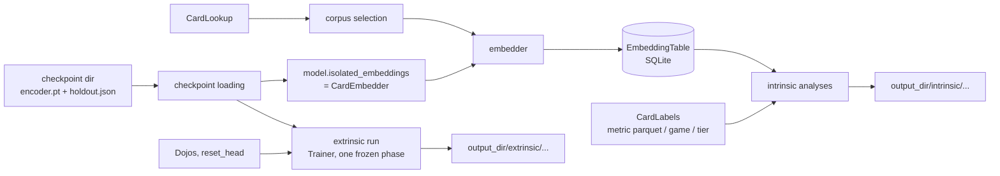

# evaluation: post-training evaluation of embedding checkpoints

## Scope

The earlier design notes in `src/evaluation/` have been replaced by a
stub `README.md` pointing here. Skeleton work follows this plan.

`src/evaluation/` measures finished encoder checkpoints, offline. It is
a library of composable pieces called by hand from a script, not an
experiment framework: `Trainer` never calls it, and there is no
first-class "experiment" object. The first intended use is manual:
take a single-card and a multi-card checkpoint and produce t-SNE plots
and cluster/compactness numbers for both, and learning curves for the
single-card one (multi-card extrinsic runs are near-term). Longer term:
comparing checkpoints/architectures/seeds (including trained vs.
untrained of the same architecture) and tracking one run's checkpoints
over time. Outputs are files on disk (plots, CSV, JSON) in an output
directory the caller picks (by convention `data/evaluations/<name>/`),
reproducible from a re-run with the same inputs and seeds.

Evaluation is agnostic to how a checkpoint was trained: it never
validates or compares the `HoldoutSpec`s (or any other training
configuration) of the encoders it is given. Encoders being compared
*should* usually share a training `HoldoutSpec` for the comparison to
mean much, but that is the caller's judgment, not a checked rule.

Two families, split by whether a new model is fit on top of the frozen
embeddings:

- **Intrinsic** - no model is fit. Embed a set of cards once, then run
any number of analyses over the stored embeddings (t-SNE plot,
cluster-then-match, label compactness, and more later).
- **Extrinsic** - a fresh dojo decoder head is trained on the frozen
encoder; its loss curve is the measurement. Compared across encoders
on the same dojo(s).

Domain shift away from the training regime (a withheld card, a
withheld set, a withheld game) is not an evaluation mode of its own. It
is expressed through *which cards go in* (corpus selection) and *how
they are labeled* (a holdout-tier label computed from the checkpoint's
`HoldoutSpec`). Evaluation embeds cards exactly as stored: it applies
no card mods and creates no synthetic variants.

MVP limits:

- Intrinsic: context-free single-card embeddings only - a
`SingleCardModel`, or a `MultiCardModel` embedding every card as its
own list of one (`CardEncoderModel.isolated_embeddings`), i.e. its
isolated-card encoding.
- Extrinsic: single-card-input dojos only. Either model may be passed.
The canonical `forward` of both models (`CardEncoderModel`,
`src/encoder_model/card_encoder_model.py`) always reads its input as a
batch, so on a single-card dojo a `MultiCardModel` embeds each card on
its own (no attention across batch-mates) - its isolated-card encoding.
- Frozen encoder only (no fine-tuning).
- Categorical labels only.
- No caching in the extrinsic path: the frozen encoder re-encodes every
batch.

Near-term, and the design must not preclude it: extrinsic runs on
multi-card dojos, comparing a contextualized `MultiCardModel` against a
`SingleCardModel` on the same multi-card dojo. This is why the extrinsic
run takes any frozen `TrainableEncoder` (the model itself), not the
context-free `CardEmbedder` view. Nothing in the extrinsic path assumes context-free
encoding: a batch of multi-card inputs goes to
`forward_batched_multi_card`, which contextualizes each example only
against itself.


## Component overview




### Checkpoint loading - built (step 1)

`load_encoder_weights(dir, model)` and `load_checkpoint_holdout(dir)` in
`training/recording/checkpointer.py`; `DirectoryCheckpointer` writes
`holdout.json` (`HoldoutSpec.to_json`). See
`src/training/recording/README.md`. The `HoldoutSpec` is only an input a
caller may hand to a holdout-tier label, never used for validation.
Rebuilding the model object stays the caller's job for the MVP.

### Corpus selection, Embedder, EmbeddingTable - built (step 3a)

`select_corpus`/`CorpusSpec`/`TierFilter`, `EmbeddingTable` (SQLite, rows
sorted by `nocab_uuid`, always finite) and `embed_corpus` (resumable;
log-and-skip failed batches, `max_consecutive_failures` cap). See
`src/evaluation/README.md`.

### Context-free embedding on the model - built (step 2)

`CardEncoderModel.embedding_dim` (from `EmbeddingHead.output_dim`, the one
source of the width) and `isolated_embeddings(cards, precision)`, sharing
`inference_context` with `evaluate_split_losses`. See
`src/encoder_model/README.md`. No adapter classes: evaluation depends on
the `CardEmbedder` Protocol (in `evaluation/embedding/embed_corpus.py`), which both models
satisfy structurally.

### CardLabels - built (step 3b)

`CardLabels` Protocol with `MetricParquetLabels`, `GameLabels`,
`HoldoutTierLabels`; see `src/evaluation/README.md`. First label sets
planned: game (available now), a cross-game normalized rarity (medium),
MtG set (hard, later).

**Outside this plan:** the rarity labels depend on a cross-game rarity
metric family in `data_refinement/metrics/`, which this plan does not
design. It is tracked in `src/data_refinement/metrics/TODO.md` ("Cross-game
rarity metric family"). Evaluation consumes it only through
`MetricParquetLabels` over its per-game parquets.

### Package layout - built (step 3c)

`evaluation/` is grouped by pipeline stage: `card_row.py` and `select_corpus.py`
at the top, then `embedding/` and `labels/` subpackages (see
`src/evaluation/README.md`). The rule, set by the user: each business-logic
class stands in its own file; small data classes and one or two trivial
helper *classes* may share their main class's file; three or more such
helper classes go to a dedicated utilities module (e.g.
`analyses/_shared.py`). Private helper functions of a module's main class
or function stay in its file and do not count toward that limit. No
`__init__` re-exports; files are named after their main symbol. The
layout is expected to evolve as steps 4-5 land. Planned placement:

```
analyses/                    step 4
  embedding_analysis.py      EmbeddingAnalysis Protocol + AnalysisResult,
                             require_fresh_output_dir, write_analysis_result
  card_sample.py             CardSample Protocol + AllCards + PerLabelCap
  labeled_sample.py          LabeledSample + draw_labeled_sample (shared by
                             every label-using analysis)
  cluster_agreement.py / label_compactness.py / projection_plot.py (+ projection_renderer.py)
extrinsic/                   step 5
  run_extrinsic.py           run_extrinsic + ExtrinsicSpec / ExtrinsicResult
  learning_curves.py         plot_learning_curves
  curve_renderer.py          CurveRenderer + CurveStyle
chart_theme.py               ChartTheme: colors/dpi shared by FigureStyle and CurveStyle
```

### Intrinsic analyses - built (step 4)

`ClusterAgreement`, `LabelCompactness` and `ProjectionPlot` (with its
`ProjectionRenderer`/`FigureStyle`), on the shared `EmbeddingAnalysis`
contract, seeded `CardSample` rules and `draw_labeled_sample`; see
`src/evaluation/README.md`. openTSNE only if sampled corpora prove too
slow for scikit-learn's t-SNE.

### Extrinsic run - built (step 5)

`run_extrinsic` and `plot_learning_curves` (with `CurveRenderer` /
`CurveStyle` on the shared `ChartTheme`) in `src/evaluation/extrinsic/`;
see `src/evaluation/README.md`.

### `training/` support for extrinsic reuse - built (step 1)

Optional checkpointer, frozen phases in eval mode, `RoundReport.elapsed_seconds`,
`evaluate_split_losses(split=..., precision=...)` with autocast shared via
`encoder_model/precision.py`, side-effect-free `CsvRunListener` construction
with a header check, and `RoundRow`/`read_rounds_csv`. See
`src/training/README.md` and `src/training/recording/README.md`.

Guard rule: `Trainer` never gets an "evaluation mode" flag and
`training/` never imports `evaluation/`. If a future extrinsic need can
only be met by `Trainer` knowing it is being used for evaluation, that
is the point to write a separate loop - not before.

### Scripts

Hand-written `scripts/` (or notebook) code composes the pieces above
directly: load checkpoint(s), select a corpus, embed into one table per
encoder, run whichever analyses are wanted; separately, extrinsic runs
per encoder. No shared driver or configuration schema.

### Output layout (convention, not enforced)

```
data/evaluations/<name>/
  embeddings/<encoder_label>.db
  intrinsic/<encoder_label>/<analysis_name>/...   (plots, metrics JSON)
  extrinsic/<encoder_label>/rounds.csv
  extrinsic/<encoder_label>/validation.json
  extrinsic/plots/...
```


## Contract manifest

Existing contracts this plan depends on (cited, unchanged unless noted):

```python
# src/data_refinement/card_binder/card_lookup.py
class CardLookup(Protocol):
    def all_cards(self, source_game: GameId) -> Iterable[GenericCard]: ...
    def version_for(self, source_game: GameId) -> str: ...

# src/schema/holdout.py
@dataclass(frozen=True)
class HoldoutSpec:
    seed: int
    tier_ratios: tuple[float, float, float]
    held_out_games: frozenset[GameId]
    def tier_of(self, nocab_uuid: UUID, source_game: GameId) -> CardTier: ...

# src/encoder_model/card_encoder_model.py - base of SingleCardModel and MultiCardModel
class CardEncoderModel(nn.Module):
    def forward(self, x: BatchedTrainingInput) -> BatchedModelOutput: ...  # always batched
    def forward_batched_single_card(self, x: BatchedSingleCardInput) -> BatchedSingleCardEmbedding: ...
        # each card embedded on its own; MultiCardModel attends over length-one sequences
    def forward_multi_card(self, x: MultiCardInput) -> MultiCardEmbedding: ...
        # one group, cards contextualized together (MultiCardModel: NOT context-free)

# src/training/trainable_encoder.py
class TrainableEncoder(Protocol):
    training: bool
    def __call__(self, inputs: BatchedTrainingInput) -> BatchedModelOutput: ...
    def parameters(self) -> Iterator[nn.Parameter]: ...
    def train(self, mode: bool = True) -> "TrainableEncoder": ...
    def state_dict(self) -> Mapping[str, Tensor]: ...
    def encoder_only_state_dict(self) -> Mapping[str, Tensor]: ...

# src/dojos/dojo.py - Dojo.name, Dojo.holdout, Dojo.trainable_parameters(), Dojo.reset_head()
# src/training/plan.py - Phase(encoder_trainable=False, ...), TrainingPlan(holdout=...),
#   HardwareLimits
# src/training/trainer.py - requires dojo.holdout == plan.holdout; encoder params
#   filtered on requires_grad; a frozen phase sets requires_grad=False on them
# src/schema/splits.py - Split.TRAIN / VALIDATION / TEST
```

Built in step 1 and now existing (cited; see the training READMEs):

```python
# src/training/trainer.py - Trainer(..., checkpointer: Checkpointer | None, listeners, *,
#   cost_of=...); frozen phases keep the encoder in eval mode
# src/training/recording/reports.py - RoundReport.elapsed_seconds
# src/training/recording/run_listener.py - CsvRunListener (no side effect until first
#   write; ValueError on header mismatch), RoundRow, read_rounds_csv(path) -> list[RoundRow]
# src/encoder_model/precision.py - Precision, ParameterOwner,
#   device_type_of(model) -> str, autocast_for(model, precision) -> ContextManager
# src/training/round_evaluation.py - evaluate_split_losses(model, dojos, *, split,
#   budget, max_examples, precision) -> Mapping[str, float]
# src/schema/holdout.py - HoldoutSpec.to_json() / from_json(text)
# src/training/recording/checkpointer.py - load_checkpoint_holdout(dir) -> HoldoutSpec,
#   load_encoder_weights(dir, model) -> None
# src/dojos/dojo.py - Dojo.reset_head restores the as-built head, deterministically
```

New boundaries:

```python
# --- encoder_model: built in step 2 (see src/encoder_model/README.md) ---
# CardEncoderModel.embedding_dim -> int; CardEncoderModel.isolated_embeddings(cards,
#   precision="fp32") -> float32 (N, embedding_dim) CPU Tensor; EmbeddingHead.output_dim;
#   MultiCardModel(text_encoder, embedding_head, num_heads, num_layers);
#   precision.inference_context(model, precision)

# --- evaluation: built in steps 3a-3c (see src/evaluation/README.md) ---
# src/evaluation/card_row.py - CardRow(nocab_uuid, source_game)
# src/evaluation/select_corpus.py - CorpusSpec(games, tier_filter), TierFilter(holdout, tiers),
#   select_corpus(cards, spec) -> Iterator[GenericCard]
# src/evaluation/embedding/embedding_table.py - EmbeddingTable.create/open/add/has_card/
#   rows/vectors_for; require_finite_vectors, NonFiniteEmbeddingError
# src/evaluation/embedding/embedding_table_metadata.py - EmbeddingTableMetadata
#   (to_json / from_json)
# src/evaluation/embedding/embed_corpus.py - CardEmbedder Protocol,
#   embed_corpus(embedder, corpus, table, batch_size, precision, *,
#   max_consecutive_failures=5) -> int
# src/evaluation/labels/card_labels.py - CardLabels Protocol (name,
#   label_of(row) -> str | None), GameLabels(), HoldoutTierLabels(holdout)
# src/evaluation/labels/metric_parquet_labels.py - MetricParquetLabels(name, parquet_paths)


# --- evaluation: intrinsic analyses - built in step 4 (see src/evaluation/README.md) ---
# src/evaluation/analyses/embedding_analysis.py - EmbeddingAnalysis Protocol (name,
#   run(table, output_dir) -> AnalysisResult), AnalysisResult(files, scalars),
#   require_fresh_output_dir, write_analysis_result(output_dir, scalars, extra_files)
# src/evaluation/analyses/card_sample.py - CardSample Protocol, AllCards, PerLabelCap(n)
# src/evaluation/analyses/labeled_sample.py - LabeledSample, draw_labeled_sample
# src/evaluation/analyses/cluster_agreement.py - ClusterAgreement(labels, sample, seed, n_init)
# src/evaluation/analyses/label_compactness.py - LabelCompactness(labels, sample, seed)
# src/evaluation/analyses/projection_plot.py - ProjectionPlot(labels, sample, seed, *,
#   perplexity, max_iter, highlighted, max_panels, renderer)
# src/evaluation/analyses/projection_renderer.py - FigureStyle, ProjectionRenderer(style)


# --- evaluation: extrinsic - built in step 5 (see src/evaluation/README.md) ---
# src/evaluation/extrinsic/run_extrinsic.py - ExtrinsicSpec, ExtrinsicResult,
#   run_extrinsic(encoder, encoder_label, dojos, spec, hardware, output_dir, *, cost_of)
# src/evaluation/extrinsic/learning_curves.py - plot_learning_curves(curves, output_dir,
#   x_axis="step", *, renderer=CurveRenderer()) -> tuple[Path, ...]
# src/evaluation/extrinsic/curve_renderer.py - CurveStyle, CurveRenderer(style)
# src/evaluation/chart_theme.py - ChartTheme (shared by FigureStyle and CurveStyle)
```


## Open questions

- **Metric-parquet label convention.** `MetricParquetLabels` is the third
reader hard-coding `nocab_uuid` + a literal `label` column (after
`masked_field.py` and `deck_card_mask.py`); the convention belongs to
`data_refinement/metrics`. Give it a shared home if a fourth consumer
appears (likely the rarity family).
- **Left to the skeleton step:** typed constructors of `ProjectionPlot`,
`ClusterAgreement`, `LabelCompactness`, and the exact fields of
`validation.json` (losses + `quarantined`).

- **Recording what produced an output directory.** Not needed for the
first hand-driven runs. If repeated runs make it worth it later, a
small README or config dump per output directory (which checkpoints,
corpus, seeds) - not an experiment framework.
- **Frozen contrastive loss as a measurement.** A head-less dojo's
TEST loss on a frozen encoder needs no training - it could become an
intrinsic analysis or a zero-step extrinsic score. Not in MVP.
- **Explicit "no saturation" option.** The fixed-budget workaround
(`patience_rounds > max_rounds`) is adequate for the MVP; a named
option on `SaturationSpec` may be worth it if it gets used often.
- **Held-out set rung.** `HoldoutSpec` supports whole-game and per-card
hash holdout only. A held-out set/expansion within a game needs a new
declarative field (not a callable, so equality and `to_json` keep
working), and card data needs a normalized set field or a per-game
extractor. Deferred past MVP.
- **Run manifest (instead of a TrainingConfig).** Decided against a
config schema that constructs objects: driver scripts are the config.
If reproducibility records are needed later: lossless JSON for
`TrainingPlan`/`HardwareLimits` (as `HoldoutSpec` gets here), written
into the checkpoint manifest, plus a small closed `ModelSpec` (model
class, text encoder, head type and dims) saved with each checkpoint so
evaluation can rebuild the model without the original script (and stop
asking the caller for `embedding_dim`). Dojos recorded by name only.
- **`SingleCardModel` vs. `MultiCardModel` on one multi-card dojo**
(near-term). Whether that comparison needs anything beyond two
`run_extrinsic` runs.
- **Intrinsic evaluation of contextualized / deck-level embeddings.**
Deferred; not shaping the MVP. Directions to discuss later: deck
embeddings (pooled card embeddings, or a dedicated deck token) grouped
by deck-level labels, or averaging an anchor card's embedding over
random companion sets. Any of these is a new embedder and possibly a
new table shape, not an extension of `CardEmbedder`.
- **Fine-tuned extrinsic runs** (`encoder_trainable=True`). Out of MVP.
- **Caching in the extrinsic path.** Deferred until frozen runs prove
slow. If added: a `TrainableEncoder` wrapper keyed by card content (not
`nocab_uuid`, so dojo-masked cards are distinct entries and dojos need
no change), valid for context-free encoders only.
- **Embedding stability under card perturbation.** A possible later
intrinsic analysis (how far a card's embedding moves under a
perturbation, or a robustness check). Deferred; would bring back
card-level mods and variants, which the MVP deliberately omits.

