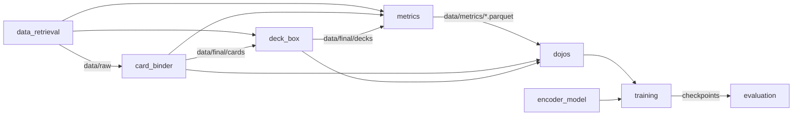

# src

A generic card embedding model: one shared embedding space for cards
from any trading card game, trained through many small pluggable tasks
("dojos") rather than one. The embedding model is the product; the
dojos are the teachers. Everything produced or consumed on disk lives
under the project's `data/` directory (not in git).

## How the pieces fit together

Two flows hand data between containers as files on disk:

1. **Card ingestion**: raw dump -> a `CardIngestionStage` -> the
   `CardBinder` (`data/final/cards/<game>.jsonl`), which gives every card
   its stable `nocab_uuid`. Everything downstream depends on it. Decks
   follow the same shape into the `DeckBox` (`data/final/decks/<game>.db`).
2. **Metric -> dojo**: raw dump -> a metric -> a parquet of (input, label)
   rows under `data/metrics/` -> a dojo, which looks each row's cards up
   in the binder. [`../docs/metric_dojo_inventory.csv`](../docs/metric_dojo_inventory.csv)
   lists every metric and the dojo that reads it.

## Containers

| Container | Status | What it is |
|---|---|---|
| [`schema/`](schema/) | stable | Shared types every container uses: `GameId`, `GenericCard`, `GenericDeck`, `Provenance`, `DataSource`, `HoldoutSpec`, splits, input/output shape hints. Plain data, no README. |
| [`data_retrieval/`](data_retrieval/README.md) | stable | One downloader per external source, writing untouched raw dumps to `data/raw/`. |
| [`data_refinement/`](data_refinement/README.md) | in progress | Raw data -> the card binder, the deck box, and metric parquets. |
| [`encoder_model/`](encoder_model/README.md) | in progress | The embedding model (PyTorch only): text encoder + embedding head, single- and multi-card. |
| [`dojos/`](dojos/README.md) | in progress | Training tasks: each yields batches within the trainer's budget and scores embeddings with its own small decoder head and loss. |
| [`training/`](training/README.md) | in progress | `Trainer`: phases, rounds and steps over a diet of dojos, with saturation-based stopping, fault isolation and checkpointing. Run on CPU against real dojos; no driver script yet. |
| [`evaluation/`](evaluation/) | not started | Post-training evaluation of the embedding itself (intrinsic: how the space is used, clusters; extrinsic: unseen dojos, cards and games). Distinct from the dojos' own train/test/validation splits. |

## A naming note: `Dojo` vs. `Gym`

A **`Dojo`** is a non-episodic task: example in, label, loss out, the
supervised/multi-task shape every task here uses. **`Gym`** is reserved,
unused, for a reinforcement-learning-shaped task (episodic
`reset()`/`step()`, rewards), so that if one is ever added its name says
which kind of loop it needs.
