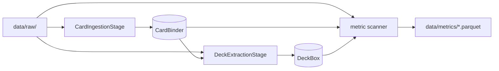

# data_refinement

Turns raw data written by `data_retrieval` (`data/raw/`) into this
project's own schema (`src/schema/`) and training labels. Everything it
writes lands under `data/final/` (cards, decks) or `data/metrics/`
(labels).

## Containers

- **[`card_binder/`](card_binder/README.md)** - `CardBinder`, the
  multi-game card store that gives every card its stable `nocab_uuid`,
  plus one `CardIngestionStage` per card source. Every other flow
  depends on it. Output: `data/final/cards/<game>.jsonl`.
- **[`deck_box/`](deck_box/README.md)** - `DeckBox`, the multi-game deck
  store (SQLite, CRUD by `nocab_uuid`), plus one `DeckExtractionStage`
  per deck source. Output: `data/final/decks/<game>.db`.
- **[`metrics/`](metrics/README.md)** - one directory per raw source,
  each turning that source into (training input, label) parquet files
  a dojo reads. Output: `data/metrics/<source>/`.

## How it works



Card ingestion runs first: deck extraction and metrics both look cards
up in the binder, so a game's binder must exist before either runs.

## How to run

```
PYTHONPATH=. python3 scripts/run_card_binder_ingestion.py --source scryfall
PYTHONPATH=. python3 scripts/run_deck_box_ingestion.py --source play_gwent
PYTHONPATH=. python3 scripts/run_metrics.py --source gwent_one
```

Each script takes `--list`, `--source <name>` or `--all`.
