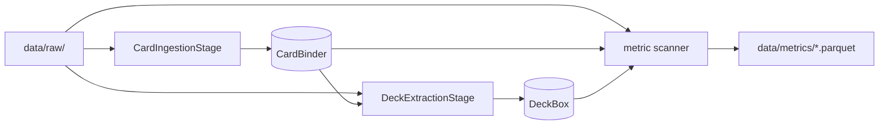

# data_refinement

Turns raw data written by `data_retrieval` (`data/raw/`) into this
project's own schema (`src/schema/`) and training labels. Everything it
writes lands under `data/final/` (cards, decks) or `data/metrics/`
(labels).

[`CURRENT_STATUS.md`](CURRENT_STATUS.md) tracks which retrieval
sources have binder, deck box and metric coverage, and what to build
next.

## Containers

- **[`card_binder/`](card_binder/README.md)** - `CardBinder`, the
  multi-game card store that gives every card its stable `nocab_uuid`,
  plus one `CardIngestionStage` per card source. Every other flow
  depends on it. Output: `data/final/cards/<game>.jsonl`.
- **[`deck_box/`](deck_box/README.md)** - `DeckBox`, the multi-game deck
  store (SQLite, CRUD by `nocab_uuid`), plus one `DeckExtractionStage`
  per deck source. Output: `data/final/decks/<game>.db`.
- **[`metrics/`](metrics/README.md)** - one directory per raw source,
  each turning that source into (training input, label) parquet files
  a dojo reads. Output: `data/metrics/<source>/`.
- **[`seventeenlands/`](seventeenlands/README.md)** - the 17lands CSV
  chunk parser and deck identity, shared by `deck_box`'s 17lands
  extraction stage and the 17lands metrics, so both store and reference
  the same decks. Imports neither.

[`deck_ids.py`](deck_ids.py) is the one file living directly here
rather than in a container above: `deck_uuid_from_cards()`, the
content-addressed deck-id hashing both `deck_box` (a source's
extraction stage) and `metrics` (that same source's metrics) need to
agree on, so a deck gets the same id on both sides. Kept a sibling of
both rather than inside either, so neither depends on the other just
to reach it.

## How it works


```mermaid
flowchart LR
    Raw[data/raw/] --> Ingest[CardIngestionStage] --> Binder[(CardBinder)]
    Raw --> Extract[DeckExtractionStage] --> Box[(DeckBox)]
    Binder --> Extract
    Raw --> Metric[metric scanner] --> Parquet[data/metrics/*.parquet]
    Binder --> Metric
    Box --> Metric
```

Card ingestion runs first: deck extraction and metrics both look cards
up in the binder, so a game's binder must exist before either runs.

## How to run

```
PYTHONPATH=. python3 scripts/run_card_binder_ingestion.py --source scryfall
PYTHONPATH=. python3 scripts/run_deck_box_ingestion.py --source play_gwent
PYTHONPATH=. python3 scripts/run_metrics.py --source gwent_one
```

Each script takes `--list`, `--source <name>` or `--all`.
