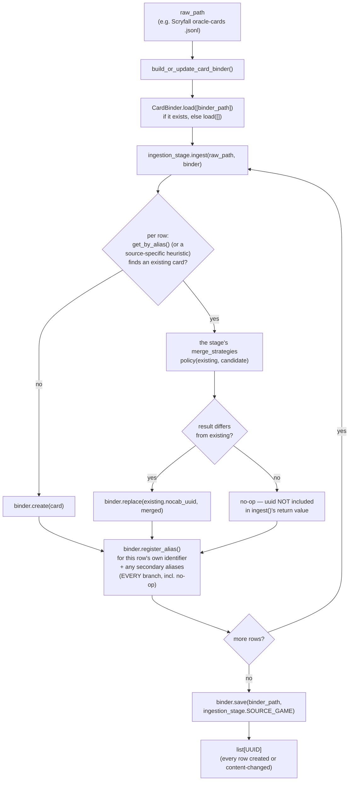

# card_binder

The standardized, multi-game card store every other `data_refinement`
stage (and `training`, downstream) reads from and writes into. Converts
a raw per-source card dump (Scryfall, Pokemon TCG, gwent.one,
spire-codex, ...) into `GenericCard` records, keyed by `nocab_uuid`.
`GameId`/`GenericCard`/`GenericDeck` themselves live in `src/schema/`,
not here — this container consumes that shared vocabulary, it doesn't
own it.

`card_binder` is one shared, cross-source capability: every source's
`CardIngestionStage` writes into the same `CardBinder`, and every
downstream consumer reads through the same facade.

## Identity is nocab_uuid only — nothing else

`CardBinder` has no opinion about "sameness" beyond `nocab_uuid`. It
does **not** enforce any uniqueness invariant over name, alias, or
anything else — a name can legitimately map to several distinct
cards (see `spire_codex/`'s Strike/Defend below), and `CardBinder`
neither knows nor cares.

A `nocab_uuid`, once minted for a card, is never regenerated by
anything in this container — a `save()`/`load()` round trip returns
the exact same uuid for the exact same card, always.

Deciding whether a raw row is a duplicate of an already-stored card,
and what to do about it if so, is entirely each `CardIngestionStage`
implementation's own job (see `ingestion.py`), performed as direct
`create()`/`update()`/`replace()`/`register_alias()` calls against a
live `CardBinder` it's handed. No single identity rule (e.g. "name is
unique per game") applies to every source — MTG's Scryfall names
really are unique, but Slay the Spire 2 has 5 distinct cards named
"Strike" (one per character) and Pokemon has same-named-but-different
reprints — so each source decides its own identity key against its
own data, rather than `CardBinder` assuming one rule fits every game.

## Full CRUD, uuid-targeted; a richer set of source-agnostic reads

Writes on `CardBinder` all target a `nocab_uuid` directly:

- `create(card)` — insert a brand-new card; raises if the uuid is
  already stored (use `update()`/`replace()` instead).
- `update(nocab_uuid, raw_content_patch=None, name=None, provenance=None)`
  — a shallow dict-merge into the existing card's `raw_content`
  (existing keys overwritten, others untouched), optionally also
  overwriting `name`/`provenance`.
- `replace(nocab_uuid, card)` — full swap of everything except the
  uuid itself (conceptually delete-then-add). `card.nocab_uuid` must
  equal the target uuid.
- `delete(nocab_uuid)` — remove a card entirely.

Reads don't presume any uniqueness:

- `get_by_uuid(nocab_uuid) -> GenericCard | None`
- `get_by_name(source_game, name) -> list[GenericCard]` — a name can
  resolve to more than one card (e.g. Slay the Spire 2's Strike).
- `get_by_name_single(source_game, name, strict=True) -> GenericCard | None`
  — convenience for callers that
  know their game's names are actually unique: `strict=True` raises on
  ambiguity, `strict=False` returns one of the matches, unspecified
  which.
- `get_by_name_regex(source_game, pattern) -> list[GenericCard]` —
  generic, source-agnostic search. `card_lookup.uuid_for_name_or_front_face()`
  builds on it for sources that spell a split/MDFC card by its front
  face only.
- `get_by_alias(source_game, data_source, source_id) -> GenericCard | None`
- `all_uuids(source_game=None)` / `all_cards(source_game)` —
  enumeration, with an optional/required game filter respectively.
- `version_for(source_game) -> str` — a content hash over every
  currently-held `source_game` card (sorted by `nocab_uuid`, keyed on
  `nocab_uuid`/`name`/`raw_content` only — `provenance` is excluded, so
  a no-op re-ingest keeps the same version). Derived, not persisted:
  recomputed on every call, so it can never itself go stale. Every
  metric writer under `metrics/` embeds the version it scanned as
  parquet schema metadata (see `metrics/version_metadata.py`), and
  `GenericDojo`/`ContrastiveDojo` check it against the live binder at
  construction, raising if a metric was built from a since-changed
  binder (`strict_version_check=False` opts out).

## The "Unknown" sentinel card

`ensure_unknown_card(source_game) -> GenericCard` looks up (or, on first
call for a game, creates) a well-known placeholder card named
`UNKNOWN_CARD_NAME` ("Unknown") — for a consumer (e.g. a
`deck_box/`'s `DeckExtractionStage`) that needs *some* `nocab_uuid` to
substitute for a raw card reference that fails to resolve, rather than
dropping that reference entirely. Its `nocab_uuid` is deterministic
(`uuid5` over a fixed namespace and `source_game`, not a random
`uuid4`), so every caller across every process agrees on the same
sentinel identity without needing to share state; the lookup checks
that uuid directly (`get_by_uuid`), never by name, so a real card that
happens to also be named "Unknown" is never mistaken for it. Seeding
is a deliberate, explicit bootstrap step — nothing in this container
calls it automatically, and a `DeckExtractionStage` is expected to
require it be called ahead of time rather than create the sentinel
itself (see `deck_box/README.md`'s `sts_gg/` entry for the concrete
consumer).

## Why there's an `AliasLedger`, not just one `source_id` field

A `GenericCard` only has room for one *current* external identifier
(`provenance.source_id`) — the one belonging to whichever content is
currently stored. Two things break if that were the only way to look a
card up:

1. **A merged-away candidate's identifier would become a dead end.**
   If two rows turn out to be the same card and one's content wins,
   the *other's* own `source_id` still needs to remain resolvable to
   the surviving card — otherwise a caller who only knows that
   identifier could never find it again. Collision handling lives in
   each `CardIngestionStage`, not `CardBinder`, so this guarantee is
   each stage's own responsibility: every stage in this
   container calls `register_alias()` for a row's own primary
   identifier on *every* branch of its collision handling, not only
   the branches that change stored content — there's no structural
   enforcement of this (a deliberately accepted risk, not solved
   centrally), so it's worth checking for in any new stage.
2. **A single card can carry several identifiers across several
   external systems at once** — a Scryfall row can carry `oracle_id`,
   `arena_id`, `mtgo_id`, `mtgo_foil_id`, and multiple `multiverse_ids`
   entries simultaneously, each in its own namespace (see
   `scryfall/ingestion_stage.py`). One `source_id` field can't
   represent "this card resolves under four different systems."

`AliasLedger` (`alias_ledger.py`) is the fix: a private,
`CardBinder`-owned `(source_game, data_source, source_id) ->
nocab_uuid` table, populated via `register_alias()`. `CardBinder` is a
Facade (PATTERNS.md) over both its own card store and this table —
nothing outside `card_binder/` ever holds an `AliasLedger` reference
directly; every interaction goes through `CardBinder.get_by_alias()`/
`register_alias()`. Persisted as a sibling `<name>.alias_ledger.jsonl`
file next to the main `<name>.jsonl`.

## Read-only access: `CardLookup`

Any consumer that should only ever read — never `create()`/`update()`/
`replace()`/`delete()`/`register_alias()` — should type against
`CardLookup` (`card_lookup.py`), not `CardBinder` directly. It's
`CardBinder`'s own read surface (`get_by_uuid`, `get_by_name`,
`get_by_name_single`, `get_by_alias`, `get_by_name_regex`,
`all_uuids`, `all_cards`) named as its own `typing.Protocol` — not a
new capability, just that subset with the write methods excluded. A
real `CardBinder` satisfies it structurally, so no wrapper object ever
gets constructed. Every dojo reads cards through a `CardLookup`
(narrowed further per split by `visible_card_lookup.py`).

A `CardIngestionStage`, by contrast, needs both read *and* write
access, and is typed to accept a full `CardBinder` directly — no
narrower read/write Protocol exists for that case. This is a
deliberately accepted risk: a stage technically *can* call
`save()`/`load()` itself even though it's never expected to; the
maintenance cost of another Protocol file was judged not worth
guarding against a mistake a stage has no reason to make.

## What goes in `raw_content`: content rules for ingestion stages

The binder is meant to be a clean, high-signal, one-card-one-entry data
source, a candidate for publishing on its own. So `raw_content` is a lean
description of the card as a game object, and derived or aggregate facts
about a card (say, "does it have a marvel printing?") belong in a dedicated
metric, not in the binder. It is also what the text encoder reads
(`encoder_model/` serializes it as compact JSON, verbatim). The ingestion stage is the only code that knows
its source, so it decides what stays; the raw dump stays on disk in
`data/raw/`, so trimming loses nothing the project cannot re-derive. The
serializer applies no per-game logic.

Why it matters: an untrimmed Scryfall row is ~2,350 tokens (median) and
only ~5% of that describes the card as a game object; the rest is image
and purchase URLs, IDs, prices and legality tables. Trimmed as below it is
~140. The text encoder truncates, so noise placed ahead of the rules text
pushes the rules text out entirely. Measurements and the full analysis:
`src/training/Notes.md` (section 7).

Rules of thumb when writing a stage:

1. **Keep the game object, drop the rest.** Keep what a player would use
   to describe the card (name, cost, type, rules text, stats). Drop what
   describes a printing, a product, an image or a database row: URLs, IDs,
   timestamps, prices, artists, image/border/finish metadata, collector
   numbers, API envelope fields (`object`, `lang`).
2. **Detect noise by value shape, not only key name.** A string that is a
   URL, a UUID or an ISO date is almost always noise, whatever its key
   (key-name rules miss odd ones like Gwent's `artid`). This one rule is
   most of the saving.
3. **Omit empty values** (`null`, `""`, `[]`, `{}`, `false`), but keep `0`
   (a power of 0 matters). Exception: when `null` is the source's default
   and an explicit `false` marks the exceptions (a tri-state field, e.g.
   STS2 `can_be_generated_in_combat`), the `false` is information; keep it.
   Also check that no key a consumer indexes directly can be empty, or
   dropping empties turns into a `KeyError` downstream.
4. **Never remove a key a metric or dojo reads or predicts.** Masked-field
   metrics and dojos read `raw_content` keys directly (Gwent: `set`,
   `rarity`, `faction`, `color`, `type`, `armor`, `provision`, `power`;
   Dominion: `type`, `set`, `cost`). Search `metrics/` and `dojos/` for the
   game before dropping a key. Conversely, do not keep a field that gives a
   masked one away (a masked `set` next to a `set_name`) - real, found-by-
   checking examples: Gwent's `category` was exactly `"Leader"` on every
   card with `color == "leader"` and never otherwise, pure duplication, so
   it is dropped for them (see `gwent_one/ingestion_stage.py`); Gwent's
   `faction-duo`, when present, always contains the true `faction` as its
   own prefix, but it is not pure duplication (it names a genuine second
   faction), so `FactionMaskDojo` masks it alongside `faction` instead of
   the stage dropping it (see `dojos/gwent_one/masked_field_dojos.py`).
   Check every masking dojo against the real data, not just by reasoning
   about the field names.
5. **Bound lists and drop references to other cards.** A Scryfall token
   lists every card that creates it (one token was 12,681 tokens). Names of
   other cards also leak held-out cards into this card's text.
6. **Collapse tables of enums** (Scryfall `legalities`: 195 tokens as
   `{format: status}`, ~40 as a list of the non-default statuses), or
   question whether they belong on the card at all.
7. **Remove duplicated information** within a card. Equal strings
   (`drop_repeated_strings`, keeping the first) and the same thing in
   another form: FaB `types`/`classes`/`talents`/`subtypes` are all inside
   `typebox`; STS2 `description_raw` is the template of `description` and
   `vars`/`powers_applied` restate its numbers; Pokemon `retreatCost` is
   a list of "Colorless" whose length is `convertedRetreatCost`. Prefer the
   canonical form over the per-print display variant (FaB `face_1_true_*`
   over `face_1_rules_text`). Equal numbers or lists can be coincidence, so
   check before dropping them.
8. **Normalize small things:** `3.0` to `3`; strip presentation markup
   where that is trivial (`map_strings`): color tags like `[gold]`, line
   breaks like `{br}`. Keep markup that is a game symbol (`[energy:1]`).
9. **Order keys:** identity and short structured fields first, long free
   text last, so truncation only eats the tail. (An augmentation `Mod` may
   shuffle keys later; that is fine.)
10. **When a source has several rows per card, store the card-level answer,
    not one row's.** If a field varies by printing but is a useful label
    (FaB `rarity`), pick a deterministic card-level value (FaB: the least
    restrictive rarity across the English prints) rather than whichever
    row happens to be read last.
11. **Decide which source rows are cards.** A dump can contain rows that
    are not playable cards (Scryfall `art_series` art cards, placeholders).
    Skip or flag them deliberately rather than by accident.
12. **Measure before you finish.** With the project's tokenizer, report
    token percentiles per card, the costliest keys, the keys removed, and
    the number of cards that serialize identically (must be 0). Aim for a
    p99 under ~384 tokens.

The shared, source-independent parts of these rules live in
`lean_content.py` (`strip_noise`, `drop_repeated_strings`, `map_strings`,
`order_keys`); which keys to keep, their order, and which rows are cards
stay in each stage. Bounding lists (rule 5) has no shared helper yet: add
one when a stage needs it. Every stage follows these rules;
`scryfall/ingestion_stage.py` and `cardvault_fabtcg/ingestion_stage.py` are
good worked examples. Measure a stage with `scripts/report_card_content.py
--source <name>`.

## Files

- `card_binder.py` — `CardBinder`, the facade. See "Full CRUD" above
  for the write/read surface; `register_alias()`, `load()`/`save()`,
  `default_output_path(source_game)` round out persistence.
  `DEFAULT_OUTPUT_DIR`/`DEFAULT_OUTPUT_NAME` name this project's
  conventional per-game save location (e.g.
  `CardBinder.default_output_path(GameId.MTG) ==
  Path("data/final/cards/mtg.jsonl")`) — a recommended default, not an
  enforced requirement.
- `merge_strategies.py` — reusable collision policies, each
  `(existing, candidate) -> GenericCard`: `keep_existing`,
  `keep_incoming`, `keep_longer_content` (more serialized `raw_content`
  bytes wins) and `keep_incoming_if_content_differs` (an unchanged
  re-ingest is a no-op). The returned card always carries
  `existing.nocab_uuid`: these decide content, never identity.
- `lean_content.py` — source-independent helpers that keep a card's
  `raw_content` lean (see "What goes in `raw_content`" above).
- `card_lookup.py` — `CardLookup`, described above, plus
  `uuid_for_name_or_front_face()`.
- `visible_card_lookup.py` — `VisibleCardLookup`, a `CardLookup` that
  hides cards a `HoldoutSpec` keeps out of a given split.
- `alias_ledger.py` — `AliasLedger`, described above.
- `ingestion.py` — `CardIngestionStage`, the Strategy Protocol every
  source stage implements: `ingest(self, raw_path, binder) -> list[UUID]`
  plus a `SOURCE_GAME: ClassVar[GameId]`. A stage ingests exactly one
  game, so passing it another game's binder is impossible by
  construction. It does its own identity/collision handling against
  `binder` and returns the `nocab_uuid` of every card it created or
  content-changed.
- `build.py` — `build_or_update_card_binder(raw_path, ingestion_stage, binder_path)`,
  the thin driver: load the binder (or start empty), `ingest()`, save.

One subdirectory per card source, each holding one `ingestion_stage.py`
(its module docstring documents that source's identity key, aliases and
collision policy):

| Directory | Stage | Game | Identity key |
|---|---|---|---|
| `scryfall/` | `ScryfallCardIngestionStage` | MTG | Scryfall `oracle_id` (+ Arena/MTGO/multiverse aliases) |
| `pokemon_tcg/` | `PokemonTcgCardIngestionStage` | Pokemon | heuristic: (name, set code) |
| `gwent_one/` | `GwentOneCardIngestionStage` | Gwent | gwent.one `data-id` |
| `spire_codex/` | `SpireCodexCardIngestionStage` | Slay the Spire 2 | spire-codex card `id` |
| `cardvault_fabtcg/` | `CardVaultFabtcgCardIngestionStage` | Flesh and Blood | cardvault `card_id` (+ `print_id` aliases) |
| `dominiontabs/` | `DominionTabsCardIngestionStage` | Dominion | dominiontabs `card_tag` |

## How it works



## How to run

```
PYTHONPATH=. python3 scripts/run_card_binder_ingestion.py --list
PYTHONPATH=. python3 scripts/run_card_binder_ingestion.py --source scryfall
```

The script knows each source's default raw path (a single file for
Scryfall, spire-codex and cardvault; a directory for pokemon_tcg,
gwent.one and dominiontabs). From Python:

```python
from pathlib import Path
from src.data_refinement.card_binder.build import build_or_update_card_binder
from src.data_refinement.card_binder.card_binder import CardBinder
from src.data_refinement.card_binder.scryfall.ingestion_stage import (
    ScryfallCardIngestionStage,
)
from src.schema.data_source import DataSource
from src.schema.game_id import GameId

changed_uuids = build_or_update_card_binder(
    Path("data/raw/scryfall/oracle-cards-20260912210156.jsonl"),
    ScryfallCardIngestionStage(),
    CardBinder.default_output_path(GameId.MTG),  # data/final/cards/mtg.jsonl
)

binder = CardBinder.load([CardBinder.default_output_path(GameId.MTG)])
binder.get_by_name_single(GameId.MTG, "Lightning Bolt")
binder.get_by_alias(GameId.MTG, DataSource.ARENA, "76497")
```
