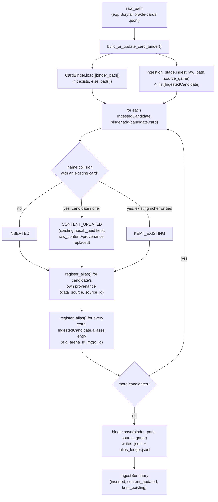

# card_binder

The standardized, multi-game card store every other `data_refinement`
stage (and `training`, downstream) reads from and writes into. Converts
a raw per-source card dump (Scryfall, Pokemon TCG, HearthstoneJSON,
...) into `GenericCard` records, keyed so that "the same card" always
resolves to the same `nocab_uuid`, no matter which source or which
external identifier a caller looks it up by. `GameId`/`GenericCard`/
`GenericDeck` themselves live in `src/schema/`, not here — this
container consumes that shared vocabulary, it doesn't own it.

Unlike the `seventeenlands/` metric pipelines (three separate,
source-specific engines by design — see `seventeenlands/
game_data_metrics/README.md` for why), `card_binder` genuinely is one
shared, cross-source capability: every source's `CardIngestionStage`
feeds the same one `CardBinder`, and every downstream consumer reads
through the same one facade.

## The uniqueness invariant

`CardBinder` enforces one invariant, **at `add()` time, not query
time**: at most one `GenericCard` per `(source_game, name)`. A validly
built binder is guaranteed collision-free by construction, so
`get_by_name()` stays a plain `GenericCard | None` lookup with no
ambiguity to resolve at read time.

On a name collision (a second candidate ingested for a name that
already has a stored card), `add()` compares richness — whichever
card's `raw_content` serializes to more JSON wins (an exact tie favors
the *existing* card, never the incoming one) — but the *existing*
card's `nocab_uuid` always survives the merge, regardless of which
content wins. Identity never moves, even as content improves across
re-ingestion. The winning card's `raw_content` and `provenance` move
together, atomically, from whichever card actually won.

## Why there's an `AliasLedger`, not just one `source_id` field

A `GenericCard` only has room for one *current* external identifier
(`provenance.source_id`) — the one belonging to whichever content is
currently stored. Two things break if that were the only way to look a
card up:

1. **A losing candidate's identifier would become a dead end.** If
   card A wins a name collision against candidate B, B's own
   `source_id` needs to remain resolvable to the same stored card —
   otherwise a caller who only knows B's identifier could never find
   it again.
2. **A single card can carry several identifiers across several
   external systems at once** — a Scryfall row can carry `oracle_id`,
   `arena_id`, `mtgo_id`, `mtgo_foil_id`, and multiple `multiverse_ids`
   entries simultaneously, each in its own namespace (see
   `scryfall/ingestion_stage.py`). One `source_id` field can't
   represent "this card resolves under four different systems."

`AliasLedger` (`alias_ledger.py`) is the fix: a private,
`CardBinder`-owned `(source_game, data_source, source_id) ->
nocab_uuid` table, populated via `register_alias()` for every
identifier a card has ever carried — the winning candidate's, the
losing candidate's, and any extra aliases beyond a candidate's own
primary `provenance`. `CardBinder` is a Facade (PATTERNS.md) over both
its own card store and this table — nothing outside `card_binder/`
ever holds an `AliasLedger` reference directly; every interaction goes
through `CardBinder.get_by_alias()`/`register_alias()`. Persisted as a
sibling `<name>.alias_ledger.jsonl` file next to the main
`<name>.jsonl`, so a saved-and-reloaded binder doesn't lose any alias a
prior session registered.

## Read-only access: `CardLookup`

Any consumer that should only ever read — never `add()`/
`register_alias()` — should type against `CardLookup`
(`card_lookup.py`), not `CardBinder` directly. It's `CardBinder`'s own
read surface (`get_by_uuid`, `get_by_name`, `get_by_alias`,
`get_by_name_regex`, `all_uuids`) named as its own `typing.Protocol` —
not a new capability, just that subset with the write methods
excluded. A real `CardBinder` satisfies it structurally, so no wrapper
object ever gets constructed — a consumer just receives a `CardBinder`
through a `CardLookup`-typed parameter. This gives static-type-level
protection against accidental writes (a function typed to take a
`CardLookup` can't call `.add()`, even on an object that actually is a
`CardBinder`), not runtime enforcement — considered and judged
sufficient for this project's scale (see `plans/training_pipeline.md`).
`training/`'s `Dojo.prepare_splits(corpus: CardLookup, ...)` is the
first consumer; any future read-only consumer (another
`data_refinement` stage, `evaluation/`) should reuse this same type
rather than defining its own narrower one.

## Files

- `card_binder.py` — `CardBinder`, the facade: `get_by_uuid()`,
  `get_by_name()`, `get_by_name_regex()` (a generic, source-agnostic
  search — 17lands-specific fallback logic that calls this lives in
  each `seventeenlands/` pipeline's own resolution code, not here),
  `get_by_alias()`, `all_uuids()`, `add()`, `register_alias()`,
  `load()`/`save()`. `AddOutcome`/`AddResult` (the three possible
  outcomes of one `add()` call: `INSERTED`, `CONTENT_UPDATED`,
  `KEPT_EXISTING`) also live here. `DEFAULT_OUTPUT_DIR`/
  `DEFAULT_OUTPUT_NAME` and the `default_output_path(source_game)`
  staticmethod (e.g. `CardBinder.default_output_path(GameId.MTG) ==
  Path("data/final/cards/mtg.jsonl")`) name this project's
  conventional per-game save location — a recommended default any
  caller may use, not an enforced requirement; `save()`'s own `path`
  parameter stays required regardless.
- `card_lookup.py` — `CardLookup`, described above.
- `alias_ledger.py` — `AliasLedger`, described above. Has no opinion
  about which source wins a naming collision — that's entirely
  `CardBinder.add()`'s job; `AliasLedger` only ever stores/resolves
  identifier mappings it's told to.
- `ingestion.py` — `CardIngestionStage`, the shared Strategy Protocol
  (structural, `typing.Protocol` — matching the convention `Metric`
  elsewhere in this project's architecture already established) every
  raw-source ingestion stage implements: `ingest(raw_path, source_game)
  -> list[IngestedCandidate]`. Deliberately a pure, stateless
  translator — no filtering, no deduplication, and no write access to
  `CardBinder`/`AliasLedger`; a stage only ever returns data.
  `ExternalIdentifier`/`IngestedCandidate` also live here.
- `build.py` — `build_or_update_card_binder()`, the thin driver tying
  one `CardIngestionStage` to a `CardBinder`: load-if-exists, ingest,
  one `add()` + one `register_alias()` per extra identifier per
  candidate, save, return a tallied `IngestSummary`. A plain function,
  not an orchestrator class — matches the "thin runnable snippet"
  pattern `src/data_retrieval/README.md`'s own examples use.
- `scryfall/ingestion_stage.py` — `ScryfallCardIngestionStage`, one
  `CardIngestionStage` implementation, reading a single Scryfall
  oracle-cards `.jsonl` file. Keys off Scryfall's `oracle_id` (not the
  printing-specific `id` field — the oracle-cards bulk dump is already
  deduplicated to one row per `oracle_id`) and extracts
  `arena_id`/`mtgo_id`/`mtgo_foil_id`/each `multiverse_ids` entry as
  aliases, whichever are present on a given row (presence is
  per-row-optional — e.g. an Arena-illegal card has no `arena_id`).
  All Scryfall-specific identity-extraction knowledge lives here, not
  in `CardBinder`/`AliasLedger`, which stay source-agnostic.
- `pokemon_tcg/ingestion_stage.py` — `PokemonTcgCardIngestionStage`,
  the second `CardIngestionStage` implementation. Unlike Scryfall's
  stage, `raw_path` here is a *directory* of pokemon-tcg-data's
  per-set `.json` files (each a JSON array, not JSONL) — every
  `*.json` file directly under `raw_path` is read and every array
  element across all of them becomes one `IngestedCandidate`
  (`CardIngestionStage.ingest`'s docstring documents `raw_path` as
  file-or-directory precisely because of this). Keys off the row's
  `id` field (printing-specific — pokemon-tcg-data has no
  oracle_id-equivalent, so distinct printings sharing a name are
  expected and left for `CardBinder.add()`'s existing richness
  comparison to collapse) as `Provenance.source_id`, under
  `DataSource.POKEMON_TCG`. Always returns an empty `aliases` list —
  no secondary identifier system exists in this data comparable to
  Scryfall's; `nationalPokedexNumbers` is deliberately excluded since
  it identifies a Pokémon species, not a printing, and would collide
  across many distinct cards if registered as an alias.
- `gwent_one/ingestion_stage.py` — `GwentOneCardIngestionStage`, the
  third `CardIngestionStage` implementation, and the first reading raw
  HTML rather than JSON (via `bs4`/BeautifulSoup, `html.parser`
  backend — see `src/data_retrieval/gwent_one/downloader.py`). Like
  `PokemonTcgCardIngestionStage`, `raw_path` here is a *directory* (of
  `page_*.html` files, not per-set `.json` files). Keys off each
  `card-wrap card-data` div's `data-id` attribute (gwent.one's own
  per-card identity) as `Provenance.source_id`, under
  `DataSource.GWENT_ONE`. `raw_content` is a flat dict built from the
  div's other `data-*` attributes (prefix stripped, kept as strings),
  plus `name`/`category` (from nested text, `category` empty-string
  when absent) and `ability_text` — the ability markup's keyword
  `<span>`s unwrapped to plain text and `<br>` tags turned into `\n`
  between ability clauses, matching Scryfall's `oracle_text`
  convention rather than preserving raw HTML. Always returns an empty
  `aliases` list — no secondary identifier system exists in this data,
  same reasoning as `PokemonTcgCardIngestionStage`.

## How it works



## How to run

```python
from pathlib import Path
from src.data_refinement.card_binder.build import build_or_update_card_binder
from src.data_refinement.card_binder.scryfall.ingestion_stage import (
    ScryfallCardIngestionStage,
)
from src.schema.game_id import GameId

summary = build_or_update_card_binder(
    Path("data/raw/scryfall/oracle-cards-20260820090157.jsonl"),
    GameId.MTG,
    ScryfallCardIngestionStage(),
    Path("data/final/cards/mtg.jsonl"),
)
print(summary.inserted, summary.content_updated, summary.kept_existing)
```

```python
# Reading the built binder back — the interface every downstream
# consumer (data_refinement's own metric pipelines, and eventually
# training) actually uses:
from pathlib import Path
from src.data_refinement.card_binder.card_binder import CardBinder
from src.schema.data_source import DataSource
from src.schema.game_id import GameId

binder = CardBinder.load([Path("data/final/cards/mtg.jsonl")])
binder.get_by_name(GameId.MTG, "Lightning Bolt")
binder.get_by_alias(GameId.MTG, DataSource.ARENA, "76497")
```

```python
# gwent.one: raw_path is a directory of page_*.html files, not a
# single file (see gwent_one/ingestion_stage.py's module docstring).
from pathlib import Path
from src.data_refinement.card_binder.build import build_or_update_card_binder
from src.data_refinement.card_binder.gwent_one.ingestion_stage import (
    GwentOneCardIngestionStage,
)
from src.schema.game_id import GameId

summary = build_or_update_card_binder(
    Path("data/raw/gwent_one"),
    GameId.GWENT,
    GwentOneCardIngestionStage(),
    Path("data/final/cards/gwent.jsonl"),
)
```

This file grows as more `CardIngestionStage` implementations (one per
raw source) get added under their own subdirectory here.
