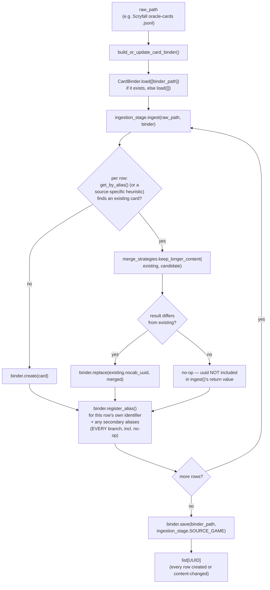

# card_binder

The standardized, multi-game card store every other `data_refinement`
stage (and `training`, downstream) reads from and writes into. Converts
a raw per-source card dump (Scryfall, Pokemon TCG, gwent.one,
spire-codex, ...) into `GenericCard` records, keyed by `nocab_uuid`.
`GameId`/`GenericCard`/`GenericDeck` themselves live in `src/schema/`,
not here — this container consumes that shared vocabulary, it doesn't
own it.

Unlike the `seventeenlands/` metric pipelines (three separate,
source-specific engines by design — see `seventeenlands/
game_data_metrics/README.md` for why), `card_binder` genuinely is one
shared, cross-source capability: every source's `CardIngestionStage`
writes into the same one `CardBinder`, and every downstream consumer
reads through the same one facade.

## Identity is nocab_uuid only — nothing else

`CardBinder` has no opinion about "sameness" beyond `nocab_uuid`. It
does **not** enforce any uniqueness invariant over name, alias, or
anything else — a name can legitimately map to several distinct
cards (see `spire_codex/`'s Strike/Defend below), and `CardBinder`
neither knows nor cares.

A `nocab_uuid`, once minted for a card, is never regenerated by
anything in this container — a `save()`/`load()` round trip returns
the exact same uuid for the exact same card, always.

Deciding whether a raw row is a duplicate of an already-stored card,
and what to do about it if so, is entirely each `CardIngestionStage`
implementation's own job (see `ingestion.py`), performed as direct
`create()`/`update()`/`replace()`/`register_alias()` calls against a
live `CardBinder` it's handed. No single identity rule (e.g. "name is
unique per game") applies to every source — MTG's Scryfall names
really are unique, but Slay the Spire 2 has 5 distinct cards named
"Strike" (one per character) and Pokemon has same-named-but-different
reprints — so each source decides its own identity key against its
own data, rather than `CardBinder` assuming one rule fits every game.

## Full CRUD, uuid-targeted; a richer set of source-agnostic reads

Writes on `CardBinder` all target a `nocab_uuid` directly:

- `create(card)` — insert a brand-new card; raises if the uuid is
  already stored (use `update()`/`replace()` instead).
- `update(nocab_uuid, raw_content_patch=None, name=None, provenance=None)`
  — a shallow dict-merge into the existing card's `raw_content`
  (existing keys overwritten, others untouched), optionally also
  overwriting `name`/`provenance`.
- `replace(nocab_uuid, card)` — full swap of everything except the
  uuid itself (conceptually delete-then-add). `card.nocab_uuid` must
  equal the target uuid.
- `delete(nocab_uuid)` — remove a card entirely.

Reads don't presume any uniqueness:

- `get_by_uuid(nocab_uuid) -> GenericCard | None`
- `get_by_name(source_game, name) -> list[GenericCard]` — a name can
  resolve to more than one card (e.g. Slay the Spire 2's Strike).
- `get_by_name_single(source_game, name, strict=True) -> GenericCard | None`
  — convenience for callers (MTG's 17lands pipelines, `Dojo`) that
  know their game's names are actually unique: `strict=True` raises on
  ambiguity, `strict=False` returns one of the matches, unspecified
  which.
- `get_by_name_regex(source_game, pattern) -> list[GenericCard]` —
  generic, source-agnostic search; 17lands-specific fallback logic
  that calls this lives in each `seventeenlands/` pipeline's own
  resolution code, not here.
- `get_by_alias(source_game, data_source, source_id) -> GenericCard | None`
- `all_uuids(source_game=None)` / `all_cards(source_game)` —
  enumeration, with an optional/required game filter respectively.

## The "Unknown" sentinel card

`ensure_unknown_card(source_game) -> GenericCard` looks up (or, on first
call for a game, creates) a well-known placeholder card named
`UNKNOWN_CARD_NAME` ("Unknown") — for a consumer (e.g. a
`deck_box/`'s `DeckExtractionStage`) that needs *some* `nocab_uuid` to
substitute for a raw card reference that fails to resolve, rather than
dropping that reference entirely. Its `nocab_uuid` is deterministic
(`uuid5` over a fixed namespace and `source_game`, not a random
`uuid4`), so every caller across every process agrees on the same
sentinel identity without needing to share state; the lookup checks
that uuid directly (`get_by_uuid`), never by name, so a real card that
happens to also be named "Unknown" is never mistaken for it. Seeding
is a deliberate, explicit bootstrap step — nothing in this container
calls it automatically, and a `DeckExtractionStage` is expected to
require it be called ahead of time rather than create the sentinel
itself (see `deck_box/README.md`'s `sts_gg/` entry for the concrete
consumer).

## Why there's an `AliasLedger`, not just one `source_id` field

A `GenericCard` only has room for one *current* external identifier
(`provenance.source_id`) — the one belonging to whichever content is
currently stored. Two things break if that were the only way to look a
card up:

1. **A merged-away candidate's identifier would become a dead end.**
   If two rows turn out to be the same card and one's content wins,
   the *other's* own `source_id` still needs to remain resolvable to
   the surviving card — otherwise a caller who only knows that
   identifier could never find it again. Since collision handling now
   lives in each `CardIngestionStage`, not `CardBinder`, this
   guarantee is each stage's own responsibility: every stage in this
   container calls `register_alias()` for a row's own primary
   identifier on *every* branch of its collision handling, not only
   the branches that change stored content — there's no structural
   enforcement of this (a deliberately accepted risk, not solved
   centrally), so it's worth checking for in any new stage.
2. **A single card can carry several identifiers across several
   external systems at once** — a Scryfall row can carry `oracle_id`,
   `arena_id`, `mtgo_id`, `mtgo_foil_id`, and multiple `multiverse_ids`
   entries simultaneously, each in its own namespace (see
   `scryfall/ingestion_stage.py`). One `source_id` field can't
   represent "this card resolves under four different systems."

`AliasLedger` (`alias_ledger.py`) is the fix: a private,
`CardBinder`-owned `(source_game, data_source, source_id) ->
nocab_uuid` table, populated via `register_alias()`. `CardBinder` is a
Facade (PATTERNS.md) over both its own card store and this table —
nothing outside `card_binder/` ever holds an `AliasLedger` reference
directly; every interaction goes through `CardBinder.get_by_alias()`/
`register_alias()`. Persisted as a sibling `<name>.alias_ledger.jsonl`
file next to the main `<name>.jsonl`.

## Read-only access: `CardLookup`

Any consumer that should only ever read — never `create()`/`update()`/
`replace()`/`delete()`/`register_alias()` — should type against
`CardLookup` (`card_lookup.py`), not `CardBinder` directly. It's
`CardBinder`'s own read surface (`get_by_uuid`, `get_by_name`,
`get_by_name_single`, `get_by_alias`, `get_by_name_regex`,
`all_uuids`, `all_cards`) named as its own `typing.Protocol` — not a
new capability, just that subset with the write methods excluded. A
real `CardBinder` satisfies it structurally, so no wrapper object ever
gets constructed. `training/`'s `Dojo.prepare_splits(corpus: CardLookup, ...)`
is the first consumer.

A `CardIngestionStage`, by contrast, needs both read *and* write
access, and is typed to accept a full `CardBinder` directly — no
narrower read/write Protocol exists for that case. This is a
deliberately accepted risk: a stage technically *can* call
`save()`/`load()` itself even though it's never expected to; the
maintenance cost of another Protocol file was judged not worth
guarding against a mistake a stage has no reason to make.

## Files

- `card_binder.py` — `CardBinder`, the facade. See "Full CRUD" above
  for the write/read surface; `register_alias()`, `load()`/`save()`,
  `default_output_path(source_game)` round out persistence.
  `DEFAULT_OUTPUT_DIR`/`DEFAULT_OUTPUT_NAME` name this project's
  conventional per-game save location (e.g.
  `CardBinder.default_output_path(GameId.MTG) ==
  Path("data/final/cards/mtg.jsonl")`) — a recommended default, not an
  enforced requirement.
- `merge_strategies.py` — reusable collision-resolution policies, each
  `(existing: GenericCard, candidate: GenericCard) -> GenericCard`:
  `keep_longer_content` (whichever card's `raw_content` serializes to
  more JSON bytes wins; ties favor `existing`), `keep_existing` (prior
  entry wins unconditionally), `keep_incoming` (new entry wins
  unconditionally). Every function in this module has a hard
  contract: the returned card always carries `existing.nocab_uuid`,
  never `candidate`'s freshly-minted one — these functions decide
  content only, never identity. All four `CardIngestionStage`
  implementations below use `keep_longer_content`.
- `card_lookup.py` — `CardLookup`, described above.
- `alias_ledger.py` — `AliasLedger`, described above. Has no opinion
  about which source wins a collision — that's entirely each
  `CardIngestionStage`'s job now; `AliasLedger` only ever stores/
  resolves identifier mappings it's told to.
- `ingestion.py` — `CardIngestionStage`, the shared Strategy Protocol
  (structural, `typing.Protocol` — matching the convention `Metric`
  elsewhere in this project's architecture already established) every
  raw-source ingestion stage implements:
  `ingest(self, raw_path: Path, binder: CardBinder) -> list[UUID]`,
  plus a `SOURCE_GAME: ClassVar[GameId]` class constant. A stage
  always ingests exactly one game, so `SOURCE_GAME` is a class
  constant rather than an `ingest()` parameter — this makes a
  nonsensical call (e.g. passing a Gwent binder to the Scryfall stage)
  impossible by construction rather than something to check for. A
  stage performs its own identity/collision handling directly against
  `binder` as a side effect (see each stage's own entry below) and
  returns the `nocab_uuid` of every card it created or content-changed
  this run — a card looked up and left untouched is not included.
- `build.py` — `build_or_update_card_binder(raw_path, ingestion_stage, binder_path) -> list[UUID]`,
  the thin driver: `CardBinder.load([binder_path] if it exists else [])`
  → `ingestion_stage.ingest(raw_path, binder)` →
  `binder.save(binder_path, ingestion_stage.SOURCE_GAME)` → return
  `ingest()`'s own `list[UUID]` unchanged. No `source_game` parameter
  of its own — it reads `ingestion_stage.SOURCE_GAME`. A plain
  function, not an orchestrator class — matches the "thin runnable
  snippet" pattern `src/data_retrieval/README.md`'s own examples use.
- `scryfall/ingestion_stage.py` — `ScryfallCardIngestionStage`
  (`SOURCE_GAME = GameId.MTG`), reading a single Scryfall oracle-cards
  `.jsonl` file. Identity is `get_by_alias(GameId.MTG,
  DataSource.SCRYFALL, oracle_id)` — Scryfall's `oracle_id` is a
  perfect natural key (already deduplicates printings to one row per
  card identity), so no heuristic is needed. Also registers
  `arena_id`/`mtgo_id`/`mtgo_foil_id`/each `multiverse_ids` entry as
  secondary aliases, whichever are present on a given row (e.g. an
  Arena-illegal card has no `arena_id`).
- `pokemon_tcg/ingestion_stage.py` — `PokemonTcgCardIngestionStage`
  (`SOURCE_GAME = GameId.POKEMON`), reading a *directory* of
  pokemon-tcg-data's per-set `.json` files (each a JSON array, not
  JSONL). The one stage without a perfect natural key: every row's own
  `id` (e.g. `"swsh8-1"`) is printing-specific, so keying off it
  directly would never collapse anything. Identity is a heuristic:
  `(name, set code)`, where set code is `id.rsplit("-", 1)[0]` (e.g.
  `"swsh8-1"` → `"swsh8"`) — NOT a `"set"` field, which was confirmed
  by sampling the full live corpus (20,444 rows) to be `None` on every
  row. Resolved via `binder.get_by_name(GameId.POKEMON, name)`,
  filtered to whichever match's own `id`-derived set code equals the
  incoming row's. Confirmed against real data that this correctly
  collapses alternate-art/rarity reprints within one set (e.g. "Mew V"
  appears 3× in one set file with identical rules text) while keeping
  cross-set same-named cards distinct. No secondary identifier system
  exists in this data; `nationalPokedexNumbers` is deliberately
  excluded from aliases since it identifies a species, not a printing.
- `gwent_one/ingestion_stage.py` — `GwentOneCardIngestionStage`
  (`SOURCE_GAME = GameId.GWENT`), reading a *directory* of
  `page_*.html` files (via `bs4`/BeautifulSoup, `html.parser` backend
  — see `src/data_retrieval/gwent_one/downloader.py`). Identity is
  `get_by_alias(GameId.GWENT, DataSource.GWENT_ONE, data_id)` — each
  `card-wrap card-data` div's `data-id` attribute is gwent.one's own
  per-card identity, a perfect natural key. `raw_content` is a flat
  dict built from the div's other `data-*` attributes plus
  `name`/`category`/`ability_text` (keyword `<span>`s unwrapped,
  `<br>` turned into `\n`, matching Scryfall's `oracle_text`
  convention). No secondary identifier system exists in this data.
- `spire_codex/ingestion_stage.py` — `SpireCodexCardIngestionStage`
  (`SOURCE_GAME = GameId.SLAY_THE_SPIRE_2`), reading a *single*
  `cards.json` file (a JSON array — spire-codex ships its entire card
  list as one file, not per-set/per-page files). Identity is
  `get_by_alias(GameId.SLAY_THE_SPIRE_2, DataSource.SPIRE_CODEX, id)`
  — each row's `id` (e.g. `"STRIKE_IRONCLAD"` vs `"STRIKE_SILENT"`) is
  already per-character-unique, a perfect natural key. `name` is the
  raw, unmangled `row["name"]` value — even though two names
  ("Strike"/"Defend") repeat once per character (5 rows each, genuinely
  distinct cards, not reprints), no disambiguation is needed: since
  identity is keyed on `id` rather than name, all 5 correctly get
  their own `nocab_uuid`, and `get_by_name("Strike")` on the built
  binder correctly returns all 5.
- `cardvault_fabtcg/ingestion_stage.py` — `CardVaultFabtcgCardIngestionStage`
  (`SOURCE_GAME = GameId.FLESH_AND_BLOOD`), reading a *single*
  `public_card_data.csv` file (one row per print — card x set/reprint
  x print_language x finish). Identity is `get_by_alias(
  GameId.FLESH_AND_BLOOD, DataSource.CARDVAULT_FABTCG, card_id)` —
  `card_id` (e.g. `"10000-year-reunion-1"`) is stable across every
  reprint, every one of the 9 `print_language` values, and every
  finish/rarity of the same card, a perfect natural key structurally
  identical to Scryfall's `oracle_id`. Each row's own `print_id` (e.g.
  `"MST131"`, `"MST131-RF"`) is registered as a secondary alias,
  analogous to Scryfall's `arena_id`/`multiverse_ids`. `name` is
  `face_1_true_name`, joined as `"{face_1} // {face_2}"` when
  `face_2_true_name` is populated (489/46,660 rows — genuine two-faced
  cards, e.g. `"A Drop in the Ocean // Inner Chi"`, same shape as an
  MTG DFC). The one deliberate departure from every other stage's
  single-pass shape: ingestion is two-pass — pass 1 builds/merges
  content from `print_language == "en"` rows only (so a non-English
  row can never win `merge_strategies.keep_longer_content` purely on
  serialized-byte-length and make the canonical name/rules text
  non-English), pass 2 processes every other row and only registers
  its `print_id` as a secondary alias against whichever card pass 1
  already created — safe by construction since every `card_id` in the
  corpus has at least one `en` row.

## How it works



## How to run

```python
from pathlib import Path
from src.data_refinement.card_binder.build import build_or_update_card_binder
from src.data_refinement.card_binder.scryfall.ingestion_stage import (
    ScryfallCardIngestionStage,
)

changed_uuids = build_or_update_card_binder(
    Path("data/raw/scryfall/oracle-cards-20260820090157.jsonl"),
    ScryfallCardIngestionStage(),
    Path("data/final/cards/mtg.jsonl"),
)
```

```python
# Reading the built binder back — the interface every downstream
# consumer (data_refinement's own metric pipelines, and eventually
# training) actually uses:
from pathlib import Path
from src.data_refinement.card_binder.card_binder import CardBinder
from src.schema.data_source import DataSource
from src.schema.game_id import GameId

binder = CardBinder.load([Path("data/final/cards/mtg.jsonl")])
binder.get_by_name_single(GameId.MTG, "Lightning Bolt")
binder.get_by_alias(GameId.MTG, DataSource.ARENA, "76497")
```

```python
# pokemon_tcg / gwent.one: raw_path is a directory, not a single file.
from pathlib import Path
from src.data_refinement.card_binder.build import build_or_update_card_binder
from src.data_refinement.card_binder.pokemon_tcg.ingestion_stage import (
    PokemonTcgCardIngestionStage,
)

changed_uuids = build_or_update_card_binder(
    Path("data/raw/pokemon_tcg/cards"),
    PokemonTcgCardIngestionStage(),
    Path("data/final/cards/pokemon.jsonl"),
)
```

```python
# spire-codex: raw_path is a single cards.json file.
from pathlib import Path
from src.data_refinement.card_binder.build import build_or_update_card_binder
from src.data_refinement.card_binder.spire_codex.ingestion_stage import (
    SpireCodexCardIngestionStage,
)

changed_uuids = build_or_update_card_binder(
    Path("data/raw/spire_codex/cards.json"),
    SpireCodexCardIngestionStage(),
    Path("data/final/cards/slay_the_spire_2.jsonl"),
)
```

```python
# cardvault.fabtcg.com: raw_path is a single public_card_data.csv file.
from pathlib import Path
from src.data_refinement.card_binder.build import build_or_update_card_binder
from src.data_refinement.card_binder.cardvault_fabtcg.ingestion_stage import (
    CardVaultFabtcgCardIngestionStage,
)

changed_uuids = build_or_update_card_binder(
    Path("data/raw/cardvault_fabtcg/public_card_data.csv"),
    CardVaultFabtcgCardIngestionStage(),
    Path("data/final/cards/flesh_and_blood.jsonl"),
)
```

This file grows as more `CardIngestionStage` implementations (one per
raw source) get added under their own subdirectory here.
