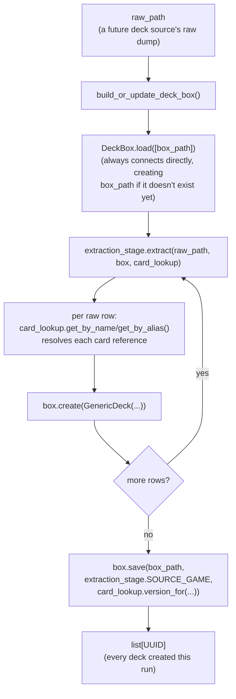

# deck_box

The standardized, multi-game deck store: given a game's already-populated
`CardBinder` (`../card_binder/`), a `DeckExtractionStage` converts one raw
deck source into `GenericDeck` records, held in a `DeckBox` keyed by
`nocab_uuid`. `GameId`/`GenericDeck` live in `src/schema/`, not here — this
container consumes that shared vocabulary, it doesn't own it.

## Why this isn't just `CardBinder` again

`CardBinder`'s non-trivial half — `AliasLedger`, `merge_strategies`,
collision-driven `get_by_alias` — exists because the *same* card recurs
across many raw sources and printings and has to collapse to one identity.
Decks don't have that problem: every raw row a `DeckExtractionStage` sees
is already a distinct deck instance, never merged with another. So
`DeckBox` mirrors only `CardBinder`'s CRUD-by-uuid and load/save shape —
there is no alias ledger, no name index, and no identity-collision handling
anywhere in this container.

## `card_nocab_uuids` is a multiset, not a set

`GenericDeck.card_nocab_uuids` is unordered, but duplicates are meaningful:
a deck running four copies of one card represents that copy count as the
same `nocab_uuid` appearing four times in the list, not a separate count
field. No method on `DeckBox` deduplicates this list; `update()`'s
`card_nocab_uuids` parameter replaces the stored list wholesale rather than
merging into it.

`GenericDeck` also carries no metadata/enrichment field. A
`DeckExtractionStage` produces a flat `card_nocab_uuids` list only —
anything richer (a win/loss label, a run id, per-slot structure) is a
separate metric's own output, referencing the deck's `nocab_uuid`, not a
field on `GenericDeck` itself.

## `GenericDeck.provenance` is optional, unlike `GenericCard`'s

`GenericDeck` carries a `provenance: Provenance | None` field (see
`src/schema/card.py`), mirroring `GenericCard`'s own `provenance` —
which `DataSource`, which raw id, and when it was last fetched.
Optional (defaulting to `None`), unlike `GenericCard.provenance`
(required): a deck already stored before this field existed has no
source to backfill, so `DeckBox.load()` reads such a row as
`provenance=None` rather than raising or guessing. Every
`DeckExtractionStage` in this container supplies a real `Provenance` on
every `create()`/content-changing `update()` it performs, using its own
raw source's `DataSource` member (e.g. `DataSource.STS_GG`,
`DataSource.PLAY_GWENT`) — distinct from whatever `DataSource` its
cards were resolved against (e.g. `DataSource.SPIRE_CODEX`,
`DataSource.GWENT_ONE`), since the deck's raw source and its cards' raw
source are frequently two different systems.

## Other `DeckBox` instances beyond this container's published one

`DeckBox` is just a store — nothing in this class ties an instance to
the published `data/final/decks/` location or to a
`DeckExtractionStage`. `metrics/sts_gg/` uses a second, entirely
separate `DeckBox` instance this way: private to that container, saved
under `data/metrics/sts_gg/` instead, and keyed by a content-derived
id (`create_if_absent()` + `metrics/deck_ids.py`'s
`deck_uuid_from_cards()`) rather than this container's
`uuid5(namespace, run_id)` scheme — see
[`../metrics/sts_gg/README.md`](../metrics/sts_gg/README.md)'s "Deck
references" section for why and how. The two instances are never
merged or cross-referenced.

## Files

- `deck_box.py` — `DeckBox`, the SQLite-backed, multi-game deck store —
  one SQLite file per game (e.g. `data/final/decks/mtg.db`), three
  tables: `decks` (one row per deck, `nocab_uuid` primary key),
  `deck_cards` (the `card_nocab_uuids` multiset, normalized to
  `(deck_uuid, card_uuid, count)` — one row per distinct card, not one
  per copy), and `metadata` (one row per game, holding
  `card_binder_version`). Three regions: **CRUD by UUID**
  (`create`/`create_if_absent`/`update`/`replace`/`delete`,
  `get_by_uuid`, `all_uuids`, `all_decks`, `version_for`,
  `card_binder_version_for`, `uuids_ranked_randomly`), **Persistence**
  (`load`/`save`, `default_output_path`), **Private Helpers** (schema
  setup, per-row reads/writes, and the metadata-invalidation mechanism
  described below). `create()` raises if `nocab_uuid` is already
  stored; `create_if_absent()` is its counterpart for a content-derived
  id scheme (e.g. `metrics/deck_ids.py`'s `deck_uuid_from_cards()`)
  where the same id legitimately recurring across calls is expected,
  not an error — a recurrence is a no-op that returns whatever is
  already stored, without comparing it against the argument; `update()`
  overwrites whichever of `card_nocab_uuids`/`name` are given
  (`None` leaves that field untouched) rather than `CardBinder.update()`'s
  dict-merge, since `GenericDeck` has no dict-shaped field to merge into;
  `replace()` fully swaps a deck's content. Every mutating method
  commits once, as the last thing it does — its own row write(s) and
  any metadata invalidation land together, or a crash before that
  commit leaves the store exactly as if the call had never happened.
  `DEFAULT_OUTPUT_DIR`/`DEFAULT_OUTPUT_NAME` name this project's
  conventional per-game save location (e.g.
  `DeckBox.default_output_path(GameId.MTG) ==
  Path("data/final/decks/mtg.db")`) — a recommended default, not an
  enforced requirement. Only `get_by_uuid`, `all_uuids`, and `all_decks`
  exist as name/uuid-shaped read methods today — no name-based or
  alias-based lookup, and no `decks_containing(card_uuid)`; these are
  deliberately deferred until a real consumer needs them. `all_uuids()`/
  `all_decks()` are lazy generators, not materialized lists — a read
  against a box far larger than memory works the same way a small one
  does. `version_for(source_game) -> str` is a derived content hash
  (same reasoning as `CardBinder.version_for()` — see that container's
  README) over this game's decks, keyed on `nocab_uuid`/`name`/a
  *sorted* `card_nocab_uuids` (a multiset, so incidental list order
  must not affect the hash), streamed in `nocab_uuid` order rather than
  sorting an in-memory list. `card_binder_version_for(source_game) ->
  str | None` reads a real `metadata` row rather than a JSONL
  header-line convention — `None` means either "never stamped" or
  "a prior run's mutating call cleared this game's stamp and no
  `save()` has re-established it since" (see crash-safety below);
  callers checking staleness treat both the same, not a free pass.

  `load(paths)` has three distinct behaviors. `load([])` (or the bare
  `DeckBox()` constructor) opens a fresh `:memory:` box with no path
  association — the sanctioned way to start empty. `load([one_path])`
  **always** connects directly to that path, whether or not it exists
  yet, so every mutating call after that persists immediately as its
  own atomic commit rather than accumulating in memory — this is what
  lets this container's largest source
  (`seventeenlands_game_data`, ~15-20M decks) survive a crash
  mid-ingestion with only genuinely-unprocessed work lost, not
  everything. `load([2+ paths])` always merges into a *fresh*
  `:memory:` connection, last-path-wins on a repeated `nocab_uuid` (and
  on a game's `card_binder_version`), and never mutates any given path
  — a genuine read, unlike the single-path case. `save(path,
  source_game, card_binder_version)` narrows to two cases: already
  connected to `path` → upsert the `metadata` row only, since every
  deck is already durable; not yet connected (still `:memory:`, or
  connected elsewhere) → copy this box's full current state to `path`
  (via `sqlite3.Connection.backup()`), then the same upsert.

  **Crash-safety of the version stamp:** the first mutating call
  touching a given game in a freshly-`load()`-ed session clears that
  game's `metadata` row before its own commit, so a crash partway
  through a re-run against an existing box leaves
  `card_binder_version_for()` returning `None` (already treated as
  untrustworthy by every caller, e.g.
  `src/dojos/contrastive/dojo.py`'s `ContrastiveDojo._check_deck_box_version()`)
  rather than a stale value that no longer describes every row.
  `save()` re-establishes the row only once a run completes without
  error. This depends on every `DeckExtractionStage` being idempotent
  under retry (deterministic identity +
  `get_by_uuid()`-then-`create()`-or-`update()` — see `extraction.py`'s
  own docstring); a hypothetical future stage that instead minted a
  fresh, non-deterministic uuid per row would silently duplicate
  content on a crash-then-retry.

  `uuids_ranked_randomly(source_game, seed) -> Iterator[tuple[UUID,
  int, int]]` ranks every one of a game's decks by a one-time
  randomized order, entirely inside this connection — the primitive
  `DeckBoxDealer` (`src/dojos/file_managers/deck_box_dealer.py`) builds
  an exact-ratio train/test/validation split on top of, without either
  side needing to materialize a full uuid list in Python or leak
  schema details across the boundary. SQLite's own `RANDOM()` isn't
  seedable, so the ordering is a deterministic hash of `(seed,
  nocab_uuid)` instead — reproducible given the same seed and box
  content, unlike a bare `ORDER BY RANDOM()` would be.
- `extraction.py` — `DeckExtractionStage`, the shared Strategy Protocol
  (structural, `typing.Protocol` — matching `CardIngestionStage`'s own
  convention) every raw deck source implements:
  `extract(self, raw_path: Path, box: DeckBox, card_lookup: CardLookup) ->
  list[UUID]`, plus a `SOURCE_GAME: ClassVar[GameId]` class constant. A
  stage is handed `CardLookup` (read-only), not a full `CardBinder` — it
  only ever resolves existing cards into `nocab_uuid`s, never
  creates/updates/replaces cards, the same least-privilege reasoning
  `card_binder/README.md` gives for `Dojo.prepare_splits`. Most raw rows
  are a new distinct deck, so `box.create()` is the common case; a stage
  MAY call `box.update()` instead when it derives a stable, deterministic
  deck identity from the raw source's own id (e.g. `sts_gg`'s
  `uuid5(namespace, run_id)`), to make re-running extraction over the
  same raw data idempotent rather than duplicating decks.
- `build.py` — `build_or_update_deck_box(raw_path, extraction_stage,
  box_path, card_lookup) -> list[UUID]`, the thin driver:
  `DeckBox.load([box_path])` →
  `extraction_stage.extract(raw_path, box, card_lookup)` →
  `box.save(box_path, extraction_stage.SOURCE_GAME,
  card_lookup.version_for(extraction_stage.SOURCE_GAME))` → return
  `extract()`'s own `list[UUID]` unchanged. `load()` connects directly
  to `box_path` whether or not it already exists (see `deck_box.py`'s
  entry above), so every deck `extract()` creates/updates is already
  durable well before `save()` runs — `save()`'s only remaining job
  here is the version stamp. No `source_game` parameter of its own —
  it reads `extraction_stage.SOURCE_GAME`. The saved box is stamped
  with the `CardBinder` version its card references were resolved
  against (see `DeckBox.save()`'s own docstring) — every raw row
  extraction already resolves through `card_lookup`, so the version is
  simply `card_lookup.version_for(extraction_stage.SOURCE_GAME)`.

## Sources

- **`sts_gg/`** — `StsGgDeckExtractionStage`, the first real
  `DeckExtractionStage` implementation. Translates sts_gg's
  `runs.jsonl` (Slay the Spire 2 run data) into `GenericDeck`s,
  resolving each card reference against spire_codex's aliases already
  registered on a `CardBinder` (same `"CARD."`-prefix-stripping
  resolution as the pre-existing `sts_gg/deck_outcome_metric.py`).
  Deck identity is `uuid5(namespace, run_id)` — deterministic, so
  re-running extraction over the same `runs.jsonl` updates rather than
  duplicates a deck. A card reference that doesn't resolve falls back
  to `CardBinder.UNKNOWN_CARD_NAME`'s sentinel card (see
  `card_binder/README.md`) instead of being dropped — this REQUIRES
  `CardBinder.ensure_unknown_card(GameId.SLAY_THE_SPIRE_2)` to have
  been called once against the real `CardBinder` before `extract()`
  runs; `extract()` raises `RuntimeError` if that sentinel isn't
  seeded and a card actually needs it. sts_gg's `"win"` outcome field
  is deliberately not carried into `GenericDeck` — see this file's
  no-metadata section above; the pre-existing `DeckOutcomeMetric`
  (`../sts_gg/deck_outcome_metric.py`) is unaffected by this stage and
  still exists as its own separate, un-migrated technology
  demonstration.
- **`fabtcg_decklists/`** — `FabtcgDecklistsExtractionStage`. Translates
  fabtcg_decklists' saved `<slug>.html` decklist fragments (Flesh and
  Blood) into `GenericDeck`s, resolving each card name against
  cardvault_fabtcg's cards already registered on a `CardBinder` (same
  non-strict `get_by_name_single` lookup as the pre-existing
  `fabtcg_decklists/decklist_cards_metric.py`). Deck identity is
  `uuid5(namespace, deck_slug)` — deterministic, so re-running
  extraction over the same fragments directory updates rather than
  duplicates a deck. The HTML-walking mechanics (selectors,
  quantity/name parsing) are shared with `DecklistCardsMetric` via
  `fabtcg_decklists/fragment_parsing.py`; this stage supplies its own
  resolution policy — an unresolved card name falls back to
  `CardBinder.UNKNOWN_CARD_NAME`'s sentinel card instead of being
  dropped, same `ensure_unknown_card(GameId.FLESH_AND_BLOOD)` bootstrap
  precondition as `sts_gg/` above. `DecklistCardsMetric` itself is
  unaffected by this stage and still exists as its own separate,
  un-migrated technology demonstration.
- **`play_gwent/`** — `PlayGwentDeckExtractionStage`. Translates
  playgwent.com's `guides.jsonl` (streamed one line at a time — the
  real file runs to several GB) into `GenericDeck`s, resolving each of
  a guide's `deck.srcCardTemplates` card template ids against
  gwent.one's cards already registered on a `CardBinder` under
  `DataSource.GWENT_ONE` (a cross-source resolution: the deck data and
  the card data come from two different raw sources sharing gwent.one's
  numeric card ids). `srcCardTemplates` is used directly as the flat
  `card_nocab_uuids` multiset — it already includes the leader and
  stratagem with duplicates as copy counts, so no separate walk of the
  guide's `deck.cards` (unique-card metadata only, no copy counts) is
  needed. Deck identity is `uuid5(namespace, guide_id)` — the guide's
  own row id, deterministic and never derived from resolved card
  content — so re-running extraction over the same `guides.jsonl`
  updates rather than duplicates a deck. A guide's own title
  (`name`) is used verbatim when present/non-empty, falling back to a
  synthetic `f"playgwent.com guide {guide_id}"` name otherwise; on a
  content-changing update this stored name is deliberately NOT
  refreshed even if the guide was renamed since first seen — this
  project doesn't rely on deck names, and the id remains the stable
  identity. An unresolvable card template id falls back to
  `CardBinder.UNKNOWN_CARD_NAME`'s sentinel card, same
  `ensure_unknown_card(GameId.GWENT)` bootstrap precondition as the
  other sources above.
- **`sts2runs/`** — `Sts2RunsDeckExtractionStage`. Translates
  sts2runs.com's monthly gzip-compressed run dump (e.g.
  `runs-all-before-2026-06.json.gz`, ~150MB decompressed — read
  directly via `gzip.open(..., "rt")`, one line at a time, never a
  pre-extracted plain-text sibling) into `GenericDeck`s, a second Slay
  the Spire 2 run source alongside `sts_gg/` above. Same card
  resolution as `sts_gg/` (`"CARD."`-prefix-stripping against
  spire_codex's aliases, Unknown sentinel fallback, same
  `ensure_unknown_card(GameId.SLAY_THE_SPIRE_2)` bootstrap
  precondition) — deliberately left duplicated rather than shared with
  `sts_gg/` for now; a cross-stage dedup pass across every source in
  this directory is planned once more of them exist. Each raw row
  nests its deck(s) under a `"players"` list rather than sts_gg's
  single top-level `"deck"` — every row observed in the current dump
  has exactly one player, but this stage still loops over `"players"`
  and mints one `GenericDeck` per entry, keyed by
  `uuid5(namespace, f"{run_id}:{player_index}")`, rather than assuming
  index 0 is the only one that will ever exist.
- **`seventeenlands_game_data/`** — `SeventeenLandsGameDataDeckExtractionStage`.
  Translates 17Lands' `game_data/<Expansion>.<FormatCode>.csv` dumps
  (~133 files, up to several GB each) into full constructed-deck
  `GenericDeck`s for `GameId.MTG`. Unlike every other source above,
  there's no per-row card list to walk: each CSV's HEADER carries one
  `deck_<CardName>` column per card ever legal for that set, and a
  row's value under it is that card's own COPY COUNT (not a presence
  flag), so extraction expands each count into that many repeated
  `nocab_uuid` entries — the same header-derived column shape
  [`../metrics/seventeenlands/game_data/game_card_columns.py`](../metrics/seventeenlands/game_data/game_card_columns.py)'s
  `GameCardColumns` already parses for that sibling container's
  metrics, but sampled here for full copy counts rather than mere
  presence. Each distinct `<CardName>` is matched against
  `card_lookup` via that same module's exact/regex-front-face-fallback
  policy, re-implemented here rather than imported (`deck_box` never
  imports from `metrics/`); an unresolved column falls back to
  `CardBinder.UNKNOWN_CARD_NAME`'s sentinel card at that row's own
  copy count, same `ensure_unknown_card(GameId.MTG)` bootstrap
  precondition as every source above. Deck identity is
  `uuid5(namespace, f"{draft_id}:{match_number}:{game_number}")` — the
  composite key this raw source has no single unique column for (same
  convention `metrics/seventeenlands/game_data/README.md` already
  established) — deterministic, so re-running extraction over the same
  CSV(s) updates rather than duplicates. `raw_path` may be a single CSV
  or (its default) the whole `data/raw/17lands/game_data/` directory,
  processed file by file, each with its own header-derived column
  index (a set's legal card pool differs per file). Also transparently
  handles a data quirk CONFIRMED on 10 of the 133 live files (every
  `AFR`/`KHM`/`MID`/`STX`/`VOW` format): a since-fixed bug in
  `SeventeenLandsDownloader.download_one()`
  (`src/data_retrieval/seventeenlands/downloader.py`) had written
  these ones' decompressed bytes to disk without un-tarring them first
  — `extract()` detects this per file (peeking for the tar header's
  ustar magic) and reads through the tar member instead, so the
  already-downloaded files don't need a network re-fetch.

## How it works



## How to run

```python
from pathlib import Path
from src.data_refinement.card_binder.card_binder import CardBinder
from src.data_refinement.deck_box.deck_box import DeckBox
from src.schema.card import GenericDeck
from src.schema.game_id import GameId

card_binder = CardBinder.load([Path("data/final/cards/mtg.jsonl")])
box = DeckBox()
box.create(
    GenericDeck(
        nocab_uuid=...,
        source_game=GameId.MTG,
        name="Mono Red",
        card_nocab_uuids=[...],
    )
)
box.save(
    DeckBox.default_output_path(GameId.MTG),
    GameId.MTG,
    card_binder.version_for(GameId.MTG),
)

# Reading a saved deck box back:
loaded = DeckBox.load([Path("data/final/decks/mtg.db")])
list(loaded.all_decks(GameId.MTG))
```

This file grows as more `DeckExtractionStage` implementations land under
their own subdirectories here.
