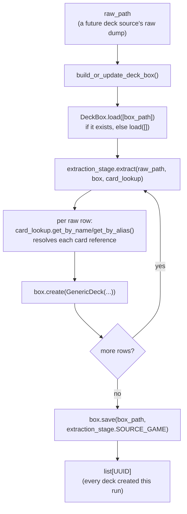

# deck_box

The standardized, multi-game deck store: given a game's already-populated
`CardBinder` (`../card_binder/`), a `DeckExtractionStage` converts one raw
deck source into `GenericDeck` records, held in a `DeckBox` keyed by
`nocab_uuid`. `GameId`/`GenericDeck` live in `src/schema/`, not here — this
container consumes that shared vocabulary, it doesn't own it.

## Why this isn't just `CardBinder` again

`CardBinder`'s non-trivial half — `AliasLedger`, `merge_strategies`,
collision-driven `get_by_alias` — exists because the *same* card recurs
across many raw sources and printings and has to collapse to one identity.
Decks don't have that problem: every raw row a `DeckExtractionStage` sees
is already a distinct deck instance, never merged with another. So
`DeckBox` mirrors only `CardBinder`'s CRUD-by-uuid and load/save shape —
there is no alias ledger, no name index, and no identity-collision handling
anywhere in this container.

## `card_nocab_uuids` is a multiset, not a set

`GenericDeck.card_nocab_uuids` is unordered, but duplicates are meaningful:
a deck running four copies of one card represents that copy count as the
same `nocab_uuid` appearing four times in the list, not a separate count
field. No method on `DeckBox` deduplicates this list; `update()`'s
`card_nocab_uuids` parameter replaces the stored list wholesale rather than
merging into it.

`GenericDeck` also carries no metadata/enrichment field. A
`DeckExtractionStage` produces a flat `card_nocab_uuids` list only —
anything richer (a win/loss label, a run id, per-slot structure) is a
separate metric's own output, referencing the deck's `nocab_uuid`, not a
field on `GenericDeck` itself.

## Files

- `deck_box.py` — `DeckBox`, the in-memory, multi-game deck store. Three
  regions: **CRUD by UUID** (`create`/`update`/`replace`/`delete`,
  `get_by_uuid`, `all_uuids`, `all_decks`), **Persistence**
  (`load`/`save`, `default_output_path`), **Private Helpers**
  (`_upsert_deck`). `create()` raises if `nocab_uuid` is already stored;
  `update()` overwrites whichever of `card_nocab_uuids`/`name` are given
  (`None` leaves that field untouched) rather than `CardBinder.update()`'s
  dict-merge, since `GenericDeck` has no dict-shaped field to merge into;
  `replace()` fully swaps a deck's content. `DEFAULT_OUTPUT_DIR`/
  `DEFAULT_OUTPUT_NAME` name this project's conventional per-game save
  location (e.g. `DeckBox.default_output_path(GameId.MTG) ==
  Path("data/final/decks/mtg.jsonl")`) — a recommended default, not an
  enforced requirement. Only `get_by_uuid`, `all_uuids`, and `all_decks`
  exist as read methods today — no name-based or alias-based lookup, and
  no `decks_containing(card_uuid)`; these are deliberately deferred until
  a real consumer needs them.
- `extraction.py` — `DeckExtractionStage`, the shared Strategy Protocol
  (structural, `typing.Protocol` — matching `CardIngestionStage`'s own
  convention) every raw deck source implements:
  `extract(self, raw_path: Path, box: DeckBox, card_lookup: CardLookup) ->
  list[UUID]`, plus a `SOURCE_GAME: ClassVar[GameId]` class constant. A
  stage is handed `CardLookup` (read-only), not a full `CardBinder` — it
  only ever resolves existing cards into `nocab_uuid`s, never
  creates/updates/replaces cards, the same least-privilege reasoning
  `card_binder/README.md` gives for `Dojo.prepare_splits`. Most raw rows
  are a new distinct deck, so `box.create()` is the common case; a stage
  MAY call `box.update()` instead when it derives a stable, deterministic
  deck identity from the raw source's own id (e.g. `sts_gg`'s
  `uuid5(namespace, run_id)`), to make re-running extraction over the
  same raw data idempotent rather than duplicating decks.
- `build.py` — `build_or_update_deck_box(raw_path, extraction_stage,
  box_path, card_lookup) -> list[UUID]`, the thin driver:
  `DeckBox.load([box_path] if it exists else [])` →
  `extraction_stage.extract(raw_path, box, card_lookup)` →
  `box.save(box_path, extraction_stage.SOURCE_GAME)` → return
  `extract()`'s own `list[UUID]` unchanged. No `source_game` parameter of
  its own — it reads `extraction_stage.SOURCE_GAME`.

## Sources

- **`sts_gg/`** — `StsGgDeckExtractionStage`, the first real
  `DeckExtractionStage` implementation. Translates sts_gg's
  `runs.jsonl` (Slay the Spire 2 run data) into `GenericDeck`s,
  resolving each card reference against spire_codex's aliases already
  registered on a `CardBinder` (same `"CARD."`-prefix-stripping
  resolution as the pre-existing `sts_gg/deck_outcome_metric.py`).
  Deck identity is `uuid5(namespace, run_id)` — deterministic, so
  re-running extraction over the same `runs.jsonl` updates rather than
  duplicates a deck. A card reference that doesn't resolve falls back
  to `CardBinder.UNKNOWN_CARD_NAME`'s sentinel card (see
  `card_binder/README.md`) instead of being dropped — this REQUIRES
  `CardBinder.ensure_unknown_card(GameId.SLAY_THE_SPIRE_2)` to have
  been called once against the real `CardBinder` before `extract()`
  runs; `extract()` raises `RuntimeError` if that sentinel isn't
  seeded and a card actually needs it. sts_gg's `"win"` outcome field
  is deliberately not carried into `GenericDeck` — see this file's
  no-metadata section above; the pre-existing `DeckOutcomeMetric`
  (`../sts_gg/deck_outcome_metric.py`) is unaffected by this stage and
  still exists as its own separate, un-migrated technology
  demonstration.
- **`fabtcg_decklists/`** — `FabtcgDecklistsExtractionStage`. Translates
  fabtcg_decklists' saved `<slug>.html` decklist fragments (Flesh and
  Blood) into `GenericDeck`s, resolving each card name against
  cardvault_fabtcg's cards already registered on a `CardBinder` (same
  non-strict `get_by_name_single` lookup as the pre-existing
  `fabtcg_decklists/decklist_cards_metric.py`). Deck identity is
  `uuid5(namespace, deck_slug)` — deterministic, so re-running
  extraction over the same fragments directory updates rather than
  duplicates a deck. The HTML-walking mechanics (selectors,
  quantity/name parsing) are shared with `DecklistCardsMetric` via
  `fabtcg_decklists/fragment_parsing.py`; this stage supplies its own
  resolution policy — an unresolved card name falls back to
  `CardBinder.UNKNOWN_CARD_NAME`'s sentinel card instead of being
  dropped, same `ensure_unknown_card(GameId.FLESH_AND_BLOOD)` bootstrap
  precondition as `sts_gg/` above. `DecklistCardsMetric` itself is
  unaffected by this stage and still exists as its own separate,
  un-migrated technology demonstration.
- **`play_gwent/`** — `PlayGwentDeckExtractionStage`. Translates
  playgwent.com's `guides.jsonl` (streamed one line at a time — the
  real file runs to several GB) into `GenericDeck`s, resolving each of
  a guide's `deck.srcCardTemplates` card template ids against
  gwent.one's cards already registered on a `CardBinder` under
  `DataSource.GWENT_ONE` (a cross-source resolution: the deck data and
  the card data come from two different raw sources sharing gwent.one's
  numeric card ids). `srcCardTemplates` is used directly as the flat
  `card_nocab_uuids` multiset — it already includes the leader and
  stratagem with duplicates as copy counts, so no separate walk of the
  guide's `deck.cards` (unique-card metadata only, no copy counts) is
  needed. Deck identity is `uuid5(namespace, guide_id)` — the guide's
  own row id, deterministic and never derived from resolved card
  content — so re-running extraction over the same `guides.jsonl`
  updates rather than duplicates a deck. A guide's own title
  (`name`) is used verbatim when present/non-empty, falling back to a
  synthetic `f"playgwent.com guide {guide_id}"` name otherwise; on a
  content-changing update this stored name is deliberately NOT
  refreshed even if the guide was renamed since first seen — this
  project doesn't rely on deck names, and the id remains the stable
  identity. An unresolvable card template id falls back to
  `CardBinder.UNKNOWN_CARD_NAME`'s sentinel card, same
  `ensure_unknown_card(GameId.GWENT)` bootstrap precondition as the
  other sources above.
- **`sts2runs/`** — `Sts2RunsDeckExtractionStage`. Translates
  sts2runs.com's monthly gzip-compressed run dump (e.g.
  `runs-all-before-2026-06.json.gz`, ~150MB decompressed — read
  directly via `gzip.open(..., "rt")`, one line at a time, never a
  pre-extracted plain-text sibling) into `GenericDeck`s, a second Slay
  the Spire 2 run source alongside `sts_gg/` above. Same card
  resolution as `sts_gg/` (`"CARD."`-prefix-stripping against
  spire_codex's aliases, Unknown sentinel fallback, same
  `ensure_unknown_card(GameId.SLAY_THE_SPIRE_2)` bootstrap
  precondition) — deliberately left duplicated rather than shared with
  `sts_gg/` for now; a cross-stage dedup pass across every source in
  this directory is planned once more of them exist. Each raw row
  nests its deck(s) under a `"players"` list rather than sts_gg's
  single top-level `"deck"` — every row observed in the current dump
  has exactly one player, but this stage still loops over `"players"`
  and mints one `GenericDeck` per entry, keyed by
  `uuid5(namespace, f"{run_id}:{player_index}")`, rather than assuming
  index 0 is the only one that will ever exist.

## How it works



## How to run

```python
from pathlib import Path
from src.data_refinement.card_binder.card_binder import CardBinder
from src.data_refinement.deck_box.deck_box import DeckBox
from src.schema.card import GenericDeck
from src.schema.game_id import GameId

card_binder = CardBinder.load([Path("data/final/cards/mtg.jsonl")])
box = DeckBox()
box.create(
    GenericDeck(
        nocab_uuid=...,
        source_game=GameId.MTG,
        name="Mono Red",
        card_nocab_uuids=[...],
    )
)
box.save(DeckBox.default_output_path(GameId.MTG), GameId.MTG)

# Reading a saved deck box back:
loaded = DeckBox.load([Path("data/final/decks/mtg.jsonl")])
list(loaded.all_decks(GameId.MTG))
```

This file grows as more `DeckExtractionStage` implementations land under
their own subdirectories here.
