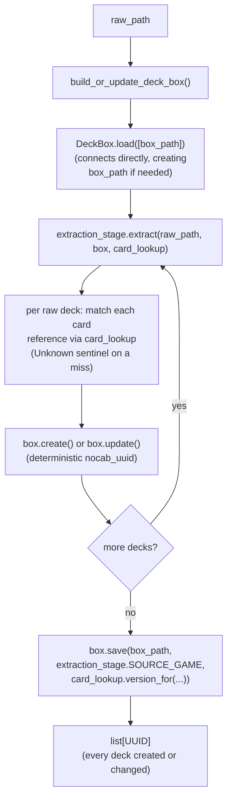

# deck_box

The standardized, multi-game deck store: given a game's already-populated
`CardBinder` (`../card_binder/`), a `DeckExtractionStage` converts one raw
deck source into `GenericDeck` records, held in a `DeckBox` keyed by
`nocab_uuid`. `GameId`/`GenericDeck` live in `src/schema/`, not here — this
container consumes that shared vocabulary, it doesn't own it.

## Why this isn't just `CardBinder` again

`CardBinder`'s non-trivial half — `AliasLedger`, `merge_strategies`,
collision-driven `get_by_alias` — exists because the *same* card recurs
across many raw sources and printings and has to collapse to one identity.
Decks don't have that problem: every raw row a `DeckExtractionStage` sees
is already a distinct deck instance, never merged with another. So
`DeckBox` mirrors only `CardBinder`'s CRUD-by-uuid and load/save shape —
there is no alias ledger, no name index, and no identity-collision handling
anywhere in this container.

## `card_nocab_uuids` is a multiset, not a set

`GenericDeck.card_nocab_uuids` is unordered, but duplicates are meaningful:
a deck running four copies of one card represents that copy count as the
same `nocab_uuid` appearing four times in the list, not a separate count
field. No method on `DeckBox` deduplicates this list; `update()`'s
`card_nocab_uuids` parameter replaces the stored list wholesale rather than
merging into it.

`GenericDeck` also carries no metadata/enrichment field. A
`DeckExtractionStage` produces a flat `card_nocab_uuids` list only —
anything richer (a win/loss label, a run id, per-slot structure) is a
separate metric's own output, referencing the deck's `nocab_uuid`, not a
field on `GenericDeck` itself.

## `GenericDeck.provenance` is optional, unlike `GenericCard`'s

`GenericDeck` carries a `provenance: Provenance | None` field (see
`src/schema/card.py`), mirroring `GenericCard`'s own `provenance` —
which `DataSource`, which raw id, and when it was last fetched.
Optional (defaulting to `None`), unlike `GenericCard.provenance`
(required): a deck already stored before this field existed has no
source to backfill, so `DeckBox.load()` reads such a row as
`provenance=None` rather than raising or guessing. Every
`DeckExtractionStage` in this container supplies a real `Provenance` on
every `create()`/content-changing `update()` it performs, using its own
raw source's `DataSource` member (e.g. `DataSource.STS_GG`,
`DataSource.PLAY_GWENT`) — distinct from whatever `DataSource` its
cards were resolved against (e.g. `DataSource.SPIRE_CODEX`,
`DataSource.GWENT_ONE`), since the deck's raw source and its cards' raw
source are frequently two different systems.

## Other `DeckBox` instances beyond this container's published one

`DeckBox` is just a store — nothing in this class ties an instance to
the published `data/final/decks/` location or to a
`DeckExtractionStage`. `metrics/sts_gg/` uses a second, entirely
separate `DeckBox` instance this way: private to that container, saved
under `data/metrics/sts_gg/` instead, and keyed by a content-derived
id (`create_if_absent()` + `metrics/deck_ids.py`'s
`deck_uuid_from_cards()`) rather than this container's
`uuid5(namespace, run_id)` scheme — see
[`../metrics/sts_gg/README.md`](../metrics/sts_gg/README.md)'s "Deck
references" section for why and how. The two instances are never
merged or cross-referenced.

## Files

- `deck_box.py` — `DeckBox`, the multi-game deck store: one SQLite file
  per game (e.g. `data/final/decks/mtg.db`) with `decks`, `deck_cards`
  (the multiset as `(deck_uuid, card_uuid, count)` rows) and `metadata`
  (the `card_binder_version` each game's decks were minted against).
  - CRUD by uuid: `create` (raises on a stored uuid),
    `create_if_absent` (for content-derived ids that legitimately
    recur), `update` (overwrites only the fields given), `replace`,
    `delete`, `get_by_uuid`; lazy `all_uuids`/`all_decks` generators,
    so a box larger than memory reads the same as a small one.
  - `version_for(game)`: a derived content hash, like
    `CardBinder.version_for()`. `card_binder_version_for(game)`: the
    stamped version, or `None` when never stamped or cleared by an
    unfinished run; callers treat `None` as stale.
  - `uuids_ranked_randomly(game, seed)`: a seeded, reproducible ranking
    computed inside SQLite, which `DeckBoxDealer`
    (`src/dojos/file_managers/deck_box_dealer.py`) turns into exact-ratio
    splits.
  - `load([])` opens an empty in-memory box; `load([path])` connects
    straight to `path`, so every mutating call is durable as its own
    atomic commit; `load([p1, p2, ...])` merges read-only into memory,
    last path wins. `save()` stamps the version (copying the box to
    `path` first if it isn't already connected there).
  - Crash safety: a game's first mutating call clears its version stamp
    in the same transaction, and `save()` restores it once the run
    finishes, so a crashed run reads as stale rather than current. This
    relies on every stage deriving deterministic deck ids (see
    `extraction.py`). The module docstring has the details.
- `_deck_tables.py` — `DeckTables`, private to `deck_box.py`: one method
  per SQL statement, never committing.
- `extraction.py` — `DeckExtractionStage`, the Strategy Protocol every
  deck source implements: `extract(self, raw_path, box, card_lookup) ->
  list[UUID]` plus `SOURCE_GAME: ClassVar[GameId]`. A stage reads cards
  through a read-only `CardLookup`, never writes them, and derives each
  deck's `nocab_uuid` deterministically from the raw source's own id, so
  re-running extraction updates decks instead of duplicating them.
- `build.py` — `build_or_update_deck_box(raw_path, extraction_stage,
  box_path, card_lookup)`, the thin driver: `load([box_path])`,
  `extract()`, then `save()` stamped with
  `card_lookup.version_for(SOURCE_GAME)`.

## Sources

One subdirectory per deck source, each holding one `extraction_stage.py`
whose module docstring documents that source's raw shape and card
matching. Every stage substitutes the game's Unknown sentinel card
(`CardBinder.ensure_unknown_card()`, which must be seeded first) for a
card reference it can't match, rather than dropping it.

| Directory | Stage | Game | Raw input | Deck identity |
|---|---|---|---|---|
| `sts_gg/` | `StsGgDeckExtractionStage` | Slay the Spire 2 | sts_gg `runs.jsonl` | `uuid5(ns, run_id)` |
| `sts2runs/` | `Sts2RunsDeckExtractionStage` | Slay the Spire 2 | sts2runs monthly `.json.gz` | `uuid5(ns, f"{run_id}:{player_index}")` |
| `fabtcg_decklists/` | `FabtcgDecklistsExtractionStage` | Flesh and Blood | fabtcg.com decklist HTML (parsed by `fragment_parsing.py`) | `uuid5(ns, deck_slug)` |
| `play_gwent/` | `PlayGwentDeckExtractionStage` | Gwent | playgwent.com `guides.jsonl` | `uuid5(ns, guide_id)` |
| `seventeenlands_game_data/` | `SeventeenLandsGameDataDeckExtractionStage` | MTG | 17lands `game_data` CSVs (`deck_<name>` copy-count columns) | `uuid5(ns, f"{draft_id}:{match_number}:{game_number}")` |

## How it works



## How to run

```
PYTHONPATH=. python3 scripts/run_deck_box_ingestion.py --list
PYTHONPATH=. python3 scripts/run_deck_box_ingestion.py --source play_gwent
```

From Python:

```python
from src.data_refinement.card_binder.card_binder import CardBinder
from src.data_refinement.deck_box.build import build_or_update_deck_box
from src.data_refinement.deck_box.deck_box import DeckBox
from src.data_refinement.deck_box.play_gwent.extraction_stage import (
    PlayGwentDeckExtractionStage,
)
from src.schema.game_id import GameId

binder = CardBinder.load([CardBinder.default_output_path(GameId.GWENT)])
binder.ensure_unknown_card(GameId.GWENT)  # the script also saves the binder here
build_or_update_deck_box(
    PlayGwentDeckExtractionStage.DEFAULT_RAW_PATH,  # data/raw/play_gwent/guides.jsonl
    PlayGwentDeckExtractionStage(),
    DeckBox.default_output_path(GameId.GWENT),  # data/final/decks/gwent.db
    binder,
)

box = DeckBox.load([DeckBox.default_output_path(GameId.GWENT)])
next(box.all_decks(GameId.GWENT))
```
