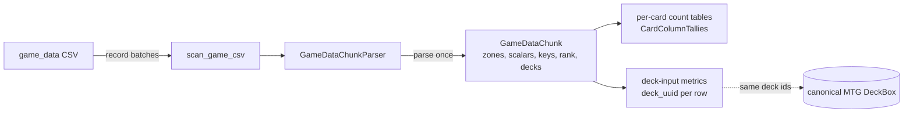

# game_data

Converts 17lands' raw per-game data
(`data/raw/17lands/game_data/<Set>.<EventType>.csv`) into one partition
file per metric per CSV under `data/metrics/seventeenlands/game_data/`
(see [`../README.md`](../README.md) for the layout and how dojos read a
slice of them), matching
each CSV's `opening_hand_<name>`/`drawn_<name>`/`tutored_<name>`/
`deck_<name>`/`sideboard_<name>` column suffixes against a `CardBinder`
already populated for `GameId.MTG` (see
[`../../../card_binder/README.md`](../../../card_binder/README.md)).

The scan is chunked and typed. `scan_game_csv` streams a CSV in pyarrow
record batches. `GameDataChunkParser` (shared, see below) turns each batch into one
`GameDataChunk` (numpy arrays, plus each row's deck identified once),
and every metric's `accumulate()` receives that chunk. All twelve
metrics are vectorized `Metric[GameDataChunk]`s: none loops over rows in
Python.

## Files

### Chunk, parser, scanner

- The chunk, its parser and the deck identity
  (`GameDataChunk`, `GameDataChunkParser`, `GameCardColumns`,
  `ChunkDecks`) live in
  [`../../../seventeenlands/`](../../../seventeenlands/README.md),
  shared with the deck box extraction stage, so every `deck_uuid` these
  metrics write is a deck in the canonical `data/final/decks/mtg.db`.
- `scanner.py` — `scan_game_csv(raw_csv_path, metrics, parser,
  block_size)`: the shared `../chunk_scanner.py`'s `scan_chunked_csv()`,
  typed for game_data. It streams the CSV with `pyarrow.csv.open_csv`,
  reading only `parser.needed_columns()`, parses each batch once and
  hands the chunk to every metric, then finalizes them all. It never
  touches the `CardBinder` or a `DeckBox`.
  - Failures are isolated per (metric, chunk) through `call_isolated`
    ([`../../isolated_call.py`](../../isolated_call.py)). Each failure
    logs an ERROR line starting `METRIC FAILURE` that names the metric,
    the CSV and the chunk, with its traceback. The scan ends with one
    `METRIC FAILURE summary` line per failing metric.
  - A metric that fails partway through `accumulate()` may be left
    half-tallied, so its output for that CSV must not be trusted.

### Shared tallies

- `../card_column_tallies.py` (shared with draft_data) —
  `CardColumnTallies(owner, tally_count, dtype)`: `tally_count` int64 or
  float64 tallies per matched column of one zone. The first chunk fixes
  the column layout; a later chunk with a different layout raises
  `ValueError`. `per_card()` sums the columns per card uuid, so two
  columns naming one card both count.
  `count_columns(names, keep)` returns the kept cards' uuids and one
  array per tally, the shape a count table writes.
- `on_play_win_counts.py` — the four on-play tallies (`COUNT_COLUMNS`:
  `play_games`, `play_wins`, `draw_games`, `draw_wins`) and the one
  place the delta rule lives. `on_play_row_masks(won, on_play)` gives
  the four per-row masks, `has_on_play_games(tallies)` says whether a
  subject has a game on either side, and `on_play_delta_output(summed,
  key_columns, label_column)` labels a slice:
  `P(won | on_play) - P(won | on_draw)`, null when either side has no
  games.

### Count tables

Every metric here except the three deck-label row streams is a count
table (`../sliced_metric.py`): each partition holds raw, summable counts
per key, and the label is computed only when a slice is built
(`output_from_counts`). Each takes `(version_metadata, output_path)`,
`output_path` being the CSV's partition path.

- `card_count_table_metric.py` — `GameCardCountTableMetric`, the
  shared `../card_count_table_metric.py` `CardCountTableMetric`
  (Template Method, abstract) fixed to game_data: the per-card count
  table over `ZONE`'s columns. The shared base owns a float64
  `CardColumnTallies` over the subclass's `_column_card_uuids(chunk)`,
  `accumulate()` (add the subclass's `_increments(chunk)`) and
  `finalize()` (one row per card with `_has_samples()`, by default a
  first count above zero, plus the optional baseline row from
  `_baseline_counts()`). A CSV with no rows writes the full schema.
- `game_card_average_metric.py` — `GameCardAverageMetric` (abstract):
  counts `(games, value_sum)` per card present in `ZONE`; the label is
  `value_sum / games`. Subclasses implement `_values(chunk)`.
- `game_card_average_metrics.py` — `GameCardWinRateMetric` (abstract;
  `_values` is `won` as 1.0/0.0) and its three concretes:
  `WinRateWhenInDeckMetric`, `OpeningHandWinRateMetric` and
  `DrawnWinRateMetric` (`P(won | card in deck_/opening_hand_/drawn_)`).
- `game_length_association_metric.py` — `GameLengthAssociationMetric`:
  a card's average `num_turns` when in the deck, minus the slice's
  average. Each partition writes its own `(games, turn sum)` as a
  baseline row with a null key; the slice sums them.
- `on_play_win_rate_delta_metric.py` — `OnPlayWinRateDeltaMetric`: per
  card in the deck, the four on-play counts; labelled by
  `on_play_delta_output`.
- `tutor_target_rate_metric.py` — `TutorTargetRateMetric`: per card,
  `P(tutored | in deck)`, from `(in_deck, tutored)` counts ("tutored":
  the card present under any `tutored_` column, via `present_for`).
  `_counted_rows(chunk)` picks the games that count (all of them).
  `sample_count` matters here: most cards' true rate is near zero.
- `tutor_choice_rate_metric.py` — `TutorChoiceRateMetric`: a
  `TutorTargetRateMetric` whose `_counted_rows` keeps only games with a
  tutored card, so the label is `P(tutored | in deck, a card was
  tutored that game)`. Deck only; the sideboard is not counted.
- `on_play_win_rate_sensitivity_by_deck_metric.py` —
  `OnPlayWinRateSensitivityByDeckMetric`: the four on-play counts per
  `deck_uuid`, counted per chunk with `np.bincount` over `row_deck`.
  Stamps its output `requires_deck_box=True`.
- `deck_occurrence_count_metric.py` — `DeckOccurrenceCountMetric`: per
  `deck_uuid`, `draft_count`, the number of DISTINCT `draft_id`s in the
  CSV that played it (not game rows: a draft plays 3-7 games, usually
  with one deck). A draft lives in one CSV, so a slice's sum is exact;
  the label `occurrence_count` is that sum. It enriches the canonical
  box's one-entry-per-decklist with popularity, for weighted sampling.

### Row streams (deck-input metrics)

- `game_deck_label_metric.py` — `GameDeckLabelMetric` (Template Method,
  abstract, streaming; a `RowStreamMetric`): one output row per game,
  `draft_id`, `match_number`, `game_number`, `deck_uuid` and one label,
  written per chunk with `ParquetBuilder.write_columns()`. Takes
  `(version_metadata, output_path)` and stamps its output
  `requires_deck_box=True`.
  Subclasses fix `LABEL_COLUMN`/`LABEL_TYPE`/`OUTPUT_STEM` and implement
  `_labels(chunk)`.
- `game_deck_label_metrics.py` — its three concretes:
  `DeckWinPredictionMetric` (`won`, `pa.bool_()`),
  `DeckGameLengthPredictionMetric` (`num_turns`, `pa.int64()`) and
  `DeckRankTierPredictionMetric` (`rank`, `pa.string()`: `bronze`/
  `silver`/`gold`/`platinum`/`diamond`/`mythic`, and `OTHER_LABEL` for
  anything else, including the empty rank of unranked events).

- `BRAINSTORM.md` — candidate metrics from this raw source not yet
  built (this container implements the eleven ideas on its "Human
  Review Short List").

## Card-name matching

`GameCardColumns` (shared, see
[`../../../seventeenlands/README.md`](../../../seventeenlands/README.md))
matches every card column once per CSV. An unmatched column is absent
from every zone, so no metric tallies it, though it still counts in the
row's deck as the Unknown card.

## Card-binder and deck-box access shape

No metric sees the binder or the header. Card matching lives in
`GameDataChunkParser`, which the driver builds once per CSV, and every
metric is built from the run's `MetricVersionMetadata` (the binder
version, hashed once per run).

The driver (`scripts/run_metrics.py`) owns everything shared:
- it reads each CSV's header once and builds its parser.

This family has no deck box of its own (`deck_box_output_path=None`):
every deck-input metric only needs a `deck_uuid` for its output row,
which it already gets from the chunk's own `ChunkDecks`
(`chunk.decks.row_deck_uuids()`), so none of them ever read a `DeckBox`
back. The canonical box that maps those ids back to card lists is built
separately, by `deck_box/seventeenlands_game_data/extraction_stage.py`.

A game's identifier is the composite `(draft_id: str, match_number:
int, game_number: int)`, written as three output columns: no single raw
column is a unique key.

## How it works



Per chunk, every metric works on whole arrays: per-column tallies are
matrix products or column sums over a zone's `present()` matrix, per-deck
tallies are `np.bincount` over `row_deck`, and streaming metrics write
the chunk's rows in one `write_columns()` call.

On `KTK.TradDraft.csv` (151 MB, 56k games, 20,931 distinct decks) the
whole family runs in 24 s, 11 s of it scanning. A parity check against
existing outputs is `scripts/compare_metric_outputs.py` (below).

## How to run

From the project root (ROCm venv):

```
PYTHONPATH=. python scripts/run_metrics.py --source seventeenlands_game_data \
    --raw-path data/raw/17lands/game_data/KTK.TradDraft.csv
```

Each metric writes its partition,
`data/metrics/seventeenlands/game_data/<OUTPUT_STEM>/<SET>/<Format>.parquet`.
This family has no deck box of its own; deck dojos read the canonical
`data/final/decks/mtg.db`.
Dojos build their slice files from the partitions on first use.

Parity check: write the outputs to a scratch root with `--output-root`,
then diff them against the existing outputs:

```
PYTHONPATH=. python scripts/run_metrics.py --source seventeenlands_game_data \
    --raw-path data/raw/17lands/game_data/KTK.TradDraft.csv --output-root scratch/parity
PYTHONPATH=. python scripts/compare_metric_outputs.py \
    --reference data/metrics/seventeenlands/game_data/drawn_win_rate \
    --candidate scratch/parity/seventeenlands/game_data/drawn_win_rate
```
