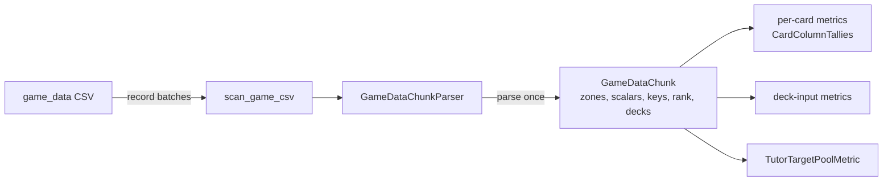

# game_data

Converts 17lands' raw per-game data
(`data/raw/17lands/game_data/<Set>.<EventType>.csv`) into training-data
parquet files under `data/metrics/seventeenlands/game_data/`, matching
each CSV's `opening_hand_<name>`/`drawn_<name>`/`tutored_<name>`/
`deck_<name>`/`sideboard_<name>` column suffixes against a `CardBinder`
already populated for `GameId.MTG` (see
[`../../../card_binder/README.md`](../../../card_binder/README.md)).

The scan is chunked and typed. `scan_game_csv` streams a CSV in pyarrow
record batches. `GameDataChunkParser` turns each batch into one
`GameDataChunk` (numpy arrays, plus each row's deck identified once),
and every metric's `accumulate()` receives that chunk. All twelve
metrics are vectorized `Metric[GameDataChunk]`s: none loops over rows in
Python.

## Files

### Chunk, parser, scanner

- `game_data_chunk.py` — the chunk's data types:
  - `GameZone`: the five card-column families, valued by header prefix.
  - `ZoneCounts`: one zone's card uuids (one per matched header column,
    possibly repeating) and an int16 `(rows, columns)` count matrix.
    `present()` is `counts > 0`; `present_for(card_uuids)` lines the zone
    up against any card list (a card's presence under any of its
    columns; never present if the zone has no column for it).
  - `GameKeys`: each row's `(draft_id, match_number, game_number)`.
  - `ChunkDecks`: every distinct deck in the chunk (one `GenericDeck`
    per deck id, in order of first row) and `row_deck`, each row's index
    into them; `row_deck_uuids()` gives each row's id as a str. It
    rejects two decks with one id, or a row naming no deck.
  - `GameDataChunk`: every zone's `ZoneCounts`, typed `won`/`on_play`/
    `num_turns`, `keys`, `rank` (str; `""` for unranked Trad and Sealed
    events) and `decks`. It checks at construction that every zone is
    present and every per-row field has the same row count.
- `chunk_decks.py` — `build_chunk_decks(deck_zone, keys, source_game)`.
  A row's deck is the FULL copy-count multiset over `deck_<name>`
  columns: each present column contributes
  `deck_zone.counts[row, column]` copies of its card uuid, in header
  order (matching
  `deck_box/seventeenlands_game_data/extraction_stage.py`'s own
  full-multiset expansion), not merely one uuid per present column.
  Rows are grouped by that full count pattern (presence alone is not a
  safe pre-grouping key once copy counts matter); each pattern is
  hashed once with `deck_ids.deck_uuid_from_cards()`. Patterns with the
  same id (two columns naming one card, or any other coincidence
  producing the same multiset) share the earliest row's deck. A deck is
  named after its first row's game (`game_data <draft_id>/<match>/<game>
  deck`). Deck identity is hashed the same way as the canonical
  `DeckBox` builder (`deck_box/seventeenlands_game_data/
  extraction_stage.py`), so no metric needs to store any of this
  module's decks anywhere: the canonical box already has them, under
  the same id.
- `game_data_chunk_parser.py` — `GameDataChunkParser.from_header(header,
  card_binder, source_game)`, the only place that knows the CSV's
  column names. Card matching is `GameCardColumns.from_header()`'s.
  `needed_columns()` and `column_types()` tell the scanner what to read:
  the matched card columns as int16, and the seven scalars (`won`,
  `on_play`, `num_turns`, `draft_id`, `match_number`, `game_number`,
  `rank`). `parse(batch)` builds a `GameDataChunk`: a null count cell
  becomes 0, a null scalar raises `ValueError` naming the column and
  row, and an empty string cell reads as `""`. A header missing a scalar
  fails the whole CSV.
- `game_card_columns.py` — `GameCardColumns`, built once per CSV by the
  parser. It matches every card column's `<name>` suffix against
  `card_binder` (see "Card-name matching" below) into
  `opening_hand_columns`/`drawn_columns`/`tutored_columns`/
  `deck_columns`/`sideboard_columns` (`list[tuple[str, UUID]]`), plus
  `uuid_for_name(name)` and `unmatched_names`.
- `scanner.py` — `scan_game_csv(raw_csv_path, metrics, parser,
  block_size)` streams the CSV with `pyarrow.csv.open_csv`, reading only
  `parser.needed_columns()`. It parses each batch once and hands the
  chunk to every metric, then finalizes them all. It never touches the
  `CardBinder` or a `DeckBox`.
  - Failures are isolated per (metric, chunk) through `call_isolated`
    ([`../../isolated_call.py`](../../isolated_call.py)). Each failure
    logs an ERROR line starting `METRIC FAILURE` that names the metric,
    the CSV and the chunk, with its traceback. The scan ends with one
    `METRIC FAILURE summary` line per failing metric.
  - A metric that fails partway through `accumulate()` may be left
    half-tallied, so its output for that CSV must not be trusted.

### Shared tallies

- `card_column_tallies.py` — `CardColumnTallies(owner, tally_count,
  dtype)`: `tally_count` int64 or float64 tallies per matched column of
  one zone. The first chunk fixes the column layout; a later chunk with
  a different layout raises `ValueError`. `per_card()` sums the columns
  per card uuid, so two columns naming one card both count.
- `on_play_win_counts.py` — `OnPlayWinCounts(play_games, play_wins,
  draw_games, draw_wins)`. `row_masks(won, on_play)` gives the four
  per-row masks, `from_tallies()` reads them back, and
  `win_rate_delta()` is `P(won | on_play) - P(won | on_draw)`, or `None`
  when either side has no games.

### Per-card metrics (accumulation)

Each takes `(version_metadata, output_path=None)` and writes
`nocab_uuid`, its label and `sample_count` for every card seen.

- `game_card_average_metric.py` — `GameCardAverageMetric` (Template
  Method, abstract): a per-card average of one per-game value over every
  game the card was present in, in the subclass's `ZONE`. Per chunk it
  adds `(value_sum, count)` per column to a float64 `CardColumnTallies`.
  A CSV with no rows writes a zero-row file with the full schema.
  Subclasses fix `LABEL_COLUMN`, `DEFAULT_OUTPUT_PATH` and `ZONE`,
  implement `_values(chunk)`, and may override
  `_extra_accumulate(chunk)` (no-op by default) and
  `_label(value_sum, count)` (default: the average).
- `game_card_average_metrics.py` — `GameCardWinRateMetric` (abstract;
  `_values` is `won` as 1.0/0.0) and its three concretes:
  `WinRateWhenInDeckMetric`, `OpeningHandWinRateMetric` and
  `DrawnWinRateMetric` (`P(won | card in deck_/opening_hand_/drawn_)`).
- `game_length_association_metric.py` — `GameLengthAssociationMetric`:
  a card's average `num_turns` when in the deck, minus the format-wide
  average (kept by `_extra_accumulate()`, subtracted by `_label()`).
- `on_play_win_rate_delta_metric.py` — `OnPlayWinRateDeltaMetric`: per
  card in the deck, `OnPlayWinCounts.win_rate_delta()`. Keeps the four
  counts per deck column in an int64 `CardColumnTallies`. A card never
  seen on one side writes a `None` delta.
- `tutor_target_rate_metric.py` — `TutorTargetRateMetric`: per card,
  `P(tutored | in deck)`. Per deck column it counts games in the deck
  and games also tutored (the card present under any `tutored_` column,
  via `present_for`). `sample_count` matters here: most cards' true
  rate is near zero.

These three standalone metrics build their output from row dicts, so
a CSV with no rows writes a column-less file.

### Deck-input metrics

Each takes `(version_metadata, output_path=None)` — no `deck_box` of its
own — and stamps its output `requires_deck_box=True`. That flag still
means what it always did: a `deck_uuid` output column is only useful to
a reader (the training-side dojo,
`src/dojos/generic/generic_dojo.py`) that can resolve it back to card
lists via a `DeckBox`. These metrics just no longer need to build or
write to one themselves — the canonical box
(`deck_box/seventeenlands_game_data/extraction_stage.py`) already holds
every deck they'd ever see, under the same `deck_uuid_from_cards()`
identity (see `chunk_decks.py` above), so a metrics-private scratch box
would be pure redundant work.

- `game_deck_label_metric.py` — `GameDeckLabelMetric` (Template Method,
  abstract, streaming): one output row per game, `draft_id`,
  `match_number`, `game_number`, `deck_uuid` and one label, written per
  chunk with `ParquetBuilder.write_columns()`. Subclasses fix
  `LABEL_COLUMN`/`LABEL_TYPE`/`DEFAULT_OUTPUT_PATH` and implement
  `_labels(chunk)`.
- `game_deck_label_metrics.py` — its three concretes:
  `DeckWinPredictionMetric` (`won`, `pa.bool_()`),
  `DeckGameLengthPredictionMetric` (`num_turns`, `pa.int64()`) and
  `DeckRankTierPredictionMetric` (`rank`, `pa.string()`: `bronze`/
  `silver`/`gold`/`platinum`/`diamond`/`mythic`, and `OTHER_LABEL` for
  anything else, including the empty rank of unranked events).
- `on_play_win_rate_sensitivity_by_deck_metric.py` —
  `OnPlayWinRateSensitivityByDeckMetric` (accumulation): per deck,
  `OnPlayWinCounts.win_rate_delta()` over every game played with it.
  Per chunk it counts each deck's four tallies with `np.bincount` over
  `row_deck` and adds them to a running per-`deck_uuid` total.
- `deck_occurrence_count_metric.py` — `DeckOccurrenceCountMetric`
  (accumulation): per deck, `occurrence_count` — the number of DISTINCT
  `draft_id`s that chose it, not the number of game rows (a draft plays
  3-7 games sharing one deck, which would otherwise inflate a popular
  deck's count by however many games each of its drafts played). Per
  chunk it adds every row's `draft_id` to a running per-`deck_uuid` set
  of distinct drafts seen so far, then writes one row per deck at
  `finalize()`.

### Pool metric

- `tutor_target_pool_metric.py` — `TutorTargetPoolMetric` (streaming,
  fan-out): one output row per (game, distinct card in `deck_` ∪
  `sideboard_`), labelled with whether it was tutored that game. Per
  chunk it lines the three zones up over one card axis and writes every
  pool cell at once. Its identity is the per-game triple plus a
  `pool_card_uuid`, never a deck id (the pool is a different multiset
  from the deck), so it takes no `deck_box`.

- `BRAINSTORM.md` — candidate metrics from this raw source not yet
  built (this container implements the eleven ideas on its "Human
  Review Short List").

## Card-name matching

`card_lookup.uuid_for_name_or_front_face()` (`src/data_refinement/card_binder/card_lookup.py`) matches a bare card name: a unique exact
`get_by_name()` match, else a unique split/MDFC front-face match (17lands'
column names use only a card's front face; Scryfall names it `"A // B"`),
else unmatched. Ambiguity is never guessed at. `GameCardColumns` applies
it to every card column suffix, once per CSV; an unmatched column is
simply absent from every zone.

## Card-binder and deck-box access shape

No metric sees the binder or the header. Card matching lives in
`GameDataChunkParser`, which the driver builds once per CSV, and every
metric is built from the run's `MetricVersionMetadata` (the binder
version, hashed once per run).

The driver (`scripts/run_metrics.py`) owns everything shared:
- it reads each CSV's header once and builds its parser.

This family has no deck box of its own (`deck_box_output_path=None`):
every deck-input metric only needs a `deck_uuid` for its output row,
which it already gets from the chunk's own `ChunkDecks`
(`chunk.decks.row_deck_uuids()`), so none of them ever read a `DeckBox`
back. The canonical box that resolves those ids to card lists is built
separately, by `deck_box/seventeenlands_game_data/extraction_stage.py`.

A game's identifier is the composite `(draft_id: str, match_number:
int, game_number: int)`, written as three output columns: no single raw
column is a unique key.

## How it works



Per chunk, every metric works on whole arrays: per-column tallies are
matrix products or column sums over a zone's `present()` matrix, per-deck
tallies are `np.bincount` over `row_deck`, and streaming metrics write
the chunk's rows in one `write_columns()` call.

On `KTK.TradDraft.csv` (151 MB, 56k games, 20,931 distinct decks) the
whole family runs in 24 s, 11 s of it scanning. A parity check against
existing outputs is `scripts/compare_metric_outputs.py` (below).

## How to run

From the project root (ROCm venv):

```
PYTHONPATH=. python scripts/run_metrics.py --source seventeenlands_game_data \
    --raw-path data/raw/17lands/game_data/KTK.TradDraft.csv
```

Each metric writes `data/metrics/seventeenlands/game_data/<SET>/<Format>/<name>.parquet`.
This family has no deck box of its own.

Parity check: write the outputs to a scratch root with `--output-root`,
then diff them against the existing outputs:

```
PYTHONPATH=. python scripts/run_metrics.py --source seventeenlands_game_data \
    --raw-path data/raw/17lands/game_data/KTK.TradDraft.csv --output-root scratch/parity
PYTHONPATH=. python scripts/compare_metric_outputs.py \
    --reference data/metrics/seventeenlands/game_data/KTK/TradDraft \
    --candidate scratch/parity/seventeenlands/game_data/KTK/TradDraft
```
