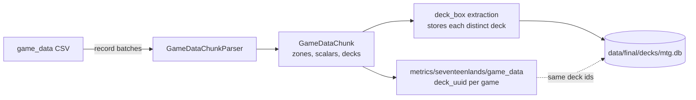

# seventeenlands

Reading 17lands' CSV exports (`data/raw/17lands/`) into typed numpy
chunks, shared by the two containers that read them: the deck box
extraction stage (`../deck_box/seventeenlands_game_data/`) and the
17lands metrics (`../metrics/seventeenlands/`). Both read game_data rows
with the same parser, so a deck id a metric writes is a deck the
canonical MTG deck box (`data/final/decks/mtg.db`) stores. Nothing here
imports `deck_box/` or `metrics/`.

## Files

- `zone_counts.py` - `ZoneCounts`: one card-column family's card uuids
  (one per matched header column, possibly repeating) and an int16
  `(rows, columns)` count matrix. `present()` is `counts > 0`;
  `present_for(card_uuids)` lines the zone up against any card list (a
  card's presence under any of its columns).
- `batch_columns.py` - typed numpy columns from a pyarrow batch:
  `read_column`, `raise_on_null`, and `read_zone_counts` (card counts
  read as float32, since some exports write `1.0`, and narrowed to int16).
- `chunk_decks.py` - `GameKeys` (each row's `draft_id`, `match_number`,
  `game_number`), `ChunkDecks` (every distinct deck in a chunk, in order
  of first row, plus `row_deck`, each row's index into them) and
  `build_chunk_decks(deck_zone, keys, source_game, family_label)`. A
  row's deck is the full copy-count multiset of its deck columns: a
  column with count 3 contributes three copies of its card. Rows are
  grouped by count pattern, and each pattern is hashed once with
  `../deck_ids.py`'s `deck_uuid_from_cards()`. Patterns with the same id
  share the earliest row's deck, named `<family_label>
  <draft_id>/<match>/<game> deck`. Used by game_data and replay_data.
- `game_data/` - the game_data CSV layout:
  - `game_data_chunk.py` - `GameZone` (the five card-column families:
    `opening_hand_`, `drawn_`, `tutored_`, `deck_`, `sideboard_`) and
    `GameDataChunk`: every zone's `ZoneCounts`, typed `won`/`on_play`/
    `num_turns`, `keys`, `rank` (`""` when unranked) and `decks`.
  - `game_card_columns.py` - `GameCardColumns`, built once per CSV: it
    matches every card column's `<name>` suffix with
    `card_lookup.uuid_for_name_or_front_face()` (a unique exact name,
    else a unique split/MDFC front face, else unmatched) into the five
    per-prefix column lists, and records `unmatched_deck_columns`.
  - `game_data_chunk_parser.py` - `GameDataChunkParser.from_header(
    header, card_lookup, source_game)`, the only place that knows the
    column names. `needed_columns()` and `column_types()` say what to
    read; `parse(batch)` builds a `GameDataChunk`. A missing required
    scalar fails the CSV; `match_number` (absent from the oldest
    exports) reads as 0. `GameZone.DECK` holds the matched deck columns
    only, but a row's deck is built from every deck column, an unmatched
    one counting as that many copies of the game's Unknown sentinel
    card (`CardBinder.unknown_card_uuid()`), so a deck keeps its size.
    `unmatched_deck_columns()` lists those columns.

## How it works



## How to run

Nothing here runs on its own; the parser is driven by
`scripts/run_metrics.py --source seventeenlands_game_data` and
`scripts/run_deck_box_ingestion.py --source seventeenlands_game_data`.
To parse one batch by hand (ROCm venv, project root):

```python
import pyarrow.csv as pa_csv
from src.data_refinement.card_binder.card_binder import CardBinder
from src.data_refinement.seventeenlands.game_data.game_data_chunk_parser import GameDataChunkParser
from src.schema.game_id import GameId

path = "data/raw/17lands/game_data/KTK.TradSealed.csv"
binder = CardBinder.load([CardBinder.default_output_path(GameId.MTG)])
parser = GameDataChunkParser.from_header(pa_csv.open_csv(path).schema.names, binder, GameId.MTG)
reader = pa_csv.open_csv(path, convert_options=pa_csv.ConvertOptions(
    include_columns=parser.needed_columns(), column_types=parser.column_types()))
chunk = parser.parse(reader.read_next_batch())
print(len(chunk.decks.decks), "distinct decks in the first batch")
```
