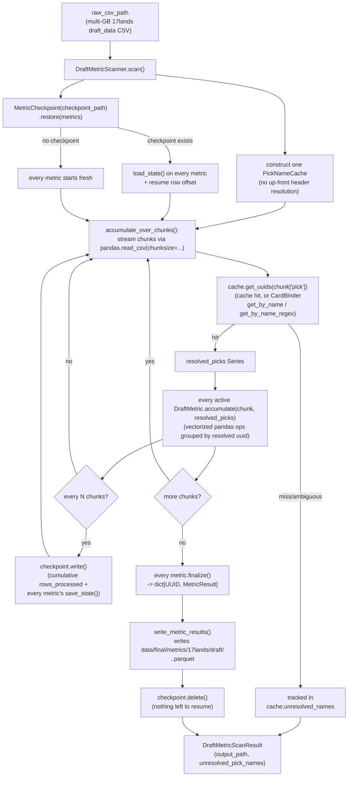

# draft_data_metrics

A pluggable, single-pass metric engine over 17lands' `draft_data` CSVs
(written by `src/data_retrieval/seventeenlands/`, landing at
`data/raw/17lands/draft_data/<expansion>.<format>.csv`). Each raw file
is one row per **pick** (not per game — see `game_data_metrics/` for
that shape), with metadata columns including `draft_id`, `pack_number`
(0-indexed), `pick_number` (0-indexed), `pick` (the card name taken
that pick), `pick_maindeck_rate`, `pick_sideboard_in_rate`, plus
header-based per-card column groups (`pack_card_<name>`, `pool_<name>`
— not used by anything built here yet, see below). Files run
multiple GB, so this container never loads one whole into memory.
Output lands in `data/final/metrics/17lands/draft/<expansion>.<format>.parquet`,
one row per `(card, metric)` pair, using the same `MetricResult` shape
`game_data_metrics/` uses (see `../metric_result.py`).

## Why this isn't just game_data_metrics with a different CSV

`game_data_metrics`'s whole resolution model — resolve the CSV's
*header* once, up front, into a fixed list of `CardColumnSet`s reused
unchanged across every chunk — depends on card references living in
the header (`deck_<name>`-style columns). The two metrics built here
(`average_pick_number`, `pick_sideboard_rate`) don't have that shape
at all: their card reference is the **`pick` column's per-row value**
— a card name string that appears in the *data*, not the header, with
the same few hundred distinct names repeating across potentially
millions of rows.

Because of that, this container has its own parallel pieces rather
than reusing `game_data_metrics`'s directly:

- `DraftMetric` (a `typing.Protocol`, same Strategy role as `Metric`)
  takes `accumulate(chunk, resolved_picks: pd.Series)` — a Series of
  already-resolved `nocab_uuid`s, index-aligned with `chunk`, one per
  row — instead of `card_columns: list[CardColumnSet]`. There's no
  header-derived list to hand it.
- `PickNameCache` (`pick_name_cache.py`) replaces `column_lookup.py`:
  instead of resolving the header once, it resolves each chunk's
  `pick` column, **caching** every name it's already seen (the same
  handful of names recur across the whole file, so re-querying
  `CardBinder` per row would be wasted work). Same underlying policy as
  `column_lookup.py`'s fallback though: try `CardBinder.get_by_name()`
  first, fall back to `get_by_name_regex()` for multi-faced cards, treat
  an ambiguous match as unresolved.
- `DraftMetricScanner` mirrors `MetricScanner`'s overall shape
  (checkpointed streaming pass, cumulative `rows_processed`, parquet
  output) closely — that part of the pattern *does* carry over — but
  its "resolve" step happens per-chunk via `PickNameCache`, not once
  up front.

`draft_data`'s header-based `pack_card_<name>`/`pool_<name>` columns
(what was in the pack/pool at each pick) aren't used by anything here
yet — no resolution machinery for them is built until a metric
actually needs it.

## Files

- `pick_name_cache.py` — `PickNameCache`: the one place in this
  container that talks to `CardBinder`, with a per-scan cache.
  Composes `../lookup_cache.py`'s `LookupCache` (the caching
  mechanism) with `../name_lookup.py`'s `find_uuid_by_name()` (the
  exact-match/regex-fallback policy) — both shared at the
  `seventeenlands/` level (`LookupCache` also with
  `replay_data_metrics`; `find_uuid_by_name()` also with
  `game_data_metrics/column_lookup.py`), not duplicated here.
- `draft_metric.py` — `DraftMetric`, the shared Strategy
  interface every concrete draft metric implements.
- `draft_metric_scanner.py` — `DraftMetricScanner`, the driver, and
  `DraftMetricScanResult`. Streaming/checkpointing/writing are NOT
  implemented locally — `scan()` composes `../metric_checkpoint.py`'s
  `MetricCheckpoint`, `../metric_scan_loop.py`'s
  `accumulate_over_chunks()`, and `../metric_writer.py`'s
  `write_metric_results()`, shared identically with `MetricScanner`
  and `ReplayMetricScanner` (see `game_data_metrics/README.md`'s
  "Shared machinery" note for why).
- `metrics/` — one file per concrete `DraftMetric` (renamed from
  `jobs/`), same per-file convention as `game_data_metrics/metrics/`.
  `average_pick_number.py` (`AveragePickNumberMetric`) and
  `pick_sideboard_rate.py` (`PickSideboardRateMetric`) — kept flat, as
  two independent classes despite a similar shape ("rule of two," not
  yet worth a shared family subdirectory — see either file's own
  docstring).

## How it works



**Crash/resume in one sentence:** identical guarantee to
`game_data_metrics` — if the process dies mid-scan, the next
`DraftMetricScanner.scan()` call against the same `checkpoint_path`
picks up from the last checkpoint's row offset instead of rescanning
from row 0.

## How to run

```python
from pathlib import Path
from src.data_refinement.card_binder.card_binder import CardBinder
from src.data_refinement.seventeenlands.draft_data_metrics.draft_metric_scanner import DraftMetricScanner
from src.data_refinement.seventeenlands.draft_data_metrics.metrics.average_pick_number import AveragePickNumberMetric
from src.data_refinement.seventeenlands.draft_data_metrics.metrics.pick_sideboard_rate import PickSideboardRateMetric
from src.schema.game_id import GameId

binder = CardBinder.load([Path("data/final/cards/mtg.jsonl")])

scanner = DraftMetricScanner(
    raw_csv_path=Path("data/raw/17lands/draft_data/MSH.PremierDraft.csv"),
    card_binder=binder,
    metrics=[
        AveragePickNumberMetric(expansion="MSH", format_code="PremierDraft"),
        PickSideboardRateMetric(expansion="MSH", format_code="PremierDraft"),
    ],
    output_path=Path("data/final/metrics/17lands/draft/MSH.PremierDraft.parquet"),
    checkpoint_path=Path("data/final/metrics/17lands/draft/MSH.PremierDraft.checkpoint.json"),
    source_game=GameId.MTG,
)
result = scanner.scan()
print(result.unresolved_pick_names)  # 'pick' values CardBinder couldn't resolve
```

This directory grows as more `DraftMetric`s get added under `metrics/`.
