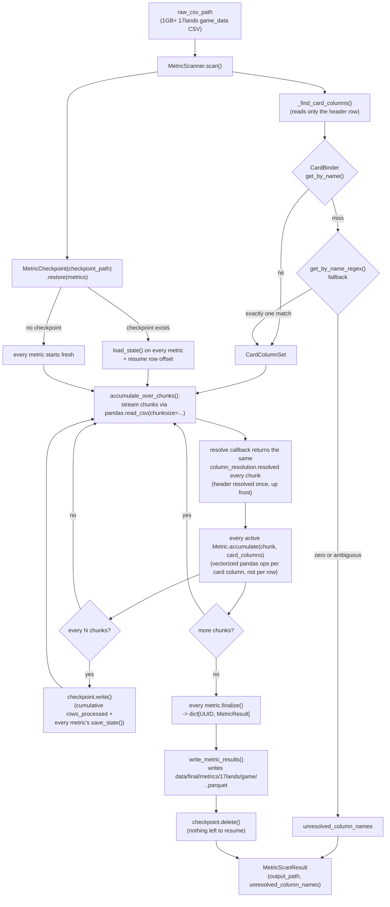

# game_data_metrics

A pluggable, single-pass metric engine over 17lands' `game_data` CSVs
(written by `src/data_retrieval/seventeenlands/`, landing at
`data/raw/17lands/game_data/<expansion>.<format>.csv`). Each raw file
is one row per game, ~18 metadata columns (`won`, `expansion`,
`event_type`/format, `opp_rank`, etc.) plus five columns per card in
the set (`opening_hand_<name>`, `drawn_<name>`, `tutored_<name>`,
`deck_<name>`, `sideboard_<name>`) — files run 1GB+, so this container
never loads one whole into memory. Two drivers read this same raw CSV
shape for two different purposes: `MetricScanner` writes
`data/final/metrics/17lands/game/<expansion>.<format>.parquet`, one
row per `(card, metric)` pair; `DeckOutcomeScanner` writes
`data/final/metrics/17lands/game/<expansion>.<format>.deck_outcomes.jsonl`,
one row per raw CSV row (that game's reconstructed deck + outcome).
See "Files" below for both.

The point of "pluggable": adding a new metric (e.g.
`win_rate_if_drawn`, `percent_of_decks_containing_card`) means writing
one new `Metric` implementation, not touching the streaming/
checkpointing/column-resolution machinery — N active metrics still
cost one pass over the file, not N passes.

**Why this lives at `data_refinement/seventeenlands/game_data_metrics/`,
not a top-level `data_refinement/game_data_metrics/`:** unlike
`card_binder` (a genuinely shared, cross-source capability — every
source's `CardIngestionStage` feeds the same one `CardBinder`),
there's no shared store or shared column-resolution logic multiple
raw sources plug into here. A different source's metrics (or even
17lands' own `draft_data`/`replay_data` CSVs — see the sibling
`draft_data_metrics/`/`replay_data_metrics/`) have entirely different
schemas and need their own resolution logic and `metrics/`, not a
shared engine reused as-is (confirmed in practice: `draft_data_metrics/`
mirrors this container's overall *pattern* but has its own
`DraftMetric`/`PickNameCache`, not `Metric`/`column_lookup.py`
reused directly — see its own README for why).
Organizing source-first, with `game_data_metrics/` as one of possibly
several sibling pipelines under `seventeenlands/`, avoids guessing at
a shared abstraction before a second real consumer exists to shape it
(PRINCIPLES.md: prefer duplication over a coupled abstraction that
will need to split again later).

## Files

- `card_column_set.py` — `CardColumnSet` (one card's five resolved column
  names). `MetricResult` (one finished `(card, metric)` output row)
  lives at `../metric_result.py` instead, shared with
  `draft_data_metrics`/`replay_data_metrics` — no game_data-specific
  needs of its own.
- `metric.py` — `Metric`, the shared Strategy interface (a
  `typing.Protocol`, matching `card_binder/ingestion.py`'s
  `CardIngestionStage` convention — structural, not inherited) every
  concrete metric implements: `accumulate()` per chunk,
  `finalize()` once at the end, `save_state()`/`load_state()` as a
  Memento pair for checkpointing.
- `column_lookup.py` — `find_card_columns()`: turns a raw CSV's
  header into resolved `CardColumnSet`s. Tries
  `CardBinder.get_by_name()` first; on a miss, falls back to
  `CardBinder.get_by_name_regex()` for cards 17lands names after
  only one face (multi-faced cards, e.g. `deck_Bruce Banner` for a
  card whose registered name is the combined `"Bruce Banner // The
  Incredible Hulk"`) — an ambiguous regex match (zero or more than
  one hit) is treated as unresolved, never guessed. The exact-match/
  regex-fallback policy itself lives in `../name_lookup.py`'s
  `find_uuid_by_name()` (shared with `draft_data_metrics/
  pick_name_cache.py`, which uses the identical policy), not
  duplicated here. `find_card_columns_in_csv(raw_csv_path, card_binder,
  source_game)` wraps `find_card_columns()` with the one piece every
  scanner in this container needs identically — reading only a raw
  CSV's header row (never the full file) before resolving it — shared
  by both `MetricScanner` and `DeckOutcomeScanner` below.
- `metric_scanner.py` — `MetricScanner`, the driver: resolves columns
  (`_find_card_columns()`, delegating to `column_lookup.
  find_card_columns_in_csv()`), then drives the checkpointed per-chunk
  scan and reports `MetricScanResult` (output path + any unresolved
  card names, which also lives here). Streaming/checkpointing/writing
  are NOT implemented locally — see "Shared machinery" below.
  `DEFAULT_OUTPUT_DIR`/`DEFAULT_OUTPUT_NAME` and the
  `default_output_path(expansion, format_code)` staticmethod name this
  pipeline's conventional output location (a recommended default a
  caller may use, not a requirement — `output_path` stays a required
  constructor parameter regardless).
- `deck_outcome_scanner.py` — `DeckOutcomeScanner`, a second driver
  over the same raw game_data CSV shape, producing a structurally
  different artifact than `MetricScanner`: one `DeckOutcome` per raw
  CSV row (that game's reconstructed deck — every resolved card's
  `nocab_uuid` repeated once per copy in its `deck_<name>` count,
  duplicates included — plus the row's `won` outcome), not a per-card
  aggregate. Does NOT implement `ScannableMetric`/`Metric` and does
  NOT compose `accumulate_over_chunks()`/`write_metric_results()`/
  `MetricCheckpoint` — there's no running aggregate here to accumulate
  or checkpoint, each row's output is independent. Writes JSONL, not
  parquet (the only non-parquet output in this project): a parquet
  file only becomes valid once its footer is written at close, so it
  can't safely resume from a crash mid-write the way this class needs,
  while a JSONL file's completed lines stay independently valid even
  if the process dies mid-write on the next one. `DEFAULT_OUTPUT_DIR`
  is the same directory `MetricScanner` writes into, under a distinct
  `DEFAULT_OUTPUT_NAME`/extension (`<expansion>.<format_code>.
  deck_outcomes.jsonl`) so the two coexist without colliding. Has no
  separate checkpoint file (no `checkpoint_path` parameter) — the
  output file itself is the sole, resume-authoritative source of
  truth: `scan()` reads any existing output line by line, tracking
  both a count of successfully-parsed lines and the byte offset
  immediately after the last one (`file.tell()`, read via an explicit
  `readline()` loop rather than `for line in file` — mixing that
  iteration form with `tell()` raises `OSError: telling position
  disabled by next() call`), discards a trailing partial line left by
  a crash, truncates to the last confirmed-valid byte offset, and
  resumes the CSV scan from that many rows in.
- **Shared machinery** (lives at `../` — the `seventeenlands/` level —
  extracted there once all three sibling pipelines needed the
  identical logic, rather than duplicated per pipeline):
  `../metric_checkpoint.py`'s `MetricCheckpoint` (checkpoint restore/
  write/delete), `../metric_scan_loop.py`'s `accumulate_over_chunks()`
  (the per-chunk streaming/progress-bar/checkpoint-interval loop), and
  `../metric_writer.py`'s `write_metric_results()` (the finalize/
  dtype-cast/parquet-write sequence) — all three composed by
  `MetricScanner.scan()`, and shared identically with
  `DraftMetricScanner` and `ReplayMetricScanner` since this logic was
  byte-for-byte identical across all three drivers before extraction.
- `metrics/` — one file per concrete `Metric` (renamed from `jobs/`),
  mirroring `card_binder/scryfall/`'s per-source subdirectory
  convention (one directory/file per variant, expected to grow).
  `win_rate/` is this container's one real metric family so far —
  `win_rate/base.py` (`_BinaryTriggerWinRateMetric`) plus
  `win_rate/win_rate.py`, `win_rate/drawn_win_rate.py`,
  `win_rate/opening_hand_win_rate.py`, promoted into its own
  subdirectory once a third sibling metric existed (the same
  threshold this project already uses elsewhere — see
  `win_rate/base.py`'s own docstring). `average_copies_when_included.py`,
  `average_game_length_with_card.py`, `inclusion_rate.py`, and
  `on_play_win_rate_delta.py` stay flat directly under `metrics/` —
  no shared base exists for them yet.

## How it works

Covers `MetricScanner.scan()` only — `DeckOutcomeScanner.scan()`'s
resume flow is different enough (no `MetricCheckpoint`, no
accumulate/finalize split) that it's described in prose in its own
"Files" bullet above rather than in this diagram.



**Crash/resume in one sentence:** if the process dies mid-scan, the
next `MetricScanner.scan()` call against the same `checkpoint_path`
picks up from the last checkpoint's row offset instead of rescanning
from row 0 — each metric's accumulator is restored via `load_state()`
before streaming resumes.

## How to run

```python
from pathlib import Path
from src.data_refinement.card_binder.card_binder import CardBinder
from src.data_refinement.seventeenlands.game_data_metrics.metric_scanner import MetricScanner
from src.data_refinement.seventeenlands.game_data_metrics.metrics.win_rate.win_rate import WinRateMetric
from src.schema.game_id import GameId

binder = CardBinder.load([Path("data/final/cards/mtg.jsonl")])

scanner = MetricScanner(
    raw_csv_path=Path("data/raw/17lands/game_data/MSH.PremierDraft.csv"),
    card_binder=binder,
    metrics=[WinRateMetric(expansion="MSH", format_code="PremierDraft")],
    output_path=Path("data/final/metrics/17lands/game/MSH.PremierDraft.parquet"),
    checkpoint_path=Path("data/final/metrics/17lands/game/MSH.PremierDraft.checkpoint.json"),
    source_game=GameId.MTG,
)
result = scanner.scan()
print(result.unresolved_column_names)  # card names CardBinder couldn't resolve
```

```python
from src.data_refinement.seventeenlands.game_data_metrics.deck_outcome_scanner import (
    DeckOutcomeScanner,
)

deck_scanner = DeckOutcomeScanner(
    raw_csv_path=Path("data/raw/17lands/game_data/MSH.PremierDraft.csv"),
    card_binder=binder,
    output_path=DeckOutcomeScanner.default_output_path("MSH", "PremierDraft"),
    source_game=GameId.MTG,
    expansion="MSH",
    format_code="PremierDraft",
)
deck_result = deck_scanner.scan()
print(deck_result.unresolved_column_names)
# data/final/metrics/17lands/game/MSH.PremierDraft.deck_outcomes.jsonl now
# holds one {"deck_card_uuids": [...], "won": ..., "expansion": ..., "format": ...}
# JSON line per raw CSV row. Re-running scan() against the same
# output_path after an interrupted run resumes from wherever the file
# was left off, rather than starting over.
```

This directory grows as more `Metric`s get added under `metrics/`.
