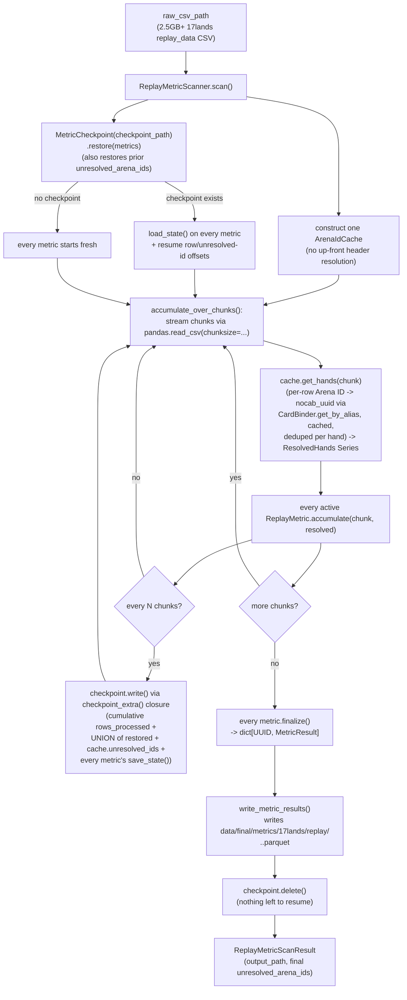

# replay_data_metrics

A pluggable, single-pass metric engine over 17lands' `replay_data` CSVs
(written by `src/data_retrieval/seventeenlands/`, landing at
`data/raw/17lands/replay_data/<expansion>.<format>.csv`) — one row per
game, ~18 metadata columns (`won`, `num_mulligans`, `expansion`, etc.)
plus `candidate_hand_1..7`/`opening_hand`, then ~2500 columns of
per-turn telemetry (`user_turn_N_*`, `oppo_turn_N_*`) — files run
2.5GB+, so this container never loads one whole into memory. Output
lands in `data/final/metrics/17lands/replay/<expansion>.<format>.parquet`
(`ReplayMetricScanner.DEFAULT_OUTPUT_DIR`/`default_output_path()` —
see below),
one row per `(card, metric)` pair.

Most of the ~2500 turn-telemetry columns (33 stat families × 30 turns
× 2 sides — `user_turn_N_creatures_cast`, `_creatures_attacked`,
`_creatures_killed_combat`, `_cards_tutored`, `eot_*_cards_in_hand`,
`eot_*_creatures_in_play`, etc.) are pipe-delimited Arena card ID
cells, the same shape as `opening_hand`/`candidate_hand_N` — not
aggregate counts, despite what their names suggest. The only
genuinely numeric per-turn columns are `*_mana_spent` and `eot_*_life`.
This means most of the file carries real per-card event attribution
(cast, drawn, discarded, tutored, attacked, blocked, killed in/out of
combat, board presence over time) — `opening_hand`/`candidate_hand_1`
(via `arena_id_cache.py`) and the cast-relevant turn columns (via
`cast_event_scanner.py`) are resolved/consumed today; the rest
(attacked/blocked/killed/tutored/discarded/board-presence columns)
don't have a consumer yet — see the placeholder files under `metrics/`
for the shape of that remaining work.

`cast_event_scanner.py` resolves the turn-indexed "was card X cast
this turn" columns; `arena_id_cache.py` only resolves the two fixed
hand columns. The two caches are deliberately independent (see
`cast_event_scanner.py`'s docstring for why), not a generalization of
one into the other.

**Why this doesn't reuse `game_data_metrics`:** `game_data_metrics`
resolves card identity from the CSV **header** — one column per card,
resolved once via `CardBinder.get_by_name()`. `replay_data` has no
per-card columns at all: the only per-card signal lives in per-**row**
**cell values** — `opening_hand`/`candidate_hand_1..7` are each a
pipe-delimited string of Arena's numeric card IDs (e.g.
`"104936|104917|105170"`), resolved via
`CardBinder.get_by_alias(source_game, DataSource.ARENA, id_str)`
instead of by name. That's a different resolution shape (per-row
parsing vs. per-header lookup), so this container has its own driver
(`ReplayMetricScanner`) and metric protocol (`ReplayMetric`) rather than
reusing `MetricScanner`/`Metric`/`column_lookup.py` — see
`game_data_metrics/README.md`'s note on why `seventeenlands/` is
organized source-first rather than around one shared metrics engine.
Both containers do reuse the same `../metric_result.py` output row
shape — that part has no game_data-specific assumptions baked in.

Most of the file's ~2500 turn-telemetry columns do carry per-card
attribution (see the correction above) — `opening_hand`/
`candidate_hand_1` (via `arena_id_cache.py`) and the cast-relevant
turn columns (via `cast_event_scanner.py`) are resolved/consumed
today; the rest (attacked/blocked/killed/tutored/discarded/board-
presence columns) don't have a consumer yet — see the placeholder files
under `metrics/` for the shape of that remaining work.

## Files

- `arena_id_cache.py` — `ResolvedHands` (one row's resolved hand data:
  `opening_hand`/`candidate_hand_1` as deduplicated `list[UUID]`, plus
  `mulliganed: bool`) and `ArenaIdCache` (constructed once per
  `ReplayMetricScanner.scan()` call, caches every Arena ID's lookup for
  the life of that scan — mirrors
  `../draft_data_metrics/pick_name_cache.py`'s `PickNameCache`, same
  rationale: a few hundred distinct cards get referenced tens of
  millions of times, so re-resolving the same ID repeatedly would be
  wasted work). `ArenaIdCache.get_hands(chunk)` returns a `pd.Series`
  of `ResolvedHands`, index-aligned with `chunk` — called once per
  chunk by `ReplayMetricScanner`, so N active metrics still cost one
  resolution pass, not N.
- `replay_metric.py` — `ReplayMetric`, the shared Strategy
  interface (a `typing.Protocol`, matching `Metric`'s convention)
  every concrete metric implements: `accumulate(chunk, resolved)` per
  chunk (resolved data passed as an explicit typed argument, never
  mutated into `chunk`), `finalize()` once at the end,
  `save_state()`/`load_state()` as a Memento pair for checkpointing.
- `replay_metric_scanner.py` — `ReplayMetricScanner`, the driver: streams
  the CSV in chunks via pandas, resolves each chunk via one
  `ArenaIdCache` instance owned for the whole scan, calls every active
  metric's `accumulate()`, checkpoints periodically, writes results,
  and reports `ReplayMetricScanResult` (output path + the
  `frozenset[str]` of distinct Arena IDs that couldn't be resolved
  anywhere in the scan — a set rather than a list, since checkpoint
  resume unions it across restarts and a set costs nothing extra,
  bounded by distinct-card-count rather than row-count).
  `DEFAULT_OUTPUT_DIR`/`DEFAULT_OUTPUT_NAME` and the
  `default_output_path(expansion, format_code)` staticmethod name this
  pipeline's conventional output location (a recommended default, not
  a requirement — `output_path` stays a required constructor
  parameter regardless).
- `cast_event_scanner.py` — `Side` (enum), `CastEvent` (one cast
  instance: side, turn, resolved card), and `CastEventScanner`
  (cache-first Arena-ID resolution across the ~240 turn-indexed cast
  columns — up to 4 column families × 30 turns × 2 sides, confirmed
  via real data). Mirrors `arena_id_cache.py`'s `ArenaIdCache` in
  shape but is deliberately NOT shared with it and NOT owned by
  `ReplayMetricScanner`/wired into `ReplayMetric`'s Protocol — each
  metric that needs cast events constructs and owns its own
  `CastEventScanner` instance, called inline inside its own
  `accumulate()`. A documented, accepted tradeoff (redundant
  resolution across metrics that are all active at once), not an
  oversight — see the module's own docstring.
- `metrics/` — one file per concrete `ReplayMetric`, with a
  subdirectory per real metric family:
  - `binary_trigger_rate/` — "fraction of games where a card appeared
    in some `ResolvedHands` field that also had some outcome true."
    `base.py` holds the shared `_BinaryTriggerRateMetric`;
    `opening_hand_win_rate.py`/`candidate_hand_mulligan_rate.py` are
    its two implemented subclasses.
  - `cast_event_average/` — "average some per-cast-instance value
    across every `CastEvent` found for a card" (sum/count, not
    positive/total — a card can contribute many observations per row,
    since every cast instance is its own observation). `base.py` holds
    the shared `_CastEventAverageMetric`;
    `average_turn_cast.py`/`average_turns_remaining_post_cast.py` are
    its two subclasses.
  - `opponent_response_rate.py` (`OpponentResponseRateMetric`) is
    deliberately standalone, built on neither shared family — its
    trigger is per-cast-instance like the average family, but its
    outcome column name is computed dynamically per instance (which
    side, which turn), not known at class-definition time. Stays flat
    directly under `metrics/`, not in its own subdirectory — no
    sibling shares its shape.

  These three metrics are fully implemented, same as the two
  hand-based metrics above — 5 of 11 `ReplayMetric`s in this container
  are implemented today (the remaining 6 are bare placeholders, see
  below). All three new metric constructors take `(expansion,
  format_code, card_binder, source_game)` — a deviation from the two
  hand-based metrics' `(expansion, format_code)`-only constructor,
  because these metrics resolve their own turn columns rather than
  receiving pre-resolved data from `ReplayMetricScanner`.

  Six files remain bare PLACEHOLDERS (name + stub methods, explicitly
  "not yet designed"), flat directly under `metrics/`:
  `average_turns_held_in_hand.py`, `average_turns_on_board.py`,
  `tutor_target_rate.py`, `discard_rate.py`, `attack_blocked_rate.py`,
  `combat_kill_involvement_rate.py`.

## How it works



## How to run

```python
from pathlib import Path
from src.data_refinement.card_binder.card_binder import CardBinder
from src.data_refinement.seventeenlands.replay_data_metrics.replay_metric_scanner import ReplayMetricScanner
from src.data_refinement.seventeenlands.replay_data_metrics.metrics.binary_trigger_rate.opening_hand_win_rate import OpeningHandWinRateMetric
from src.data_refinement.seventeenlands.replay_data_metrics.metrics.binary_trigger_rate.candidate_hand_mulligan_rate import CandidateHandMulliganRateMetric
from src.schema.game_id import GameId

binder = CardBinder.load([Path("data/final/cards/mtg.jsonl")])

scanner = ReplayMetricScanner(
    raw_csv_path=Path("data/raw/17lands/replay_data/MSH.PremierDraft.csv"),
    card_binder=binder,
    metrics=[
        OpeningHandWinRateMetric(expansion="MSH", format_code="PremierDraft"),
        CandidateHandMulliganRateMetric(expansion="MSH", format_code="PremierDraft"),
    ],
    output_path=Path("data/final/metrics/17lands/replay/MSH.PremierDraft.parquet"),
    checkpoint_path=Path("data/final/metrics/17lands/replay/MSH.PremierDraft.checkpoint.json"),
    source_game=GameId.MTG,
)
result = scanner.scan()
print(result.unresolved_arena_ids)  # distinct Arena IDs CardBinder couldn't resolve
```

This directory grows as more `ReplayMetric`s get added under `metrics/`.
