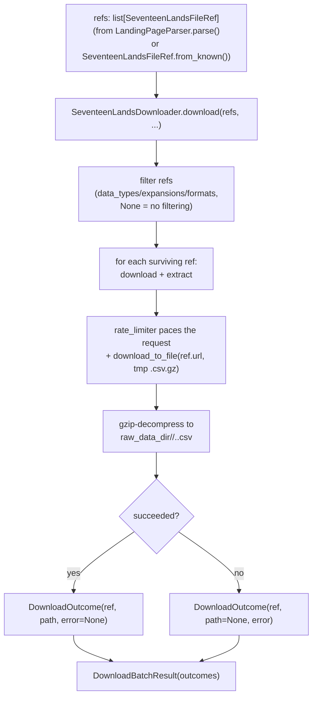

# seventeenlands

Fetches 17Lands' public per-set/per-format CSV dumps (`draft_data`,
`game_data`, `replay_data` — see https://www.17lands.com/) and writes
them, decompressed, to `data/raw/17lands/<data_type>/<expansion>.
<format_code>.csv`. No parsing, filtering, or schema conversion
happens here — that's `data_refinement`'s job (see
`src/data_retrieval/README.md` for this container's shared scope).

A file to fetch is represented as a `SeventeenLandsFileRef`, produced
either way and consumed identically by the downloader:

- **Discovery** — `LandingPageParser.parse(html: str) ->
  list[SeventeenLandsFileRef]` scrapes whatever `.csv.gz` links are
  currently listed on the 17lands.com landing page.
- **Direct/manual** — `SeventeenLandsFileRef.from_known(data_type:
  DataType, expansion: str, format_code: str) ->
  SeventeenLandsFileRef` builds the same ref from a known triple,
  since the download URL is a deterministic template — no network
  needed. See `notes.txt` in this directory for a reference list of
  known expansion/format codes.

**Explicitly out of scope:** no date-range filtering — every 17lands
file is a static full-history dump per (data_type, expansion, format);
there is no server-side way to request a time slice (any
time-windowing is `data_refinement`'s concern). 17lands' `card_data`
API (pre-computed per-card `win_rate`/`play_rate`/etc. — documented in
`notes.txt`) is also explicitly out of scope: this project's goal is
an extensible metric engine over raw rows, not a client for what
17lands already exposes.

## Files

- `refs.py` — `DataType` (`DRAFT`/`GAME`/`REPLAY`) and
  `SeventeenLandsFileRef` (frozen dataclass: `data_type`, `expansion`,
  `format_code`, `url`), plus `from_known()` above.
- `landing_page_parser.py` — `LandingPageParser`, single-consumer to
  this directory.
- `downloader.py` — `SeventeenLandsDownloader`, `DownloadOutcome`
  (`ref`, `path: Path | None`, `error: Exception | None` — exactly one
  of `path`/`error` is meaningful per outcome), and
  `DownloadBatchResult` (`outcomes: list[DownloadOutcome]`).
  `SeventeenLandsDownloader(raw_data_dir: Path, rate_limiter:
  RateLimiter)` exposes:
  - `download(refs: list[SeventeenLandsFileRef], *, data_types:
    list[DataType] | None = None, expansions: list[str] | None =
    None, formats: list[str] | None = None) -> DownloadBatchResult` —
    filters refs (`None` on any dimension means no filtering), then
    downloads each surviving ref. Collect-and-continue: one ref
    failing is recorded in the result, not raised — a large batch
    always finishes.
  - `download_one(ref: SeventeenLandsFileRef) -> Path` — downloads +
    decompresses a single ref; used internally by `download()`, but
    also usable directly.

## How it works



## How to run

```python
from pathlib import Path
from src.data_retrieval.seventeenlands.downloader import SeventeenLandsDownloader
from src.data_retrieval.seventeenlands.refs import DataType, SeventeenLandsFileRef
from src.data_retrieval.rate_limiter import RateLimiter

downloader = SeventeenLandsDownloader(
    Path("data/raw/17lands"),
    RateLimiter(requests_per_minute=12),
)
refs = [SeventeenLandsFileRef.from_known(DataType.GAME, "MSH", "PremierDraft")]
result = downloader.download(refs)
print(result.outcomes)
```
