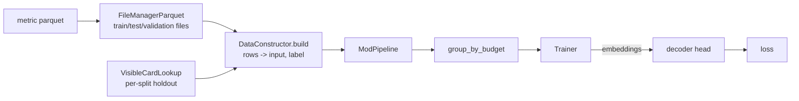

# dojos/generic

The reusable dojo "cells": one generic dojo class per
`(input shape, task shape)` pair, each owning a small private decoder
head and a loss. A metric family plugs into a cell by supplying a
`DataConstructor` that turns its parquet rows into (input, label) pairs,
so one cell serves every metric family with the same shape.

## Files

- `generic_dojo.py` - `GenericDojo`, the parquet-backed `Dojo`
  implementation every cell builds on: splits the metric file into
  train/test/validation (`FileManagerParquet`), reads each split through
  a holdout-filtered `VisibleCardLookup`, applies the `ModPipeline`,
  packs examples to the trainer's `BatchBudget`, and checks the metric
  file's embedded `CardBinder`/`DeckBox` versions at construction. Its
  last construction step calibrates the cell's loss to the TRAIN split
  (see "Loss calibration" below).
- `dojo_config.py` - `DojoConfig`, a frozen value object for the
  configuration half of a cell's constructor: `name` (the dojo's
  `Trainer`-facing identity; set it when two metric files share a stem),
  split-file location and prefix, `force_resplit`, `rng_seed`,
  `strict_version_check`. `GenericDojo.__init__` is the only place a
  `None` field falls back to its default.
- `data_constructor.py` - the `DataConstructor` Protocol:
  `build(chunk: pd.DataFrame, lookup: CardLookup) -> List[TrainingDatum]`.
- `data_constructors/` - the concrete constructors, one module each
  (see the table below). `_row_values.py` holds the shared helpers that
  turn one raw row value into a typed label or card(s).
- `paired_metric_dojos.py` - base classes for per-metric wrappers that
  only name their paired metric: `CardAverageMetricDojo`,
  `DeckLabelMetricDojo`, `MaskedFieldMetricDojo`,
  `HeldOutDeckCardMetricDojo` (passes its deck box on, so the metric
  version check verifies it) (see "Per-metric
  wrappers" below).
- `pooling.py` - `EmbeddingPooler` Strategy (variable-length list of
  card embeddings -> one vector); `MeanEmbeddingPooler` is the only
  implementation.
- `option_scoring.py` - `OptionScoringHead` Strategy (one logit per
  option in a ragged pack, optionally conditioned on a context vector);
  `BilinearOptionScoringHead` is the only implementation. Deliberately
  low-capacity: a high-capacity scorer could solve the task in its own
  weights and leave the card embeddings under-constrained.
- One subdirectory per cell, each with `dojo.py` and `decoder_head.py`
  (`single_card_fixed_classification/` also has `loss_spec.py`):

| Cell | Input | Label | Loss | Calibration (baseline) |
|---|---|---|---|---|
| `single_card_regression/` | one card | float | `MseLoss` | z-scored labels (1.0) |
| `single_card_fixed_classification/` | one card | one of `label_values` | from its `LossSpec` (default `FixedClassificationLoss`) | from its `LossSpec` (default class-prior entropy) |
| `multi_card_regression/` | a deck | float | `MseLoss` | z-scored labels (1.0) |
| `multi_card_binary_classification/` | a deck | 0/1 | `BceLoss` (one logit) | binary entropy of the positive rate |
| `multi_card_fixed_classification/` | a deck | one of `label_values` | `FixedClassificationLoss` | class-prior entropy |
| `multi_card_option_selection/` | a ragged pack of options | picked option's index | `PickPredictionCrossEntropyLoss` | mean ln(pack size) |
| `multi_group_option_selection/` | `[pack_options, pool]` | picked option's index | `PickPredictionCrossEntropyLoss` | mean ln(pack size) |
| `multi_group_regression/` | `[group_0, group_1]` | float | `MseLoss` | z-scored labels (1.0) |

Multi-card cells pool the deck with an injected `EmbeddingPooler` before
their MLP. The option-selection cells never pool the options: they
score each one. Group order is load-bearing for both multi-group cells:
`input_shape_of()` (`src/schema/type_hints.py`) classifies an input by
peeking group 0, so group 0 must never be empty. `multi_group_regression`
pools both groups with one shared pooler, concatenates them in fixed
order, and substitutes a learned placeholder vector when group 1 is
empty. `single_card_fixed_classification`'s `loss_spec` (a `LossSpec`:
a loss factory and its matching calibration, as one value) lets a metric
use `SOFT_CLASSIFICATION_LOSS_SPEC` (a distribution over `label_values`,
`CardCharacterPredictionDojo`) or `MASKED_VECTOR_REGRESSION_LOSS_SPEC`
(independent per-position rates in [0, 1], `PickNumberDecayCurveDojo`;
not z-scored, since its loss sigmoids the head's output) with the same
head.

## Loss calibration

Every cell passes `GenericDojo` a `LossCalibration`
(`../loss/loss_calibration.py`). As its last construction step,
`GenericDojo` builds an evenly strided, unmodded sample of the TRAIN
split through the data constructor (every row up to 20,000 TRAIN rows,
then every k-th row) and hands it to the calibration. The result, one
`CalibratedLoss`, holds:

- the loss `compute_loss` scores with (`loss_calculator`). Regression
  cells wrap `MseLoss` in `StandardizedLabelLoss`, so the head predicts
  (y - mean) / std of the TRAIN labels; batches keep raw labels.
- the baseline `baseline_loss(batch)` returns for every batch: the loss
  of the best input-ignoring predictor on the sample (column above).
- `label_stats` (regression only): the TRAIN `LabelStats`, to map a
  prediction back to label units (`to_label_units`).

An empty TRAIN sample, a constant regression label (zero std), or a zero
baseline (e.g. one class only) raises `ValueError` at construction.
Each dojo logs one INFO line with the sample size, the time taken and
the baseline (plus label mean and std for regression).

Data constructors:

| Constructor | Metric family | Input -> label |
|---|---|---|
| `CardAverageDataConstructor` | `CardAverageMetric` and 17lands per-card rates | card -> float (`uuid_column` configurable, e.g. `"pool_card_uuid"`) |
| `MaskedFieldDataConstructor` | `MaskedFieldMetric` | card -> masked field's class |
| `MaskedFieldRegressionDataConstructor` | `MaskedFieldRegressionMetric` | card -> masked field's number |
| `CardCharacterPredictionDataConstructor` | `CardCharacterPredictionMetric` | card -> character distribution |
| `PickNumberDecayCurveDataConstructor` | `PickNumberDecayCurveMetric` | card -> sparse `{bucket: take_rate}` (buckets under `min_sample_count` masked) |
| `DeckLabelDataConstructor` | `DeckLabelMetric` and 17lands per-deck labels | deck (from a `DeckBox`) -> label (`label_caster` configurable) |
| `DeckCardMaskDataConstructor` | `DeckCardMaskMetric` | deck minus one card -> that card |
| `PackToPickChoiceSetDataConstructor` | `PackToPickChoiceSetMetric` | pack -> picked index (row skipped if any option is unmatched) |
| `PoolConditionedPickDataConstructor` | `PoolConditionedPickMetric` | `[pack, pool]` -> picked index |
| `HeldOutDeckCardDataConstructor` | `HeldOutDeckCardMetric` | `[candidates, deck minus every copy of the target]` -> target's index. A hidden target skips the row; a hidden decoy is dropped and the index taken after (no decoy left skips); hidden context cards are dropped (empty context skips) |
| `AttackerBlockerCombatOutcomeDataConstructor` | `AttackerBlockerCombatOutcomeMetric` | `[attackers, blockers]` -> net kill delta (empty blockers allowed) |

## Per-metric wrappers

A per-source package (`../gwent_one/`, `../sts_gg/`, `../seventeenlands/`,
...) holds one thin wrapper per metric: a cell subclass with the metric's
output path, label column and constructor filled in. Where a wrapper is
nothing more than that, it subclasses a `paired_metric_dojos.py` base
and sets `METRIC`:

```python
class CardRelicCountDojo(CardAverageMetricDojo):
    """Card -> predicted average relicCount."""

    METRIC = CardRelicCountMetric
```

A wrapper that needs more (a label literal, a custom loss, a non-default
constructor) subclasses its cell directly.

## How it works


```mermaid
flowchart LR
    P[metric parquet] --> FM[FileManagerParquet<br/>train/test/validation files]
    FM --> DC[DataConstructor.build<br/>rows -> input, label]
    VL[VisibleCardLookup<br/>per-split holdout] --> DC
    DC --> M[ModPipeline] --> B[group_by_budget] --> T[Trainer]
    T -- embeddings --> H[decoder head] --> L[loss]
```

## How to run

```python
from src.data_refinement.card_binder.card_binder import CardBinder
from src.dojos.dojo import BatchBudget
from src.dojos.gwent_one.masked_field_dojos import ColorMaskDojo
from src.schema.game_id import GameId
from src.schema.holdout import HoldoutSpec
from src.schema.splits import Split

binder = CardBinder.load([CardBinder.default_output_path(GameId.GWENT)])
dojo = ColorMaskDojo(binder, HoldoutSpec.no_holdout(), card_embedding_size=32)
batch = next(dojo.batches(Split.TRAIN, BatchBudget(32, lambda card: 1)))
```
