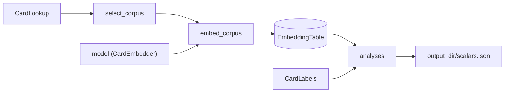

# evaluation

Post-training evaluation of encoder checkpoints, run offline by hand from
scripts. **Intrinsic** evaluation fits no model: it embeds cards once into a
table, then analyzes the stored vectors (projection plots, cluster
agreement, label compactness). **Extrinsic** evaluation trains fresh dojo
heads on a frozen encoder by reusing `Trainer`, and compares the loss
curves. `Trainer` never calls this package.

Status: in progress. Built: corpus selection, the embedding table,
embedding a corpus into it, card labels, and the intrinsic analyses
(cluster agreement, label compactness, projection plot), extrinsic
runs, and learning-curve plots. A first-draft driver,
[`scripts/run_evaluation.py`](../../scripts/run_evaluation.py), composes
them end to end (see How to run).
[`scripts/plot_learning_curves.py`](../../scripts/plot_learning_curves.py)
plots any rounds CSVs on their own (`--curve label=path`, repeatable):
an extrinsic run that stopped partway, or a training run's own
`rounds.csv`. Remaining design questions are in
[`plans/evaluation.md`](../../plans/evaluation.md).

## Files

Grouped by pipeline stage; each business-logic class has its own file,
sharing it only with small data classes or trivial helpers.

- [chart_theme.py](chart_theme.py): `ChartTheme`, the colors and
  resolution every figure shares (the dataviz reference palette, light
  mode: eight categorical colors in their validated order, surface, text,
  gridline and axis grays). Each chart's style composes it:
  `FigureStyle` (projection scatter) and `CurveStyle` (learning curves).
- [card_row.py](card_row.py): `CardRow` (`nocab_uuid`, `source_game`),
  the key the embedding table, labels and analyses all share.
- [select_corpus.py](select_corpus.py): `CorpusSpec` (games, optional `TierFilter`) and
  `select_corpus(card_lookup, spec)`, a lazy generator over the chosen
  games' cards, in `GameId` order. A `TierFilter` keeps an exact set of
  holdout tiers under a given `HoldoutSpec` (e.g. only VALIDATION cards,
  the ones a checkpoint never saw): domain shift is expressed by which
  cards go in, not by a separate evaluation mode.
- [embedding/](embedding/): cards to stored vectors.
  - [embedding_table.py](embedding/embedding_table.py): `EmbeddingTable`,
    one encoder's card embeddings in a SQLite file, keyed by `nocab_uuid`.
    Its games are fixed at `create()`. `rows()` is sorted by
    `nocab_uuid`, so seeded sampling picks the same cards from any two
    tables over the same corpus. Every `add()` is committed before it
    returns, and a stored table is always finite
    (`require_finite_vectors`, `NonFiniteEmbeddingError`).
  - [embedding_table_metadata.py](embedding/embedding_table_metadata.py):
    `EmbeddingTableMetadata`, what produced a table (encoder label,
    checkpoint, width, binder version per game, time), with its lossless
    `to_json()` / `from_json()`.
  - [embed_corpus.py](embedding/embed_corpus.py): `embed_corpus`, which
    embeds a corpus into a table in batches, and the `CardEmbedder`
    Protocol it takes (`embedding_dim`, `isolated_embeddings`), which
    `SingleCardModel` and `MultiCardModel` satisfy as they are.
- [labels/](labels/): a categorical label per card.
  - [card_labels.py](labels/card_labels.py): the `CardLabels` Protocol
    (`name`, `label_of(row) -> str | None`, `None` meaning unlabeled),
    `GameLabels`, and `HoldoutTierLabels` (a card's tier under a
    `HoldoutSpec`, typically the checkpoint's own: the domain-shift label).
  - [metric_parquet_labels.py](labels/metric_parquet_labels.py):
    `MetricParquetLabels`, from one or more per-card categorical metric
    parquets (only `nocab_uuid` and `label` are read, with pyarrow so
    integer labels stay integers); a card in more than one row is
    rejected, a null label leaves it unlabeled.

- [analyses/](analyses/): intrinsic measurements over a table.
  - [embedding_analysis.py](analyses/embedding_analysis.py): the
    `EmbeddingAnalysis` Protocol (`name`, `run(table, output_dir) ->
    AnalysisResult`) and the shared output contract:
    `require_fresh_output_dir` (a non-empty directory is an earlier run's
    results: `FileExistsError`) and `write_analysis_result` (writes
    `scalars.json`; NaN/inf is refused, never written).
  - [card_sample.py](analyses/card_sample.py): the seeded `CardSample`
    rules, `AllCards` and `PerLabelCap(n)` (at most n cards per label, so
    one dominant label cannot swamp the rest). The same table + labels +
    seed always picks the same cards.
  - [labeled_sample.py](analyses/labeled_sample.py): `draw_labeled_sample`,
    the preparation every label-using analysis shares (sample, drop
    unlabeled cards, require two cards and two labels, read vectors).
  - [cluster_agreement.py](analyses/cluster_agreement.py):
    `ClusterAgreement`, KMeans (k = number of labels) blind to the labels,
    scored against them: `ari`, `nmi`.
  - [label_compactness.py](analyses/label_compactness.py):
    `LabelCompactness`: `silhouette`, and `nearest_centroid_accuracy`
    with leave-one-out centroids (a card never votes for itself) next to
    its `majority_baseline`. Needs some label with two or more cards.
  - [effective_rank.py](analyses/effective_rank.py): `EffectiveRank`,
    label-free and unsampled: exp(entropy) of the centered vectors'
    variance shares, i.e. how many directions the embedding really uses
    (`effective_rank`, `effective_rank_fraction`, `top1_variance_share`,
    `top5_variance_share`). Flags dimensional collapse; the driver writes
    it under `intrinsic/<encoder>/unlabeled/`.
  - [projection_plot.py](analyses/projection_plot.py): `ProjectionPlot`,
    a seeded t-SNE of the sampled cards, illustrative only (report it
    next to a numeric analysis). Writes `projection.png` (up to the
    style's `max_highlighted` labels colored, the rest folded into a
    neutral "Other"), `projection_by_label.png` (small multiples: one
    panel per label, the `max_panels` largest - 12 by default),
    `projection.csv` (`nocab_uuid`, `source_game`, `label`, `x`, `y`: the
    table view, and re-plotting without re-running t-SNE) and
    `scalars.json` (`kl_divergence`, left out if not finite). `highlighted` takes a
    count (most-sampled first, ties by name) or the labels themselves -
    name them when comparing encoders under `PerLabelCap`, where every
    large label ties.
  - [projection_renderer.py](analyses/projection_renderer.py):
    `ProjectionRenderer` draws both figures in a `FigureStyle` (a frozen
    dataclass; defaults are the dataviz reference palette, light mode).
    The overview's color limit is the style's `max_highlighted`
    (`len(series)`): only three colors stay distinguishable in a scatter
    for color-blind readers, so a custom `series` must be re-validated.

  All three analyses work on unit-length vectors, so distances rank pairs like
  cosine distance, and all report `n_cards` and `n_labels`
  (`LabeledSample.size_scalars`) - a convention for label-using analyses,
  not something the Protocol enforces.

- [extrinsic/](extrinsic/): fresh dojo heads trained on a frozen encoder.
  - [run_extrinsic.py](extrinsic/run_extrinsic.py): `run_extrinsic`,
    one frozen `Trainer` phase (named `"extrinsic"`) over every given dojo,
    no checkpointer, a `CsvRunListener` writing
    `<output_dir>/extrinsic/<encoder_label>/rounds.csv`, then one
    VALIDATION pass over each head restored to its best TEST round
    (`validation.json`: raw `losses` and `normalized_losses`, i.e. loss /
    the dojo's baseline; skipped if the run stopped early). Regression
    dojos' raw losses are in label standard deviations (their labels are
    z-scored from TRAIN statistics), so they are not comparable with runs
    from before that change. `ExtrinsicSpec` holds the phase settings and
    seed; `ExtrinsicResult` reports what was written. Everything is
    validated before anything touches disk (label, directory, a trainable
    head per dojo, then `Phase`/`TrainingPlan`/`Trainer` construction);
    after training starts nothing raises - a failed VALIDATION pass or
    write is logged, so a finished run is never lost. Reuse the *same*
    dojo objects for every encoder: each run calls `reset_head()` and
    reseeds `random`/`torch`, so every encoder starts from identical heads.
  - [best_head_keeper.py](extrinsic/best_head_keeper.py): `BestHeadKeeper`,
    a `RunListener` that snapshots each dojo's head at its lowest
    normalized TEST loss and restores those snapshots before the
    VALIDATION pass.
  - [learning_curves.py](extrinsic/learning_curves.py):
    `plot_learning_curves(curves, output_dir, x_axis)`: encoder label ->
    rounds CSV in, one `<dojo>.png` per dojo out, every encoder's
    normalized TEST loss (with a reference line at 1.0, "learned nothing")
    against `step` or `elapsed_seconds`; a chart with any row from a
    rounds CSV older than the `normalized_test_loss` column plots raw TEST
    loss instead. Reads CSVs only through
    `read_rounds_csv`; reads, groups and names every plot (refusing two
    dojos that would share a file name) before writing any. The order of
    `curves` fixes each encoder's color on every chart; up to eight
    encoders (the validated line colors).
  - [curve_renderer.py](extrinsic/curve_renderer.py): `CurveRenderer`
    draws one chart in a `CurveStyle`: 2px lines ending in a ringed dot, a
    legend for two or more encoders (one encoder: the title names it),
    direct end labels when there are at most four and their ends don't
    crowd, hairline gridlines. The rounds CSVs are the table view.

## How it works



`embed_corpus` skips every card already in the table, so an interrupted
run resumes where it stopped and a second corpus can extend a table. It is
built for unattended runs: a batch whose embedding fails (an exception, or
NaN/inf output) is logged and skipped, its cards left out for a re-run to
retry, and only `max_consecutive_failures` failed batches in a row stop
the run. A card of a game the table was not created for raises at once.

One table holds one encoder's embeddings; comparing encoders means
comparing tables built from the same corpus.

## How to run

The whole flow - load checkpoints, embed and analyze per encoder, extrinsic
runs on shared dojos, learning curves - is
[`scripts/run_evaluation.py`](../../scripts/run_evaluation.py) (a prototype:
corpus, labels and dojos are hard-coded there as a worked example; it is
re-runnable, skipping finished work):

```bash
PYTHONPATH=. python3 scripts/run_evaluation.py --name gwent_v1 \
    --single-checkpoint runs/single/pretrain_round0007 \
    --multi-checkpoint runs/multi/pretrain_round0005
PYTHONPATH=. python3 scripts/run_evaluation.py --name smoke --smoke  # wiring check
```

The pieces, by hand:

```python
games = frozenset({GameId.MTG, GameId.GWENT})
spec = CorpusSpec(games=games, tier_filter=None)
metadata = EmbeddingTableMetadata(
    encoder_label="single_v1", checkpoint_dir=checkpoint_dir,
    embedding_dim=model.embedding_dim,
    binder_versions={game: binder.version_for(game) for game in games},
    created_at=datetime.now(timezone.utc),
)
with EmbeddingTable.create(Path("data/evaluations/run_a/embeddings/single_v1.db"), metadata) as table:
    embed_corpus(model, select_corpus(binder, spec), table, batch_size=64, precision="fp16")
```

```python
labels = GameLabels()
with EmbeddingTable.open(Path("data/evaluations/run_a/embeddings/single_v1.db")) as table:
    for analysis in (ClusterAgreement(labels, PerLabelCap(500), seed=0),
                     LabelCompactness(labels, PerLabelCap(500), seed=0),
                     ProjectionPlot(labels, PerLabelCap(500), seed=0,
                                    highlighted=("mtg", "gwent"))):
        out = Path("data/evaluations/run_a/intrinsic/single_v1") / analysis.name
        print(analysis.name, dict(analysis.run(table, out).scalars))
```

Extrinsic, one run per encoder on the same dojos:

```python
curves = {}
spec = ExtrinsicSpec(diet_rule=Uniform(), head_lr=1e-3, steps_per_round=200,
                     max_rounds=50, saturation=saturation, eval_examples_per_dojo=512,
                     seed=0)
for label, model in (("single_v1", trained), ("untrained", fresh)):
    result = run_extrinsic(model, label, dojos, spec, hardware,
                           Path("data/evaluations/run_a"))
    print(label, result.validation_losses)
    curves[label] = result.rounds_csv
plot_learning_curves(curves, Path("data/evaluations/run_a/extrinsic/plots"))
```
