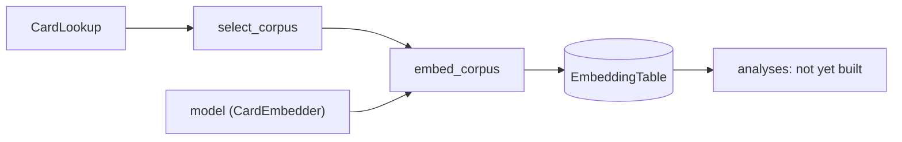

# evaluation

Post-training evaluation of encoder checkpoints, run offline by hand from
scripts. **Intrinsic** evaluation fits no model: it embeds cards once into a
table, then analyzes the stored vectors (projection plots, cluster
agreement, label compactness). **Extrinsic** evaluation trains fresh dojo
heads on a frozen encoder by reusing `Trainer`, and compares the loss
curves. `Trainer` never calls this package.

Status: in progress. Built: corpus selection, the embedding table, and
embedding a corpus into it. Not yet built (design in
[`plans/evaluation.md`](../../plans/evaluation.md)): card labels, the
intrinsic analyses, extrinsic runs and learning-curve plots.

## Files

- [corpus.py](corpus.py): `CorpusSpec` (games, optional `TierFilter`) and
  `select_corpus(card_lookup, spec)`, a lazy generator over the chosen
  games' cards, in `GameId` order. A `TierFilter` keeps an exact set of
  holdout tiers under a given `HoldoutSpec` (e.g. only VALIDATION cards,
  the ones a checkpoint never saw): domain shift is expressed by which
  cards go in, not by a separate evaluation mode.
- [embedding_table.py](embedding_table.py): `EmbeddingTable`, one
  encoder's card embeddings in a SQLite file, keyed by `nocab_uuid`.
  `EmbeddingTableMetadata` records what produced it (encoder label,
  checkpoint, width, binder version per game, time); its games are fixed
  at `create()`. `rows()` is sorted by `nocab_uuid`, so seeded sampling
  picks the same cards from any two tables over the same corpus. Every
  `add()` is committed before it returns, and a stored table is always
  finite (`NonFiniteEmbeddingError`).
- [corpus_embedding.py](corpus_embedding.py): the `CardEmbedder` Protocol
  (`embedding_dim`, `isolated_embeddings`), which `SingleCardModel` and
  `MultiCardModel` satisfy as they are, and `embed_corpus`, which embeds
  a corpus into a table in batches.

## How it works



`embed_corpus` skips every card already in the table, so an interrupted
run resumes where it stopped and a second corpus can extend a table. It is
built for unattended runs: a batch whose embedding fails (an exception, or
NaN/inf output) is logged and skipped, its cards left out for a re-run to
retry, and only `max_consecutive_failures` failed batches in a row stop
the run. A card of a game the table was not created for raises at once.

One table holds one encoder's embeddings; comparing encoders means
comparing tables built from the same corpus.

## How to run

```python
spec = CorpusSpec(games=frozenset({GameId.MTG}), tier_filter=None)
metadata = EmbeddingTableMetadata(
    encoder_label="single_v1", checkpoint_dir=checkpoint_dir,
    embedding_dim=model.embedding_dim,
    binder_versions={GameId.MTG: binder.version_for(GameId.MTG)},
    created_at=datetime.now(timezone.utc),
)
with EmbeddingTable.create(Path("data/evaluations/run_a/embeddings/single_v1.db"), metadata) as table:
    embed_corpus(model, select_corpus(binder, spec), table, batch_size=64, precision="fp16")
```
