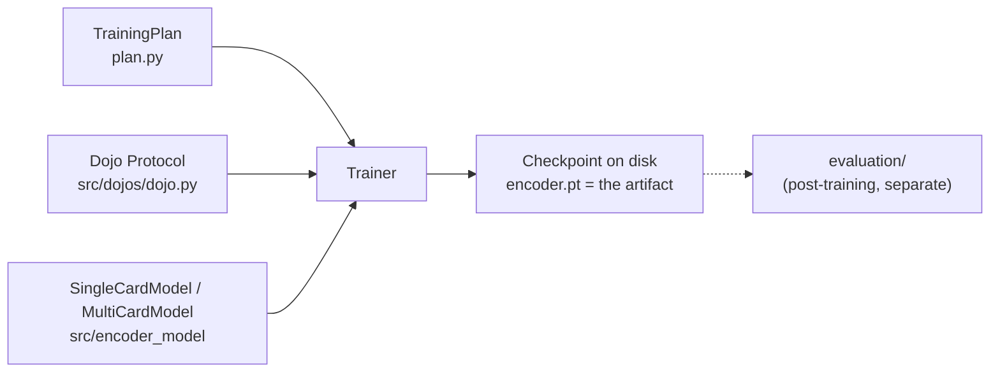

# training

Trains the card-embedding encoder (`../encoder_model/`) against a suite of
dojos (`../dojos/`). The encoder is the product; dojos are the teachers.
Status: implemented and tested; run end to end on CPU against two real
Gwent dojos (`scripts/smoke_test_training_loop.py`). No training driver or
config file yet (see `TODO.md`, section D).

Start with [`trainer.py`](trainer.py). It is the only file that knows the
whole story; every other file is a piece it delegates to.

## How it fits



The trainer sees dojos only through the `Dojo` Protocol, so generic and
contrastive dojos are interchangeable. It never calls `evaluation/`.

## Files

Top level:

- [trainer.py](trainer.py): `Trainer.run()` walks phases -> rounds ->
  optimizer steps. One step trains on one batch from one dojo.
- [phase_run.py](phase_run.py): the per-phase machinery (optimizer,
  tracker, sampler, batch streams) bundled into one object.
- [plan.py](plan.py): `TrainingPlan` -> `Phase`s. A phase says which
  dojos, which `DietRule`, learning rates, whether the encoder is frozen,
  and when to stop (`SaturationSpec`). Also `HardwareLimits`. Frozen and
  validated on construction, so a run is described entirely by its plan.
- [round_evaluation.py](round_evaluation.py): per-round capped,
  deterministic TEST loss for every dojo (diet or held-out). This is the
  tracker's input. It is the loop's own signal, not the post-training
  `evaluation/`.
- [trainable_encoder.py](trainable_encoder.py): the slice of the model the
  trainer needs.
- [TODO.md](TODO.md): the checklist to a first real training run.
  [Notes.md](Notes.md): the dated findings behind it (hardware, GPU
  measurements, serialization analysis).

Subdirectories:

- [diet/](diet/README.md): what to train on next (sampler, saturation
  tracker, batch stream).
- [recording/](recording/README.md): what comes out of training (reports,
  checkpointer, listeners).

## How it works

```mermaid
sequenceDiagram
    participant T as Trainer
    participant S as DietSampler
    participant B as DojoBatchStream
    participant M as Encoder model
    participant D as Dojo
    participant E as evaluate_test_losses
    participant K as SaturationTracker
    participant C as Checkpointer / Listeners

    loop each Phase
        T->>T: open phase (optimizer, tracker, sampler, streams)
        loop each Round (until phase_done or max_rounds)
            T->>K: active_dojo_names()
            loop steps_per_round
                T->>S: next_dojo(active)
                S-->>T: dojo
                T->>B: next_batch()
                B->>D: batches(TRAIN, budget)
                B-->>T: batch
                T->>M: model(batch.inputs)
                M-->>T: embeddings
                T->>D: compute_loss(embeddings, batch)
                D-->>T: loss (backward + optimizer step)
            end
            T->>E: TEST losses, ALL dojos
            E-->>T: per-dojo loss
            T->>K: record_round(losses)
            K-->>T: statuses
            T->>C: on_round_end(report); save if best
        end
    end
```

Points worth knowing:

- The diet is re-decided only at round boundaries, from the ACTIVE dojos.
- One `BatchBudget` (from `HardwareLimits.max_batch_cost` and `cost_of`)
  is passed to every dojo, so no dojo owns a batch size.
- Held-out dojos (`TrainingPlan.held_out_dojos`) are evaluated every round
  but never trained on.
- `Trainer` raises if any dojo's `holdout` differs from the plan's, so
  card holdout is consistent across dojos.
- The best checkpoint is chosen per phase; scores are not comparable across
  phases because the diet changes.
- Nothing here is meant to crash an overnight run. A failing step
  (exception, out-of-memory, non-finite loss or gradient), evaluation,
  checkpoint save or listener is logged and skipped. Gradients are clipped
  to `Phase.max_grad_norm`, and a non-finite gradient skips the step before
  it can reach the weights. Under `HardwareLimits(precision="fp16")` the
  loss is scaled by a per-phase `GradScaler` and gradients are unscaled
  before clipping; an fp16 overflow only skips the step and halves the
  scale, and counts as a failure only once the scale is at its floor of 1
  (the gradients are then non-finite in true units). A dojo that fails
  `FaultPolicy.max_consecutive_dojo_failures` times in a row (or
  `max_total_dojo_failures` in total) is quarantined for the phase, and
  `max_consecutive_failures` in a row stops the run cleanly with the last
  good checkpoint. Only plan/dojo mismatches raise, and they do so in the
  constructor, before training starts.
- A round is "best" only when its mean TEST loss over the diet dojos scored
  in both it and the previous best is strictly lower, so a round in which a
  hard dojo failed to evaluate cannot win by omission.
- A checkpoint is a weights snapshot; it does not save tracker or RNG
  state, so a run cannot resume mid-way, and there is no automatic
  rollback to the best checkpoint after divergence.
- Not built: gradient accumulation, GradCache, several tasks per step,
  per-dojo step size on the shared encoder, staged partial unfreezing,
  cached card encodings while the LM is frozen, token-aware `cost_of`,
  saving `GradScaler` state for resume, Hugging Face export.

## How to run

Assumes `model` is a `SingleCardModel`/`MultiCardModel` and `dojos` is a
list of constructed `Dojo`s.

```python
plan = TrainingPlan(phases=(...), holdout=HoldoutSpec(...), held_out_dojos=frozenset(),
                    eval_examples_per_dojo=512, seed=0)
result = Trainer(model, dojos, plan, HardwareLimits(max_batch_cost=256),
                 DirectoryCheckpointer(Path("runs/a")), [LoggingRunListener()]).run()
```
