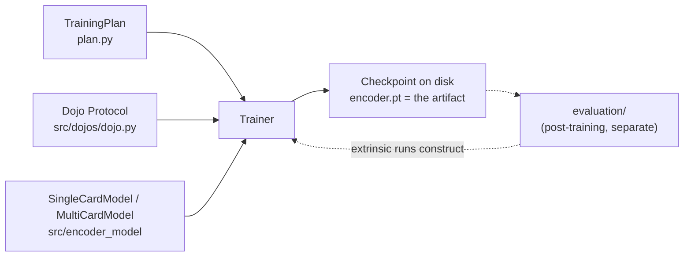

# training

Trains the card-embedding encoder (`../encoder_model/`) against a suite of
dojos (`../dojos/`). The encoder is the product; dojos are the teachers.
Status: implemented and tested; run end to end on CPU and on the RX 6800
against real Gwent dojos. Runs are launched from a YAML config by
`scripts/run_training.py` (see "How to run").

Start with [`trainer.py`](trainer.py). It is the only file that knows the
whole story; every other file is a piece it delegates to.

## How it fits


```mermaid
flowchart LR
    Plan[TrainingPlan<br/>plan.py] --> Trainer
    Dojos["Dojo Protocol<br/>src/dojos/dojo.py"] --> Trainer
    Encoder["SingleCardModel / MultiCardModel<br/>src/encoder_model"] --> Trainer
    Trainer --> Ckpt[Checkpoint on disk<br/>encoder.pt = the artifact]
    Ckpt -.-> Eval["evaluation/<br/>(post-training, separate)"]
    Eval -.->|extrinsic runs construct| Trainer
```

The trainer sees dojos only through the `Dojo` Protocol, so generic and
contrastive dojos are interchangeable. It never calls `evaluation/`;
evaluation's extrinsic runs construct a `Trainer` of their own (one frozen
phase, no checkpointer) to train fresh dojo heads on a finished encoder.
Mixed precision (`Precision`, `autocast_for`) lives in
`../encoder_model/precision.py`, shared with evaluation's embedders.

## Files

Top level:

- [trainer.py](trainer.py): `Trainer.run()` walks phases -> rounds ->
  optimizer steps. One step trains on one batch from one dojo.
- [phase_run.py](phase_run.py): the per-phase machinery (optimizer,
  tracker, sampler, batch streams) bundled into one object.
- [plan.py](plan.py): `TrainingPlan` -> `Phase`s. A phase says which
  dojos, which `DietRule`, learning rates, whether the encoder is frozen,
  and when to stop (`SaturationSpec`). Also `HardwareLimits`. Frozen and
  validated on construction, so a run is described entirely by its plan.
- [round_evaluation.py](round_evaluation.py): `evaluate_split_losses`, a
  capped, deterministic scoring pass over one split for every dojo, at a
  given precision. Each dojo gets a `SplitLoss`: its example-weighted mean
  loss and mean `baseline_loss` over the same batches, so
  `SplitLoss.normalized` (loss / baseline) is comparable across dojos. `Trainer` runs it on TEST each round (diet or held-out
  dojos alike) as the tracker's input, the loop's own signal; evaluation's
  extrinsic runs call it once on VALIDATION after training.
- [trainable_encoder.py](trainable_encoder.py): the slice of the model the
  trainer needs.
- [run_config.py](run_config.py): reads a YAML run config, applies
  `--set key.path=value` overrides, and parses it into a `RunConfig`: the
  `TrainingPlan`, `HardwareLimits`, device, `ModelSpec` and dojo list.
  Unknown keys raise, with their dotted location.
- [dojo_catalog.py](dojo_catalog.py): `DOJO_CATALOG`, every dojo a config
  can name, keyed `"<metric source>.<metric stem>"` (e.g.
  `gwent_one.color_mask`). The key becomes the dojo's `name`, so same-stem
  metrics from different games cannot collide. `build_dojos()` loads each
  game's binder (and deck box) once, through a `CardShelf`. The 17lands
  keys (`seventeenlands_<family>.<stem>`) each train on their metric's
  all-sets, all-formats slice file. Contrastive
  entries (`contrastive.gwent`, `contrastive.flesh_and_blood`,
  `contrastive.slay_the_spire_2`) read the game's final deck box directly
  (positives: two cards from the same deck; split index under
  `data/splits/contrastive/`). Every dojo, contrastive or metric, takes
  the game's default augmentation mods, or a run config's per-dojo
  replacement (`mods:`); a metric dojo runs them after its own task mods.
  Deck mods are opt-in, for the dojos and groups in `DECK_MOD_GROUPS`.
  Every mod gets its own seed from a stream separate from the dojo's own
  sampling.
- [preflight.py](preflight.py): `preflight_dojo()` exercises one already-
  built dojo (one TRAIN batch, `compute_loss` against random embeddings,
  and that batch's `baseline_loss`, which must be finite and > 0)
  without an encoder, so a stale split file, a `card_embedding_size`
  mismatch or a degenerate baseline surfaces before an unattended run
  reaches it. Run over the
  first-run candidates by `scripts/preflight_dojos.py`.
- [TODO.md](TODO.md): the checklist to a first real training run.
  [Notes.md](Notes.md): the dated findings behind it (hardware, GPU
  measurements, serialization analysis).

Subdirectories:

- [diet/](diet/README.md): what to train on next (sampler, saturation
  tracker, batch stream).
- [recording/](recording/README.md): what comes out of training (reports,
  checkpointer, listeners).

## Vocabulary

From largest unit to smallest:

| Term | What it is | Where |
|---|---|---|
| **Run** | One `Trainer.run()`: a whole `TrainingPlan` executed against one model and a set of dojos. | `trainer.py`, `plan.py` (`TrainingPlan`) |
| **Phase** | One stage of the plan (e.g. pretraining with everything trainable, then a head-only stage with the encoder frozen). Each has its own diet, learning rates, frozen flag and stopping rule. Phases run in order. | `plan.py` (`Phase`) |
| **Round** | The loop's decision unit within a phase: `steps_per_round` optimizer steps, then one TEST pass over every dojo, after which the diet is re-decided, saturation checked and a checkpoint maybe written. A phase runs until enough dojos saturate or `max_rounds` is reached. | `Trainer._train_round` + `_evaluate_round` |
| **Step** | One optimizer update: pick a dojo from the diet, take its next batch, forward, loss, backward, update. `RoundReport.step` is the running total. | `Trainer._take_step` |
| **Batch** | What one step consumes: examples from **one** dojo, sized by a cost budget (`max_batch_cost`) rather than a fixed count. | `DojoBatch`, `BatchBudget` |
| **Epoch** | **Not a concept here.** Each dojo's TRAIN data is an endless stream that starts another pass whenever it runs out. Dojos differ in size and sampling rate, so "one pass over the data" means something different for each dojo and nothing for the run. Rounds are the unit of progress instead. | `diet/dojo_batch_stream.py` |

```
Run
 └─ Phase 1 … N              (in order)
     └─ Round 0 … ≤ max_rounds
         ├─ steps_per_round × Step   (each = one Batch from one Dojo)
         └─ one TEST pass → RoundReport → saturation, diet, checkpoint
```

**Normalized loss:** every decision below uses each dojo's normalized
TEST loss (loss / its baseline: 1.0 = learned nothing, 0.0 = perfect;
see `../dojos/README.md`), so no dojo's loss scale outweighs another's.
Raw losses are still reported beside them.

**Loss weighting:** the same ratio scales training. `Trainer` multiplies
each step's loss by `weight / max(baseline, baseline_floor)`
(`loss_weighting.py`), so every dojo's untrained loss starts near its
weight and a dojo with `loss_weights: {name: 2.0}` counts twice a baseline
dojo. `loss_weights:` (dojo name to multiplier, default 1.0 each) and
`baseline_floor:` (default 0.05; caps the scale at `1 / baseline_floor`
for a near-deterministic dojo) are top-level config keys, one set for the
whole run. A batch with no usable baseline (a contrastive batch with no
negatives) is skipped before the forward pass and counted in the round's
log line; it is neither a success nor a fault for the fault ledger. A plan
whose `loss_weighting` is `None` trains on the raw loss: that is what
evaluation's extrinsic runs do. `max_grad_norm` clips the weighted
gradient. `scripts/survey_dojo_baselines.py` prints every catalog dojo's
baseline spread, for choosing the floor.

**Regression loss:** the top-level `regression_loss: mse | huber` (default
`mse`) picks the loss every regression dojo trains with
(`RegressionObjective`, `../dojos/loss/`). Huber is quadratic for errors
under 1.345 label stds and linear beyond, so one extreme label cannot
dominate a batch; its baseline (the best constant predictor's Huber loss)
is below 1.0 on heavy-tailed labels. `weight_by_baseline: false` trains on
the raw loss, the control for comparing the two losses (it is an error
alongside `loss_weights:` or `baseline_floor:`). Only the three regression
cells take the objective; the catalog binds it in `_constructor_for`.

**Saturation:** a dojo whose normalized TEST loss has stopped improving
(no gain larger than `epsilon` for `patience_rounds` rounds) leaves the
diet. It re-enters if its normalized loss rises more than
`reactivation_delta` above its value when it saturated. Both thresholds
are therefore fractions of the dojo's baseline (`epsilon: 0.001` is 0.1%
of it). That can only happen when other dojos move a shared,
trainable encoder: a saturated dojo's own head is not trained, so a head
that overfit before saturating stays out instead of flip-flopping.

## How it works

```mermaid
sequenceDiagram
    participant T as Trainer
    participant S as DietSampler
    participant B as DojoBatchStream
    participant M as Encoder model
    participant D as Dojo
    participant E as evaluate_split_losses
    participant K as SaturationTracker
    participant C as Checkpointer / Listeners

    loop each Phase
        T->>T: open phase (optimizer, tracker, sampler, streams)
        loop each Round (until phase_done or max_rounds)
            T->>K: active_dojo_names()
            loop steps_per_round
                T->>S: next_dojo(active)
                S-->>T: dojo
                T->>B: next_batch()
                B->>D: batches(TRAIN, budget)
                B-->>T: batch
                T->>M: model(batch.inputs)
                M-->>T: embeddings
                T->>D: compute_loss(embeddings, batch)
                D-->>T: loss (backward + optimizer step)
            end
            T->>E: TEST losses, ALL dojos
            E-->>T: per-dojo loss
            T->>K: record_round(losses)
            K-->>T: statuses
            T->>C: on_round_end(report); save if best
        end
    end
```

Points worth knowing:

- The diet is re-decided only at round boundaries, from the ACTIVE dojos.
- One `BatchBudget` (from `HardwareLimits.max_batch_cost` and `cost_of`)
  is passed to every dojo, so no dojo owns a batch size.
- Held-out dojos (`TrainingPlan.held_out_dojos`) are evaluated every round
  but never trained on.
- A phase with `encoder_trainable=False` keeps the encoder in eval mode
  (no dropout) while the dojo heads train; the heads are not part of the
  model, so their mode is untouched.
- Every `RoundReport` carries `elapsed_seconds` (monotonic, since
  `run()` began), for loss-vs-time curves.
- The checkpointer is optional: with `checkpointer=None` nothing is saved
  and `TrainingResult.best_checkpoint` is `None` (evaluation's extrinsic
  runs, smoke tests, dry runs).
- `Trainer` raises if any dojo's `holdout` differs from the plan's, so
  card holdout is consistent across dojos.
- The best checkpoint is chosen per phase; scores are not comparable across
  phases because the diet changes.
- Retention (`DirectoryCheckpointer`): only the best checkpoint of each
  phase stays on disk (a new best deletes the phase's previous one once it
  is fully written), plus `latest/`, rewritten after every round. The
  checkpoints CSV lists every best ever written, so most of its paths no
  longer exist. Each checkpoint holds the whole model (the frozen LM too),
  and `latest/` also holds the optimizer state.
- Nothing here is meant to crash an overnight run. A failing step
  (exception, out-of-memory, non-finite loss or gradient), evaluation,
  checkpoint save or listener is logged and skipped. Gradients are clipped
  to `Phase.max_grad_norm`, and a non-finite gradient skips the step before
  it can reach the weights. Under `HardwareLimits(precision="fp16")` the
  loss is scaled by a per-phase `GradScaler` and gradients are unscaled
  before clipping; an fp16 overflow only skips the step and halves the
  scale, and counts as a failure only once the scale is at its floor of 1
  (the gradients are then non-finite in true units). A dojo that fails
  `FaultPolicy.max_consecutive_dojo_failures` times in a row (or
  `max_total_dojo_failures` in total) is quarantined for the phase, and
  `max_consecutive_failures` in a row stops the run cleanly with the last
  good checkpoint. Only plan/dojo mismatches raise, and they do so in the
  constructor, before training starts.
- A round is "best" only when its mean normalized TEST loss over the diet
  dojos scored in both it and the previous best is strictly lower, so a round in which a
  hard dojo failed to evaluate cannot win by omission.
- Regression dojo heads predict z-scored labels, so a head from a
  checkpoint written before labels were z-scored predicts raw label units
  and does not fit a current dojo; start such runs fresh.
- A checkpoint is a weights snapshot; it does not save tracker or RNG
  state, so a run cannot resume mid-way, and there is no automatic
  rollback to the best checkpoint after divergence.
- Not built: gradient accumulation, GradCache, several tasks per step,
  per-dojo step size on the shared encoder, staged partial unfreezing,
  cached card encodings while the LM is frozen, token-aware `cost_of`,
  saving `GradScaler` state for resume, Hugging Face export.

## How to run

From a config file (configs live in `configs/training/`; use the ROCm
venv for a GPU run, see `TODO.md` section A):

```sh
PYTHONPATH=. python scripts/run_training.py configs/training/gpu_smoke.yaml
PYTHONPATH=. python scripts/run_training.py configs/training/gpu_smoke.yaml \
    --set run_directory=data/runs/smoke_2 --set phases.0.max_rounds=2
# Build and preflight the dojos only; trains and writes nothing
PYTHONPATH=. python scripts/run_training.py configs/training/gpu_smoke.yaml --check
```

The script builds the model and the config's dojos, preflights every dojo
(any failure stops the run before training), then trains. Preflight also
prints each augmentation mod's tally over its one batch (cards changed,
failed) and warns on a mod that changed nothing or failed; that never
stops the run. A config's optional `mods:` section replaces a dojo's
default augmentations (see `configs/training/gwent_contrastive.yaml`);
dojo names contain ".", so `--set` cannot reach them (nor `loss_weights:`). The run
directory must not already exist; it receives `run_config.yaml` (the
config with overrides applied; defaults it left out are not written),
`rounds.csv`, `checkpoints.csv` and the checkpoint directories. Batch cost
is one per card, for preflight and training alike (`card_cost`).

Directly from code, assuming `model` is a `SingleCardModel`/`MultiCardModel`
and `dojos` is a list of constructed `Dojo`s:

```python
plan = TrainingPlan(phases=(...), holdout=HoldoutSpec(...), held_out_dojos=frozenset(),
                    eval_examples_per_dojo=512, seed=0)
result = Trainer(model, dojos, plan, HardwareLimits(max_batch_cost=256),
                 DirectoryCheckpointer(Path("runs/a")), [LoggingRunListener()]).run()
```
